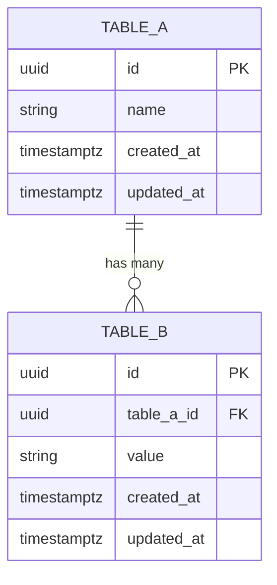

<!-- 出力先: docs/design/[epic-slug]-db-schema.md -->
# DB スキーマ骨格 — [Epic名]

> 骨格レベルの定義: テーブル一覧・カラム名・型・主要制約まで。
> インデックス設計・詳細バリデーション・マイグレーション手順は Task で定義する。

## テーブル一覧

| テーブル名 | 操作 | 対応集約 | 説明 |
|-----------|------|---------|------|
| [テーブル名] | [新設 / 変更 / 削除] | [集約名] | [このテーブルの役割] |
| [テーブル名] | [新設 / 変更 / 削除] | [集約名] | [このテーブルの役割] |

<!-- 以下、テーブルごとに H3 セクションを作成する -->

### [テーブル名]

| カラム名 | 型 | 制約 | 説明 |
|---------|-----|------|------|
| id | [UUID / BIGINT 等] | PK | 主キー |
| [カラム名] | [型] | [NOT NULL / UNIQUE / FK 等] | [このカラムの意味] |
| [カラム名] | [型] | [NOT NULL / UNIQUE / FK 等] | [このカラムの意味] |
| created_at | TIMESTAMPTZ | NOT NULL | 作成日時 |
| updated_at | TIMESTAMPTZ | NOT NULL | 更新日時 |

### [テーブル名 2]

| カラム名 | 型 | 制約 | 説明 |
|---------|-----|------|------|
| id | [UUID / BIGINT 等] | PK | 主キー |
| [外部キーカラム名] | [型] | FK NOT NULL | [参照先テーブル名].id |
| [カラム名] | [型] | [NOT NULL / UNIQUE / FK 等] | [このカラムの意味] |
| created_at | TIMESTAMPTZ | NOT NULL | 作成日時 |
| updated_at | TIMESTAMPTZ | NOT NULL | 更新日時 |

## リレーション図

