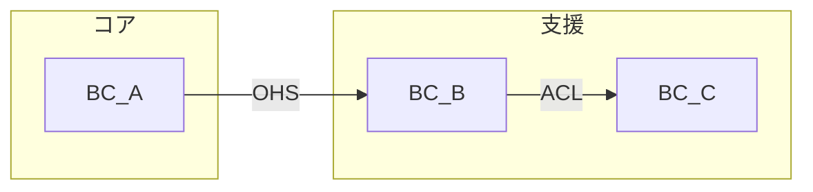

<!-- 出力先: docs/domain/context-map.md -->
# コンテキストマップ — [Phase名]

## BC 一覧

<!-- 全 BC を列挙する。責務は 1 文で簡潔に。
     コアドメインの判定基準: 「この機能を競合と同じ方法で実装しても、ビジネス上の不利益はないか？」
     → Yes なら支援/汎用、No ならコアドメイン -->

| BC | 責務（1文） | コアドメイン？ |
|----|------------|-------------|
| <!-- BC名 --> | <!-- この BC の責務を 1 文で --> | <!-- はい/いいえ --> |
| <!-- BC名 --> | <!-- この BC の責務を 1 文で --> | <!-- はい/いいえ --> |
| <!-- BC名 --> | <!-- この BC の責務を 1 文で --> | <!-- はい/いいえ --> |

## 統合パターン

<!-- BC 間の統合パターンを定義する。
     パターンの選択基準:
     - ACL（腐敗防止層）: 下流が上流のモデルに汚染されたくない場合
     - OHS（公開ホストサービス）: 上流が公開 API を提供する場合
     - CF（適合者）: 下流が上流のモデルをそのまま受け入れる場合
     - SK（共有カーネル）: 2 つの BC が同じモデルを共有する場合（慎重に使用）
     - PL（パブリッシュ言語）: イベント駆動で疎結合に連携する場合

     上流/下流の判定:
     - 上流 = データや機能を提供する側
     - 下流 = データや機能を利用する側
     - 双方向の場合は 2 行に分けて記載する -->

| 上流 BC | 下流 BC | パターン | 備考 |
|---------|---------|---------|------|
| <!-- BC名 --> | <!-- BC名 --> | <!-- ACL / OHS / CF / SK / PL --> | <!-- 選択理由 --> |
| <!-- BC名 --> | <!-- BC名 --> | <!-- ACL / OHS / CF / SK / PL --> | <!-- 選択理由 --> |

## Mermaid 図

<!-- BC 間の関係を図示する。矢印は依存方向（上流→下流）。
     パターン名をラベルに含める。
     BC が多い場合はサブグラフでグルーピングする -->

