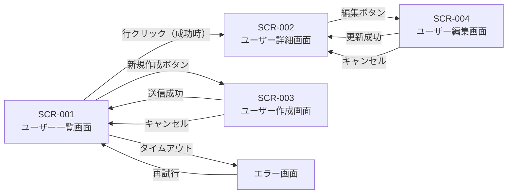
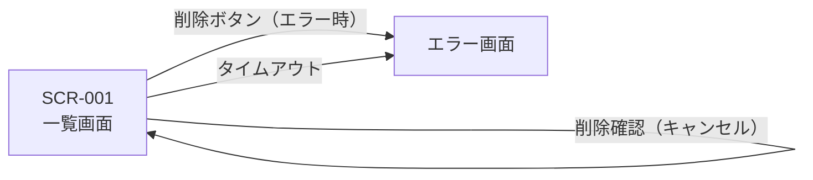
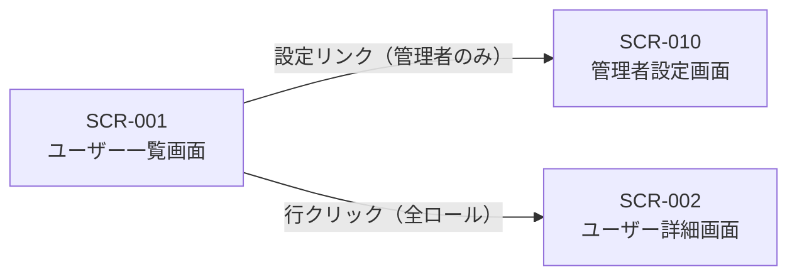
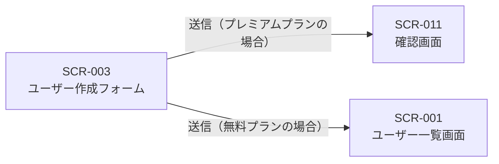

<!-- 配置先: docs/design/screen-flow-[slug].md にコピーして使用する -->
<!-- 生成スキル: /aidd-screen-spec -->
<!-- 後続スキル: /aidd-screen-ui（この遷移図を設計資料として使用） -->

# 画面遷移図: [Epic名]（[ES-NNN]）

<!-- AC-E053-11: 全 SCR-ID を含む Mermaid 形式の画面遷移図を生成する -->

| 項目 | 内容 |
|------|------|
| 対象 Epic | ES-NNN |
| 生成日 | yyyy-mm-dd |
| 生成スキル | /aidd-screen-spec |

---

## 遷移図（全体）

<!-- AC-E053-11: graph LR 形式を基本とする -->
<!-- AC-E053-12: 各矢印にトリガー条件ラベル（成功・エラー・キャンセル・タイムアウト）を付与する -->



---

## トリガー条件ラベル定義（AC-E053-12, AC-E053-13）

<!-- AC-E053-13: 成功・エラー・キャンセル・タイムアウトの4種のトリガー条件を定義する -->
<!-- AC-E053-14: トリガーが1種のみの遷移も定義でき、省略可能なトリガーは省略できる -->

| ラベル種別 | 書き方 | 説明 |
|----------|--------|------|
| 成功時 | `"[アクション名]（成功時）"` | 操作が正常に完了した場合の遷移 |
| エラー時 | `"[アクション名]（エラー時）"` | 操作が失敗した場合の遷移 |
| キャンセル時 | `"キャンセル"` | ユーザーが操作を中止した場合の遷移 |
| タイムアウト時 | `"タイムアウト"` | 一定時間経過後の遷移 |
| 条件付き | `"[アクション名]（[条件]の場合）"` | ロールやデータ状態による条件付き遷移 |

### 書き方例



---

## 条件付き遷移（AC-E053-15, AC-E053-16）

<!-- AC-E053-15: ユーザーロールやデータ状態による条件付き遷移を Mermaid の条件分岐として表現する -->
<!-- AC-E053-16: 条件付き遷移が定義されている場合、条件ラベル付きで明示する -->

### ロールベースの条件付き遷移



### データ状態による条件付き遷移



---

## 遷移一覧（補足）

<!-- 遷移図の矢印を表形式で補足する。矢印が多い場合に読みやすくなる -->

| 遷移元 SCR-ID | 遷移先 SCR-ID | トリガー | 条件 |
|-------------|-------------|---------|------|
| SCR-001 | SCR-002 | 行クリック | 成功時 |
| SCR-001 | SCR-003 | 新規作成ボタン | — |
| SCR-002 | SCR-004 | 編集ボタン | — |
| SCR-003 | SCR-001 | 送信 | 成功時 |
| SCR-003 | SCR-001 | キャンセルボタン | — |
| SCR-004 | SCR-002 | 更新 | 成功時 |
| SCR-004 | SCR-002 | キャンセルボタン | — |
| SCR-001 | エラー画面 | — | タイムアウト時 |

---

## サンプル（記入例）

以下は `screen-flow-onboarding.md` の記入例（3画面構成）:

```markdown
# 画面遷移図: オンボーディング（ES-020）

| 項目 | 内容 |
|------|------|
| 対象 Epic | ES-020 |
| 生成日 | 2025-01-15 |
| 生成スキル | /aidd-screen-spec |

## 遷移図（全体）

\`\`\`mermaid
graph LR
    SCR010["SCR-010\nウェルカム画面"]
    SCR011["SCR-011\nプロフィール設定画面"]
    SCR012["SCR-012\nプラン選択画面"]
    SCR001["SCR-001\nダッシュボード（既存）"]

    SCR010 -->|"「始める」ボタン"| SCR011
    SCR011 -->|"保存（成功時）"| SCR012
    SCR011 -->|"保存（エラー時: バリデーション失敗）"| SCR011
    SCR012 -->|"プラン選択（成功時）"| SCR001
    SCR012 -->|"スキップ（管理者承認済みの場合）"| SCR001
    SCR012 -->|"タイムアウト（30秒）"| SCR010
\`\`\`

## 遷移一覧

| 遷移元 SCR-ID | 遷移先 SCR-ID | トリガー | 条件 |
|-------------|-------------|---------|------|
| SCR-010 | SCR-011 | 「始める」ボタン | — |
| SCR-011 | SCR-012 | 保存 | 成功時 |
| SCR-011 | SCR-011 | 保存 | エラー時（バリデーション失敗） |
| SCR-012 | SCR-001 | プラン選択 | 成功時 |
| SCR-012 | SCR-001 | スキップ | 管理者承認済みの場合のみ |
| SCR-012 | SCR-010 | タイムアウト（30秒） | — |
```
