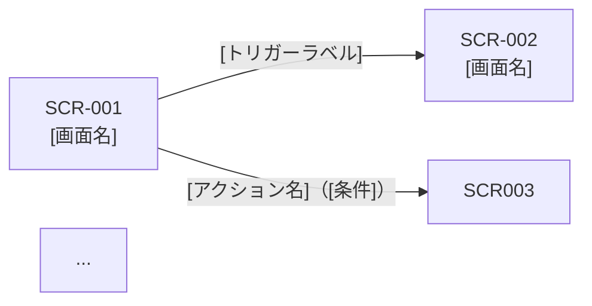

# Step 2: 画面遷移図生成 — 詳細手順

画面仕様書の全 SCR-ID を基に Mermaid 形式の画面遷移図を生成し、トリガー条件・条件付き遷移を対話的に定義する詳細手順を定義する。

## 対応 AC

| AC-ID | 内容 |
|-------|------|
| AC-E053-11 | `screen-list-*.md` の全 SCR-ID を基にした Mermaid 形式の画面遷移図が `docs/design/screen-flow-[slug].md` に生成される |
| AC-E053-12 | 遷移図の各矢印にトリガー条件ラベル（成功・エラー・キャンセル・タイムアウト）が付与される |
| AC-E053-13 | 各遷移に「成功時」「エラー時」「キャンセル時」「タイムアウト時」の4種のトリガー条件を対話的に定義できる |
| AC-E053-14 | トリガーが1種のみの遷移も定義でき、省略可能なトリガーは省略できる |
| AC-E053-15 | ユーザーロールやデータ状態による条件付き遷移を Mermaid の条件分岐として表現できる |
| AC-E053-16 | 条件付き遷移が定義されている場合、遷移図に条件ラベル付きで明示される |

## 入力

- Step 0 で読み込んだ screen-list ドキュメント（SCR-ID 一覧・画面名・種別）
- Step 1 で生成済みの画面仕様書（ロール定義・状態設計を含む）
- `references/screen-flow-template.md`（Mermaid テンプレート）
- Epic 仕様書（存在する場合: フロー・ロール定義の詳細）

## 処理フロー

### 1. SCR-ID の収集（AC-E053-11）

Step 0 で取得した全 SCR-ID を遷移図のノードとして準備する。

#### 1-1. ノード定義の生成

全 SCR-ID を以下の形式で定義する:

```
SCR001["SCR-001\n[画面名]"]
```

- SCR-ID の `-`（ハイフン）を除いた英数字でノード変数名を生成する（例: `SCR-001` → `SCR001`）
- ノードラベルは `SCR-NNN\n[画面名]` 形式とする（改行を含む）
- 特殊ノード（エラー画面・外部システム等）も必要に応じて定義する

#### 1-2. ユーザーへの確認

生成したノード一覧をユーザーに提示し、追加・変更・削除がないか確認する。

```
## Step 2: 画面遷移図生成を開始します

### 遷移図のノード（全 N 件の SCR-ID）

| ノード変数名 | SCR-ID | 画面名 |
|------------|--------|--------|
| SCR001 | SCR-001 | [画面名] |
| SCR002 | SCR-002 | [画面名] |
...

遷移図に含める画面を確認してください。
- 追加の画面（外部システム・エラー画面等）があれば指摘してください
- 削除・変更があれば指摘してください
- 問題なければ「OK」で遷移の定義に進みます
```

ユーザーの指摘があれば修正して再提示する。「OK」等の明確な承認を得てから手順 2 に進む。

### 2. 遷移の対話的定義（AC-E053-12, AC-E053-13, AC-E053-14）

画面間の遷移を1つずつ対話的に定義する。

#### 2-1. 遷移元画面ごとのループ

各 SCR-ID を遷移元として、以下の手順を実行する。

```
処理対象: N 件の SCR-ID（遷移元として順番に処理）
処理順: screen-list の記載順
```

#### 2-2. 各遷移元からの遷移先と条件を定義

遷移元の画面名・種別・画面仕様書（ロール定義・状態設計）から、遷移先とトリガー条件を推定する。

**画面種別に応じた典型的な遷移パターン:**

| 遷移元の画面種別 | 典型的な遷移先 | トリガー条件 |
|---------------|-------------|------------|
| 一覧 | 詳細画面 | 行クリック（成功時） |
| 一覧 | フォーム（作成） | 「新規作成」ボタン |
| 一覧 | エラー画面 | タイムアウト / 取得失敗 |
| 詳細 | フォーム（編集） | 「編集」ボタン |
| 詳細 | 一覧 | 「削除成功時」 / 「戻る」ボタン |
| フォーム（作成） | 一覧 / 詳細 | 送信成功 |
| フォーム（作成） | 同じ画面 | 送信エラー（バリデーション失敗） |
| フォーム（作成） | 前の画面 | キャンセル |
| フォーム（編集） | 詳細 | 更新成功 / キャンセル |
| ダッシュボード | 各機能の一覧画面 | リンク / ボタンクリック |
| モーダル | 元の画面 | 確認成功 / キャンセル |
| ウィザード | 次のステップ / 完了画面 | 次へ（成功時） |
| ウィザード | 前のステップ | 「戻る」ボタン |
| エラー画面 | 前の画面 / ホーム | 再試行 / 戻る |

#### 2-3. トリガー条件の種類と書き方（AC-E053-13, AC-E053-14）

各遷移のトリガー条件ラベルは以下の形式で定義する:

| トリガー種別 | ラベル形式 | 説明 |
|-----------|----------|------|
| 成功時 | `"[アクション名]（成功時）"` | 操作が正常に完了した場合の遷移 |
| エラー時 | `"[アクション名]（エラー時）"` | 操作が失敗した場合の遷移（例: バリデーション失敗・API エラー） |
| キャンセル時 | `"キャンセル"` または `"[アクション名]（キャンセル）"` | ユーザーが操作を中止した場合の遷移 |
| タイムアウト時 | `"タイムアウト"` または `"[N秒後]"` | 一定時間経過後の遷移 |

**省略ルール（AC-E053-14）:** 遷移に1種類のみのトリガーが存在する場合（例: 「ページ遷移」のみ）は他のトリガーを省略できる。ラベルも簡略化して構わない。

#### 2-4. ユーザーへの確認

推定した遷移を遷移元ごとにユーザーに提示し、確認を求める。

```
## [SCR-ID] [画面名] — 遷移先とトリガー条件

| 遷移先 SCR-ID | 遷移先画面名 | トリガー | 種別 |
|-------------|-----------|---------|------|
| SCR-002 | [画面名] | 行クリック（成功時） | 成功時 |
| SCR-003 | [画面名] | 「新規作成」ボタン | — |
| エラー画面 | — | タイムアウト | タイムアウト時 |

遷移の定義を確認してください。
- 遷移先・トリガー条件の追加・変更・削除があれば指摘してください
- この画面から他の画面への遷移がなければ「遷移なし」とお知らせください
- 問題なければ「OK」で次の画面の定義に進みます
```

ユーザーの指摘があれば修正して再提示する。「OK」等の明確な承認を得てから次の SCR-ID に進む。

### 3. 条件付き遷移の定義（AC-E053-15, AC-E053-16）

遷移の定義が完了したら、ロールやデータ状態による条件付き遷移を確認する。

#### 3-1. 条件付き遷移の検出

以下のいずれかに該当する遷移を「条件付き遷移候補」として列挙する:

- Step 1b のロール定義で「管理者のみ」「特定ロールのみ」等のロール制限がある画面への遷移
- Epic 仕様書でデータ状態（例: 「未承認の場合」「有料プランの場合」）に依存する遷移
- 手順 2 でユーザーが「条件付き」と指示した遷移

#### 3-2. 条件付き遷移のラベル形式（AC-E053-15）

条件付き遷移は Mermaid の `|条件|` ラベル形式で表現する:

```
SCR001 -->|"設定リンク（管理者のみ）"| SCR_ADMIN
SCR001 -->|"詳細（全ロール）"| SCR002
SCR003 -->|"送信（プレミアムプランの場合）"| SCR_CONFIRM
SCR003 -->|"送信（無料プランの場合）"| SCR001
```

**条件付き遷移のラベル形式:**

| 条件種別 | ラベル形式 | 例 |
|---------|----------|-----|
| ロールによる条件 | `"[アクション名]（[ロール]のみ）"` | `"設定ページ（管理者のみ）"` |
| データ状態による条件 | `"[アクション名]（[状態]の場合）"` | `"送信（承認済みの場合）"` |
| 複合条件 | `"[アクション名]（[条件1]かつ[条件2]）"` | `"エクスポート（管理者かつデータあり）"` |

#### 3-3. ユーザーへの確認（AC-E053-16）

検出した条件付き遷移候補をユーザーに提示し、確認を求める。

```
## 条件付き遷移の確認

以下の遷移がロールまたはデータ状態に依存する可能性があります:

| 遷移元 | 遷移先 | 推定条件 | 確認 |
|--------|--------|---------|------|
| SCR-001 | SCR-010 | 管理者のみ（ロール定義より） | |
| SCR-003 | SCR-011 | プレミアムプランの場合（Epic 仕様書より） | |

各遷移の条件を確認してください:
- 条件が正しければ「OK」で次に進みます
- 条件が不要な場合は「条件なし」とお知らせください
- 条件の内容を変更したい場合は修正内容を指定してください
- 上記以外にも条件付き遷移がある場合は追加してください
```

ユーザーの指摘があれば修正して再提示する。「OK」等の明確な承認を得てから手順 4 に進む。

### 4. Mermaid 遷移図の生成（AC-E053-11, AC-E053-12）

手順 2・3 で承認した遷移定義をもとに、`references/screen-flow-template.md` のフォーマットに従って遷移図を生成する。

#### 4-1. Mermaid コードの組み立て



**組み立てルール:**

| ルール | 内容 |
|------|------|
| 方向 | `graph LR`（左から右）を基本とする。画面数が多い場合は `graph TB`（上から下）も可 |
| ノード定義 | 全 SCR-ID を冒頭にまとめて定義する |
| 遷移定義 | ノード定義の後に記述する |
| コメント | `%% 通常遷移` / `%% 条件付き遷移` 等のコメントで区分けして可読性を高める |
| エラーノード | エラー画面・外部システム等の特殊ノードは最後に定義する |

#### 4-2. 遷移一覧テーブルの生成

遷移図の補足として、遷移を表形式でも記録する（矢印が多い場合の読みやすさ向上のため）:

```markdown
| 遷移元 SCR-ID | 遷移先 SCR-ID | トリガー | 条件 |
|-------------|-------------|---------|------|
| SCR-001 | SCR-002 | 行クリック | 成功時 |
| SCR-001 | エラー画面 | — | タイムアウト時 |
```

#### 4-3. 出力ファイルの生成（AC-E053-11）

`docs/design/screen-flow-[slug].md` に以下の内容を書き出す:

```markdown
<!-- 配置先: docs/design/screen-flow-[slug].md -->
<!-- 生成スキル: /aidd-screen-spec -->

# 画面遷移図: [Epic名]（[ES-NNN]）

<!-- AC-E053-11: 全 SCR-ID を含む Mermaid 形式の画面遷移図を生成する -->

| 項目 | 内容 |
|------|------|
| 対象 Epic | ES-NNN |
| 生成日 | yyyy-mm-dd |
| 生成スキル | /aidd-screen-spec |

---

## 遷移図（全体）

<!-- AC-E053-11: graph LR 形式を基本とする -->
<!-- AC-E053-12: 各矢印にトリガー条件ラベル（成功・エラー・キャンセル・タイムアウト）を付与する -->

\`\`\`mermaid
graph LR
    ...
\`\`\`

---

## トリガー条件ラベル定義（AC-E053-12, AC-E053-13）

<!-- AC-E053-13: 成功・エラー・キャンセル・タイムアウトの4種のトリガー条件を定義する -->
<!-- AC-E053-14: トリガーが1種のみの遷移も定義でき、省略可能なトリガーは省略できる -->

| ラベル種別 | 書き方 | 説明 |
|----------|--------|------|
| 成功時 | `"[アクション名]（成功時）"` | 操作が正常に完了した場合の遷移 |
| エラー時 | `"[アクション名]（エラー時）"` | 操作が失敗した場合の遷移 |
| キャンセル時 | `"キャンセル"` | ユーザーが操作を中止した場合の遷移 |
| タイムアウト時 | `"タイムアウト"` | 一定時間経過後の遷移 |
| 条件付き | `"[アクション名]（[条件]の場合）"` | ロールやデータ状態による条件付き遷移 |

---

## 条件付き遷移（AC-E053-15, AC-E053-16）

<!-- AC-E053-15: ユーザーロールやデータ状態による条件付き遷移を Mermaid の条件分岐として表現する -->
<!-- AC-E053-16: 条件付き遷移が定義されている場合、条件ラベル付きで明示する -->

[条件付き遷移がある場合のみ記載する。ない場合は「条件付き遷移なし」と記載する]

---

## 遷移一覧（補足）

| 遷移元 SCR-ID | 遷移先 SCR-ID | トリガー | 条件 |
|-------------|-------------|---------|------|
| ... | ... | ... | ... |
```

**出力ファイル名:** `docs/design/screen-flow-[slug].md`（screen-list の `[slug]` と一致させる）

### 5. 遷移図の提示とユーザー確認

生成した遷移図をユーザーに提示し、最終確認を求める。

```
## Step 2: 画面遷移図を生成しました

生成ファイル: docs/design/screen-flow-[slug].md

### 遷移図（プレビュー）

\`\`\`mermaid
graph LR
    ...（生成した Mermaid コード）
\`\`\`

### 生成内容の概要

- ノード（SCR-ID）: N 件
- 遷移矢印: N 本
- 条件付き遷移: N 本

遷移図の内容を確認してください。
- 追加・変更・削除があれば指摘してください
- 問題なければ「OK」で Step 3（ブリーフィング）に進みます
```

ユーザーの指摘があれば修正して再提示する。「OK」等の明確な承認を得てから Step 3 に進む。

## エラー処理

| ケース | 条件 | 振る舞い |
|--------|------|---------|
| 遷移が定義されない画面がある | 特定の SCR-ID から他への遷移がない | 「[SCR-ID] は他の画面への遷移がない（孤立ノード）です。これは正しいですか？」とユーザーに確認する |
| 全ての遷移が省略された | 遷移が0件の状態でユーザーが承認しようとする | 「遷移が0件のため遷移図は生成できません。少なくとも1件の遷移を定義してください。」と警告する |
| 条件付き遷移が複雑すぎる | 条件が3つ以上の組み合わせになる | 条件を簡略化するか、テキストで補足説明を追記するか確認する |
| SCR-ID が screen-list と不一致 | Step 1 で新たな SCR-ID が追加されている | 「画面一覧にない SCR-ID が追加されています。遷移図に含めますか？」と確認する |

## TBD 管理

- 遷移先が未定（将来追加予定の画面）の場合は「FUTURE」ノードとして仮置きできる
- 条件付き遷移の条件が未確定の場合は `"[アクション名]（条件TBD）"` と記録できる
- TBD の一覧は Step 3（ブリーフィング）でユーザーに提示する

## 注意事項

- **全 SCR-ID をノードとして含める**（screen-list の全画面を遷移図に含める。AC-E053-11 に準拠）
- **各矢印にトリガー条件ラベルを付与する**（ラベルのない矢印は使用しない。AC-E053-12 に準拠）
- **条件付き遷移には条件ラベルを付与する**（条件のわかる形でラベルに含める。AC-E053-16 に準拠）
- **1種類のトリガーのみの遷移は省略して構わない**（AC-E053-14 に準拠）
- **ユーザーの明示的な承認を得てから遷移図ファイルを生成する**（手順 2〜3 の承認後に生成する）
- **AC トレーサビリティを維持する**（生成した遷移図ファイルの各コメントに AC-ID を記録する）
- **`references/screen-flow-template.md` のフォーマットに従う**（テンプレートを参考に出力する）
