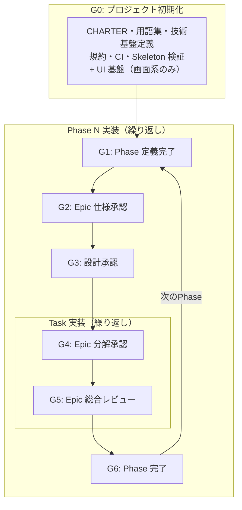
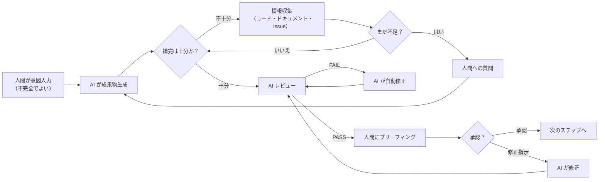
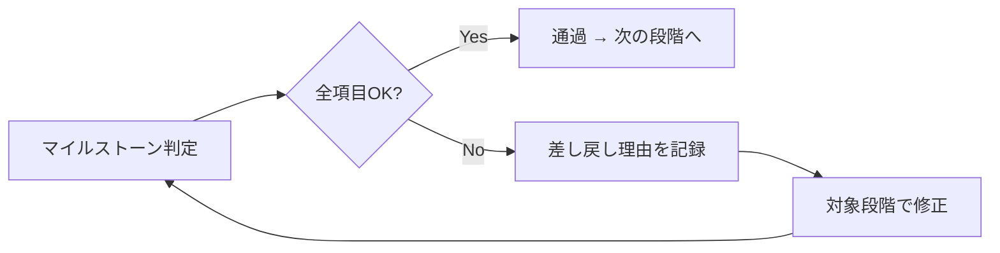

# Development Framework: AI 駆動開発プロジェクト運営フレームワーク

| 項目 | 内容 |
|------|------|
| ステータス | **承認済み** |
| 日付 | 2026-04-08 |

---

## このフレームワークについて

### 対象

AI エージェント群と人間チームの協働により、チーム規模に依存しない開発スループットと品質を実現するプロセスフレームワーク。

### 解決する問題

AI 駆動開発では、人間の意図入力の質が成果物の品質を決定する。しかし人間の入力は常に不完全である。このフレームワークは、AI が不完全な入力を検知・補完し、完全な成果物を生成する**意図入力-補完ループ**を定義する。要件定義から実装・テストまでの一連のプロセスを通じて、AI と人間の協働品質を最大化する。

### 全体構成

- **原則** — このフレームワークの根底にある考え方
- **プロセス全体フロー** — 共通ループとマイルストーン
- **ロールと AI モード** — 誰が何を判断するか
- **マイルストーン** — 各段階の通過基準 → 詳細は [process/milestones.md](./process/milestones.md)
- **ドキュメント体系** — ストーリー起点のトレーサビリティ → 詳細は [process/story-to-epic.md](./process/story-to-epic.md)
- **技術基盤の確立** — 実装に入る前に整備すべきもの
- **スキルパイプライン** — プロセスを実行するスキル群
- **管理ツール** — 進捗管理と可視化

### 用語とファイル命名

本フレームワークで使用する主要ドキュメントの名称とファイル命名規則:

| ドキュメント名 | ファイル名パターン | 例 |
|-------------|----------------|---|
| Phase 定義書 | `PD-NNN-slug.md` | `PD-001-phase1-dooh-ad-server.md` |
| Epic 仕様書 | `ES-NNN-slug.md` | `ES-002-inventory.md` |
| 横断仕様書 | `ES-NNN-slug.md` | `ES-001-unified-api.md`（横断仕様書も ES 番号体系を共有） |
| Task | `TASK-NNN-slug.md` | `TASK-001-publisher-crud.md` |
| ADR | `ADR-NNN-slug.md` | `ADR-001-tech-stack.md` |

番号は連番。廃止されても番号は再利用しない。

---

## 原則

### 3つの原則

1. **開発の成否は、人間の意図入力と AI の補完ループの質で決まる** — 人間の入力は不完全でよい。AI が補完する
2. **全ての問題は必ず解決する** — AI は後回しを選択肢に含めない
3. **ドメインの言語がコードの言語を決定する** — 用語集の品質が AI の命名精度を決める

### 開発の成否は、人間の意図入力と AI の補完ループの質で決まる

<!-- レビュー指摘: 旧原則「AIに投げる前の準備で決まる」を発展。人間の入力は不完全でよいが、AIが補完する責務を明確化 -->

AI 駆動開発において、人間にしかできないことと AI の仕事は明確に異なる。

```
人間にしかできないこと = ビジネス意図の入力（何を実現したいか、誰のためか、なぜ今か）
                        + ドメイン知識の補完（AIの質問に答える）
                        + 最終承認（成果物がビジネス意図に合致しているか）

AI の仕事             = 不完全な入力を検知し、情報収集・質問・推論で補完する
                        + 補完された情報から完全な成果物を生成する
                        + 成果物の品質を自己検証する
```

**人間の入力は不完全でよい。AI が補完する。** ただし AI は補完の過程を透明にし、人間に確認を求める。補完なしに推測で進めてはいけない。

**共通ループ（全スキルが共有する基本パターン）:**

```
人間が意図を入力（不完全でよい）
  → AI が成果物を生成（スキル実行）
    → AI が自己チェック:「補完は十分か？」
      → 不十分 → 情報収集（コード・ドキュメント・Issue 等を自律探索）
        → それでも不足 → 人間への質問
      → 十分 → AI レビュー実行
        → FAIL → AI が自動修正 → 再レビュー
        → PASS → 人間にブリーフィング
          → 承認 → 次のステップへ
          → 修正指示 → AI が修正 → 再レビュー
```

> 詳細は各スキルの SKILL.md を参照。

**AI の行動原則: 自律的に分析し、提案する**

AI は人間に選択肢を丸投げしてはいけない。プロジェクトの状態を自律的に分析し、根拠とともに推奨案を提示した上で、人間の承認を得ること。

| やってはいけないパターン | 正しいパターン |
|--------------------------|-----------------|
| 「A と B のどちらにしますか？」 | 「プロジェクトの状態を分析した結果、A を推奨します。理由: ...。この方向で進めてよいですか？」 |
| 「どのファイルを修正しますか？」 | 「影響分析の結果、X と Y の修正が必要です。修正案を提示します。」 |
| 「次に何をしますか？」 | 「未完了の Issue を確認した結果、TASK-003 の着手を推奨します。理由: 依存関係が解消済みで、優先度が最も高い。」 |

### 全ての問題は必ず解決する

<!-- レビュー指摘: 旧原則「検出した問題はその場で修正する」を強化。AIは後回しを選択肢に含めない -->

AI は検出した問題の先送りを選択肢に含めてはならない。AI 駆動開発では修正コストが極めて低い（数秒〜数分）ため、先送りの合理性がない。

| 観点 | 従来の開発 | AI 駆動開発 |
|------|----------|-----------|
| 実装・修正コスト | 高い（数時間〜数日） | 極めて低い（数秒〜数分） |
| 先送りの管理コスト | 低い（チーム内で共有済み） | 高い（Issue 作成、コンテキスト復元、再レビュー） |
| 技術的負債の影響 | チームの暗黙知で回避可能 | AI が既存コードに引きずられ、規約遵守率が低下する |

**人間が後回しを判断した場合のみ、Issue 作成が必須。** AI は後回しを推奨してはならないが、人間が明示的に判断した場合は ADR に記録し、解消 Issue を必ず作成する。

### ドメインの言語がコードの言語を決定する

AI はドキュメントに書かれた言葉をそのままコードに変換する。ドメインの用語が曖昧なら、AI が生成するコードの命名も曖昧になる。

| 用語集の品質 | AI の命名精度 |
|------------|-------------|
| BC ごとに用語が定義され、コンテキスト間の意味の違いが明示 | クラス名・メソッド名・変数名が用語集と一致。文脈に応じた正確な命名 |
| 単一のフラットなリスト。同じ用語が複数の意味を持つ | AI が最初に見つけた定義を適用。文脈に合わない命名が混入 |
| 用語集なし | AI がドメイン知識を推測。プロジェクト内で命名がバラバラに |

> **コード上の名前（クラス名、メソッド名、変数名、テーブル名）は用語集に定義された言葉と一致すること。** 用語集は境界づけられたコンテキスト（BC）ごとにセクションを分けて管理する。

### 意思決定基準

AI がレビュー・分析・推奨を行う際は、以下の優先順序に**厳格に**従う。上位の判断を下位の理由で覆してはならない。

**上位原則: 全ての問題は必ず解決する。AI は後回しを選択肢に含めない。**

**判断の優先順序:**

| 優先度 | 判断軸 | 定義 | 対応義務 |
|--------|--------|------|---------|
| 1 | **安全性** | セキュリティ・データ整合性・認可に関わる問題 | 無条件で対応 |
| 2 | **正確性** | バグ・ロジック誤り・仕様との不一致 | 無条件で対応 |
| 3 | **規約準拠** | 規約ドキュメント・AI エージェント指示ファイルの規約に違反 | 無条件で対応 |
| 4 | **整合性** | ドキュメント間・コード間・設計間の矛盾 | 対応必須 |
| 5 | **技術的負債** | 将来のバグ・パフォーマンス問題の種 | 対応必須 |
| 6 | **品質向上** | 可読性・保守性・パフォーマンスの改善 | 原則その場で対応。スコープ外は別コミットで分離 |

> **優先度 1〜6 の全ての問題を原則その場で修正する。** 「コストが高いから見送り」「現在のデータ量では問題ない」「Phase 1 では不要」「ブロッカーではない」「次の Task で対応可能」「動いているから OK」「規約に書いてないから OK」は免除理由にならない。

**見送り・後回しのルール:**

| 状況 | AI が推奨可能か | 条件 |
|------|---------------|------|
| 指摘自体が誤り（現状が正しい） | ○ 見送り推奨可 | 根拠を明示 |
| 純粋な好みの問題（どちらでも正しい） | ○ 見送り推奨可 | — |
| スコープ外の改善提案 | ○ 見送り推奨可 | 別 Issue として記録 |
| 優先度 1〜5 に該当する問題 | **見送り・後回し推奨不可** | 人間が判断した場合のみ。ADR + Issue 必須 |
| 優先度 6（品質向上） | 原則その場で対応 | スコープ外の場合は別コミットまたは別 PR で分離 |

**技術的負債の分類:**

| 分類 | 定義 | 対応 |
|------|------|------|
| **意図しない負債** | バグ・設計ミス・規約違反が放置されたもの | 無条件で対応 |
| **環境起因の負債** | 技術スタックの制約やライブラリの問題で生じるもの | 対応。回避策がある場合は代替案を提示 |
| **意図的な負債** | トレードオフとして意識的に受け入れるもの | **AI は推奨しない。** 人間が明示的に判断した場合のみ許容。ADR に記録し、解消 Issue を必ず作成 |

---

## プロセス全体フロー

プロジェクト開始からデリバリーまでの全体フロー。



**全てのスキルは共通ループに従う:**



> 各スキルの SKILL.md がスキル固有のプロセスを定義する。

**プロセス × スキル対応:**

```
/aidd-setup → /aidd-skeleton                       → G0
/aidd-new-phase                                   → G1
/aidd-new-epic                                    → G2 + G3（AC 定義 + 詳細設計を統合）
/aidd-decompose-epic                                    → G4（Epic 分解承認）
/aidd-impl → /aidd-epic-review                    → G5（Task ごとに繰り返し）
/aidd-phase-review                                → G6
```

> 画面系プロジェクトでは G0 に `/aidd-setup mocks` + `/aidd-ui-skeleton`、G2+G3 後に `/aidd-mock` + `/aidd-screen-design` が追加される。

---

## ロールと AI モード

### 3 つのロール

| ロール | 種別 | 責務 |
|--------|------|------|
| **PO** (Product Owner) | 人間 | ビジネス意図の入力。ドメイン知識の補完。最終承認 |
| **TL** (Tech Lead) | 人間 | 技術的判断の最終決定。アーキテクチャ承認。PR 最終承認 |
| **AI** | AI | 4 つのモードで動作（下記参照） |

> **チーム規模に応じてロールを兼務する。** 重要なのはロールの分離ではなく、各段階で「このロールの視点で判断したか」を意識すること。小規模チームでは人間が PO と TL を兼務し、AI が補完する。

### AI の 4 つのモード

| モード | 目的 | 品質責任 | 対応スキル |
|--------|------|---------|-----------|
| **生成モード** | AI が品質責任を負い、完全な成果物を生成する | **AI が品質責任を負う。** 不完全な入力は AI が検知・補完し、自己レビューを経て人間に提示する | `/aidd-new-phase`, `/aidd-new-epic`, `/aidd-decompose-epic` |
| **実装モード** | 合意済み仕様に基づきコード・テストを生成する | AC・設計・規約に準拠した実装を生成。G5 レビューで検証 | `/aidd-impl` |
| **レビューモード** | 成果物の全問題を検出する。検出漏れは AI の不具合 | **全問題検出を保証する。** 規約・AC・設計整合性を機械的に検証。検出漏れがあれば AI の改善課題とする | `/aidd-epic-review`, `/aidd-phase-review` |
| **オーケストレーションモード** | プロセス進行を管理する | 3 条件をチェック: (1) 前提条件が揃っているか (2) 次のアクションは何か (3) ブロッカーはないか | `/aidd-next`, `/aidd-status` |

> 詳細は [roles/roles.md](./roles/roles.md) を参照。

**人間の判断が不可欠な領域（AI に委譲してはならない）:**

| 領域 | 理由 | 該当マイルストーン |
|------|------|------------------|
| ビジネス要件の優先度・スコープ判断 | ビジネスコンテキストはドキュメントに完全には表現できない | G0, G1, G6 |
| ドメインの正確性（AC の内容が正しいか） | ドメイン知識は人間の専門性に依存する | G2 |
| アーキテクチャ判断（集約境界、技術選定） | トレードオフの評価は人間の経験に依存する | G3 |
| リリース判断（デプロイ ≠ リリース） | ビジネスリスクの受容判断は人間が行う | G6 |

---

## マイルストーン

### マイルストーン一覧

旧 12 ゲートを 7 マイルストーンに統合。各マイルストーンの詳細なチェックリストは [process/milestones.md](./process/milestones.md) および [checklists/](./checklists/) を参照。

**遷移の3条件:** マイルストーン間の遷移には (1) AI 補完完了、(2) AI レビュー PASS、(3) 人間承認 が必要。詳細は [process/milestones.md](./process/milestones.md) を参照。

| マイルストーン | 旧ゲート | タイミング | 判断者 | 問い |
|-------------|---------|----------|--------|------|
| **G0: プロジェクト初期化完了** | G0+G0.1+G0.2+G0.5+G0.6 | プロジェクト最初期 | PO + TL | プロジェクトの方向性が合意され、技術基盤が動作確認済みか? |
| **G1: Phase 定義完了** | G1 | Phase 定義完了時 | PO + TL | 何を作るかの合意があるか? |
| **G2: Epic 仕様承認** | G2 | Epic 仕様完了時 | PO + TL | AC が完全で、検証可能な形式で定義されているか? |
| **G3: 設計承認** | G2.5+G2.7 | `/aidd-new-epic` Step 3 で G2 と統合実行 | TL | 設計が実装可能で、Epic 仕様との整合が取れているか? |
| **G4: Epic 分解承認** | G3 | Task 分解完了時 | TL | AC → Task のトレーサビリティが完全で、実装着手可能か? |
| **G5: Epic 総合レビュー** | G4 | Task 実装完了時 | TL | 実装が AC に準拠し、規約を満たしているか? |
| **G6: Phase 完了** | G5+G6 | 全 Epic 完了時 | PO + TL | Phase のビジネス成果基準を満たしているか? |

**G2 + G3 が最も重要。** ここで AC と設計の品質を担保すれば、G5（Epic 総合レビュー）は AC に準拠しているかの確認が中心になり、レビューコストが大幅に下がる。

**レビューの 2 層構造:**

| スキル | レイヤー | 責務 |
|--------|---------|------|
| `/aidd-epic-review` | Epic 検証（G5） | Epic 単位の AC 準拠・設計整合性・コード品質を 3 観点で検証 |
| `/aidd-phase-review` | Phase 検証（G6） | Phase 完了検証（成功基準・マスタドキュメント最新化） |

### 累積的 Definition of Done（DoD）

```
G4（Epic 分解）── AC → Task のトレーサビリティ承認
  │
  ▼ 実装着手
G5（Task）─── コード品質の検証
  │            テスト通過、コードレビュー、CI グリーン
  │
  ▼ 全 Task が G5 通過
G6（Phase）── E2E シナリオ検証 + ビジネス成果の検証
               全 AC がチェック済み、E2E テスト通過、成功基準達成
```

### マイルストーン判定ルール

| ルール | 内容 |
|--------|------|
| **全項目必須** | マイルストーンの判断内容は全て満たす必要がある。部分的な通過は認めない |
| **判断者全員の合意** | マイルストーンに記載された判断者全員が合意して初めて通過 |
| **記録** | `/aidd-next` がステータス更新と GitHub Issue へのマイルストーン通過コメントを自動実行する |
| **例外承認** | やむを得ない場合のみ。未達成項目のリスクを明記し、解決 Issue を必ず作成する |

### 差し戻しフロー

マイルストーンを通過しなかった場合、差し戻し理由を具体的に記録し、対象の段階に戻って修正する。



---

## ドキュメント体系

### ストーリー起点のトレーサビリティ

全ての成果物は人間の意図入力（ストーリー）から導出される。

```
ストーリー（人間入力）
  → Epic（AI が構造化）
    → AC（AI が導出）
      → Task（AI が分解）
        → PR（AI が実装）
```

各段階で AI が補完・構造化するが、人間の意図との整合性は常にブリーフィングで確認する。

> 詳細は [process/story-to-epic.md](./process/story-to-epic.md) を参照。

### ドキュメント一覧

| ドキュメント | 種別 | 役割 | 作成タイミング |
|------------|------|------|-------------|
| **CHARTER** | 要件 | ビジョン、ビジネスゴール、Phase ロードマップ | プロジェクト開始時 |
| **Phase 定義書** | 要件 | スコープ、Epic 一覧、成功基準 | Phase 開始時 |
| **Epic 仕様書** | 要件 | ストーリー、AC、バリデーション、エラーケース | Phase 開始時（全 Epic 分） |
| **横断仕様書** | 要件 | 全 Epic 共通の要件（認証、権限等） | Phase 開始時 |
| **設計成果物** | 設計 | ドメインモデル、スキーマ、API spec 等 | Epic 着手時（Task 定義前） |
| **Task** | 要件 | 1 コミットで実装する作業単位 | Epic 着手時 |
| **技術スタック** | マスタ | 採用技術の一覧 | プロジェクト最初期 |
| **アーキテクチャ概要** | マスタ | システム構成、レイヤー構造 | プロジェクト最初期 |
| **DB 設計** | マスタ | スキーマ、テーブル関係 | Phase 開始時 |
| **ADR** | 意思決定ログ | 技術的意思決定とその根拠 | 意思決定の発生時 |
| **用語集** | 用語 | ドメイン用語の定義（ユビキタス言語） | プロジェクト最初期 |
| **規約ドキュメント群** | 規約 | コーディング規約、テスト規約、禁止事項 | Phase 開始前 |

#### ドキュメント種別の説明

| 種別 | 特徴 |
|------|------|
| **要件** | 階層構造（CHARTER → Phase → Epic → Task）。上位ほど抽象度が高い |
| **設計** | Epic 単位で作成。AI 生成 → AI 自己レビュー → 人間承認 |
| **マスタ** | 常に最新の状態を反映する「生きたドキュメント」 |
| **意思決定ログ** | 一度承認されたら変更しない。新判断は新ドキュメントで supersede |
| **用語** | プロジェクト全体で統一。曖昧さの排除が目的 |
| **規約** | AI が直接参照する。継続的に成長する |

### Traceability（追跡可能性）

```
CHARTER → Phase 定義書:       CHARTER の関連ドキュメントセクション
Phase 定義書 → Epic 仕様書:   Phase 定義書の Epic 表に Epic 仕様書へのリンク
Epic 仕様書 → ADR:            Epic 仕様書ヘッダーの ADR 参照フィールド
Epic 仕様書 → Contract 定義:  各ストーリーの AC にインターフェースへの参照
Task → Epic 仕様書:           Task のスコープに Epic 仕様書 + Story 番号
Task → 先行 Task:           Task の依存関係フィールド
PR → Epic / Task:           PR description に `Epic: #<Epic Issue番号>` と `Closes #(Task Issue 番号)`
ADR → マスタ:               ADR の決定結果を対応するマスタに反映
マスタ → ADR:               マスタの各項目に根拠となる ADR 番号を付記
```

### ドキュメント品質基準

全ての成果物は以下の品質基準を満たすこと。ドキュメントは AI への入力でもある。認知負荷が高いドキュメントは、人間のレビュー効率を下げるだけでなく、AI のコンテキスト理解精度も下げる。

**構成の 5 原則:**

| # | 原則 | 定義 | 違反例 |
|---|------|------|--------|
| 1 | **結論ファースト** | パラグラフの冒頭に最も重要なメッセージを置く | 背景説明が長く、結論が最後に来る |
| 2 | **一文一意** | 一つの文章には一つの主張だけを込める | 「A であり、B でもあり、C も考慮する」 |
| 3 | **構造の視覚化** | 見出し階層、箇条書き、テーブルで情報を構造化する | 長い地の文が延々と続く |
| 4 | **図解の活用** | フロー、構成、シーケンスは Mermaid で図示する | テキストだけで複雑な処理順序を説明 |
| 5 | **具体性の保持** | 数値、コード片、バージョン番号を明記する | 「適宜」「必要に応じて」「適切な」 |

**AI 駆動開発固有の原則:**

| 原則 | 理由 |
|------|------|
| **正例・誤例の併記** | AI は「やるべきこと」だけでなく「やってはいけないこと」との対比で精度が上がる |
| **曖昧語の禁止** | 「適宜」「必要に応じて」「適切な」「十分な」「高速な」は禁止。具体値を記述する |
| **1 ドキュメント 1 テーマ** | AI に渡すコンテキストを必要な単位でフィルタできるようにする |

---

## 技術基盤の確立

機能の詳細化に入る前に、**技術基盤を確立し明文化する**。技術基盤が曖昧なまま機能要件を詳細化しても、AI は「何で」「どう」作るかで迷う。

### 確立すべき項目

| 項目 | 内容 | 確立タイミング | マスタ（現在の状態） | 意思決定ログ |
|------|------|-------------|-------------------|------------|
| 技術スタック | 言語、フレームワーク、データストア、インフラ | プロジェクト最初期 | 技術スタック | ADR |
| アーキテクチャ方針 | レイヤー構造、通信パターン、データフロー | プロジェクト最初期 | アーキテクチャ概要 | ADR |
| DB 設計 | スキーマ、テーブル関係、インデックス方針 | Phase 開始時 | DB 設計 | ADR |
| 非機能要件（全体） | 性能目標、セキュリティ方針、可用性目標 | Phase 定義時 | CHARTER / Phase 定義書 | — |
| コーディング規約 | 命名規則、エラーハンドリング、ログ規約、テスト規約 | Phase 開始前 | 規約ドキュメント群 | — |
| 実装パターン | ディレクトリ構造、レイヤー間の呼び出し方向、DI パターン | Phase 開始前 | 規約ドキュメント群 | ADR（必要な場合） |
| インターフェース設計規約 | エラーレスポンス形式、ページネーション、命名規則 | Phase 開始前 | 規約ドキュメント群 / 横断仕様書 | ADR |
| CI/CD パイプライン | リント、テスト、ビルド、デプロイの自動化 | Phase 開始前 | コード | ADR（必要な場合） |
| 開発環境 | ローカル環境構成、コンテナ構成 | プロジェクト最初期 | コード | — |

### 開発基盤ツール

技術スタック（言語、フレームワーク、DB 等）はプロジェクト固有だが、**開発基盤ツール**は技術スタックに依存しないデファクトスタンダードである。

| カテゴリ | 推奨ツール | 役割 | 適用条件 |
|---------|----------|------|---------|
| コンテナ | Docker + Docker Compose | 開発環境の再現性・隔離 | 全プロジェクト |
| ランタイム管理 | mise | 言語ランタイムのバージョン固定・切り替え | 全プロジェクト |
| 環境変数管理 | direnv | ディレクトリ単位の環境変数自動読み込み | 全プロジェクト |
| タスクランナー | Taskfile | 開発タスクの定義・実行 | 全プロジェクト |
| Git フック管理 | lefthook | pre-commit / pre-push フックで CI チェックをローカル事前実行 | 全プロジェクト |
| CI/CD | GitHub Actions | リント・テスト・ビルド・デプロイの自動化 | 全プロジェクト |
| インフラ管理 | Terraform + Terragrunt | クラウドリソースの IaC 管理。環境ごとの設定差分を DRY に管理できる | デプロイ対象がある場合 |
| GitOps | Helm + Flux | Kubernetes マニフェストの宣言的管理・自動 sync。Git を唯一の真実のソースとして継続的デリバリーを実現する | Kubernetes を利用する場合 |
| フロントエンド FW | Next.js | React ベースのフルスタックフレームワーク。App Router による SSR/SSG/RSC | フロントエンドを含む場合 |
| ユニットテスト | Vitest | Vite ベースの高速 UT ランナー。TypeScript ネイティブ対応 | フロントエンドを含む場合 |
| 統合テスト | Supertest | HTTP サーバーの API エンドポイントをプロセス内でテスト | API を含む場合 |
| E2E テスト | Playwright | クロスブラウザ E2E テスト。CI での並行実行に対応 | フロントエンドを含む場合 |
| Linter/Formatter | Biome | Rust 製の高速 linter/formatter。ESLint+Prettier の代替 | フロントエンドを含む場合 |

> プロジェクトに既存の開発基盤がある場合は、ADR で代替判断を記録したうえで別のツールを採用してよい。セットアップ手順は [開発環境ガイド](./guides/dev-environment.md) を参照。

> IaC+GitOps の詳細な運用規約は [IaC 規約ガイド](./guides/iac-conventions.md) を参照。

> フロントエンド開発の詳細な規約は [フロントエンド規約ガイド](./guides/frontend-conventions.md) を参照。

### 規約ドキュメント

規約ドキュメント群は以下の必須 7 項目を含む:

1. **命名規則** — 変数、関数、ファイル、ディレクトリの命名規則
2. **ディレクトリ構造** — プロジェクトのディレクトリ構成とファイル配置ルール
3. **レイヤー間のルール** — 依存方向、呼び出しパターン、データの受け渡し方
4. **エラーハンドリング方針** — エラーの伝播方法、ログ出力、リカバリ方針
5. **テスト規約** — テストの命名、構造、カバレッジ基準
6. **禁止事項** — やってはいけないことの明示的なリスト
7. **Git 運用ルール** — ブランチ戦略、コミット規約

> **Git 運用ルール:** 本フレームワークは GitHub Flow の採用を前提とする。main ブランチからフィーチャーブランチを作成し、PR 経由でマージする。Epic PR の description には `Epic: #<Epic Issue番号>` と `Closes #(Task Issue 番号)` を記載する。

#### Worktree 運用

ユーザーから依頼があった場合、git worktree を使って並行作業を分離できる。

- **作成方法:** `task wt:create BRANCH=<branch>` を使う（手動 `git worktree add` 禁止）
- **ディレクトリ配置:** `/tmp/<project>-<branch>/` に作成される
- **削除タイミング:** PR マージ後に `task wt:remove BRANCH=<branch>` で削除する

#### 環境戦略

GitHub Flow では**環境はブランチではなくデプロイメントターゲット**として扱う。`develop` や `staging` といった長寿命の環境ブランチは作らない。

**デプロイとリリースの区別:**

| 概念 | 定義 | 判断者 |
|------|------|--------|
| **デプロイ** | コードを環境に配置する技術的行為 | エンジニア |
| **リリース** | 機能をユーザーに公開するビジネス判断 | PO |

**環境構成パターン:**

| 構成 | 環境 | 適用場面 |
|------|------|---------|
| 最小構成 | dev + prod | 小規模プロジェクト、初期フェーズ |
| 推奨構成 | dev + stg + prod | 本番運用があるプロジェクト |

**マイルストーンと環境の対応（推奨）:**

| マイルストーン | 検証環境 | 検証内容 |
|-------------|---------|---------|
| G0〜G4 | — | 計画・設計・定義（環境不要） |
| G4 | — | AC → Task トレーサビリティ承認（環境不要） |
| G5 | local / CI | コード品質、テスト通過、Epic 総合レビュー（/aidd-epic-review） |
| G6 | dev / stg / prod | E2E シナリオ検証、ビジネス成果指標の検証 |

**障害時の対応方針:**

| 状況 | 対応 |
|------|------|
| 即時修正可能 | hotfix（→ `/aidd-adhoc hotfix`） |
| 修正に時間がかかる | ロールバック（前バージョンを再デプロイ） |

### 確立の完了基準

技術基盤が「確立された」と言えるための基準は [process/milestones.md](./process/milestones.md) の G0 セクションを参照。

---

## スキルパイプライン

### プロセス実行パイプライン

**初期化:**

```
/aidd-setup → /aidd-skeleton
  → /aidd-setup mocks → /aidd-ui-skeleton  ← 画面系のみ
  → G0 マイルストーン確認
```

**Phase N 実装（繰り返し）:**

```
/aidd-new-phase → G1 マイルストーン確認
  → /aidd-new-epic → G2 + G3 マイルストーン確認（AC 定義 + 詳細設計を統合）
    → /aidd-mock → /aidd-screen-design  ← 画面系のみ
    → /aidd-decompose-epic → G4 マイルストーン確認
      → /aidd-impl（Task ごとにコミット）→ /aidd-epic-review → G5
  → /aidd-phase-review → G6 マイルストーン確認
```

### 横断スキル（いつでも使用可）

| スキル | 用途 |
|--------|------|
| `/aidd-design` | 未決定の設計課題を対話でドキュメント化（Phase/Epic 前の設計探索） |
| `/aidd-status` | 進捗確認 |
| `/aidd-next` | 次のアクション提案 |
| `/aidd-doctor` | 環境健康診断 |
| `/aidd-discuss` | 方針決定が必要な場面 |
| `/aidd-feedback-recorder` | 仕様変更・規約追記・AI ミスパターンの記録 |
| `/aidd-adhoc` | 単発作業（bugfix/hotfix/後付けTask/雑務） |
| `/aidd-epic-review` | Epic 単位の統合レビュー（AC 検証・完了形式チェック・gate 制御） |
| `/aidd-phase-review` | Phase 完了検証（成功基準・マスタドキュメント最新化・G6 準備） |
| `/aidd-research` | 業界調査・技術選定・仕様調査・ベストプラクティス調査 |
| `/aidd-publish` | プラグインリリース（version bump・git tag・GitHub Release） |
| `/aidd-doc-drift` | git 履歴起点のドキュメント乖離検出・修正（事後一括回収） |
| `aidd-architect`（サブエージェント） | ADR 作成 / 設計判断のトレードオフ分析 / Epic・Phase をまたぐ設計整合性チェック（設計判断が必要な場面で呼び出す） |
| `/aidd-adr` | ADR の対話的作成・採番・保存・既存 ADR との矛盾チェック（設計判断が必要な場面） |
| `/aidd-impl-review` | 実装中の任意タイミングでコードレビューを単体実行（`--comment` で PR コメント投稿） |

> 画面系のステップは画面系プロジェクトのみ実行する。全ステップを必ず踏む義務はなく、プロジェクト特性に応じてスキップ可能。

---

## 管理ツール

### ドキュメント管理

- 仕様の本体: リポジトリ内の Markdown（docs/）
- 図表: Mermaid（Markdown 内に埋め込み）

### 進捗管理: GitHub Issues + Milestone

Issue は「ステータス管理と追跡のハブ」、Markdown は「仕様の本体」。Issue 本文に仕様を書き写すのではなく、Markdown ドキュメントへのリンク + 概要のみ記載する。

<!-- レビュー指摘: PD/ES/TASK の GitHub Issue 階層と PR body 契約がずれていた -->
**階層構造:**

```
Milestone: Phase N
  └── Epic Issue（ES）
        ├── Task Issue（TASK, sub-issue）
        ├── Task Issue（TASK, sub-issue）
        └── Task Issue（TASK, sub-issue）
```

| 階層 | GitHub の機能 | Issue 本文に含めるもの | 仕様の本体 |
|------|-------------|---------------------|-----------|
| Phase | Milestone | — | Phase 定義書（Markdown） |
| Epic | Issue + PR | Epic 仕様書へのリンク + 概要 | Epic 仕様書（Markdown） |
| Task | sub-issue | Task 定義へのリンク + 概要 | Task 定義（Markdown） |

**PR-Issue リンク:**
- PR description の先頭に `Epic: #<Epic Issue番号>` を記載
- PR description に `Closes #(Task Issue 番号)` を記載
- マージ時に Task Issue が自動クローズされる
- `Closes` で Epic Issue を閉じてはならない
- Epic Issue は全 sub-issue がクローズされ、対応 PR がマージされた時点で手動クローズする
- G6 通過後に Milestone を close する

**ラベル:**

| ラベル | 用途 |
|--------|------|
| `task` | Task Issue の識別 |
| `epic` | Epic Issue の識別 |
| `chore` | 雑務・CI 修正・Phase 定義書 Issue 等の識別 |
| `feedback` | フィードバック Issue の識別 |

### 状態管理: GitHub Issues が唯一の SoT

ドキュメント（PD/ES/TASK）は仕様・設計の内容に専念し、状態（進行中・完了等）は持たない。状態管理は GitHub Issues に一本化する。

| 状態の確認方法 | 手段 |
|-------------|------|
| Phase/Epic/Task の進行状態 | `gh issue list` + ラベル（`status:in-progress`）+ open/closed |
| ゲート通過状況 | Issue コメント（`✅ G2 通過 (日付)`）+ PR ラベル（`gate:reviewed`） |
| 一括確認 | `/aidd-status`（Milestone → Epic Issue → Task Issue のツリーで表示） |

**Sub-issues による階層管理:** `/aidd-decompose-epic` が Task Issue を Epic Issue の子として作成する。PR 作成時は `Epic: #NNN` で親 Epic を示し、Sub-issues から `Closes #NNN` を自動生成して全 Task Issue を確実にクローズする。

### 可視化: GitHub Projects（推奨）

GitHub Projects の Board ビューで Task のカンバン管理を行う。

カラム: `Backlog` → `Ready` → `In Progress` → `In Review` → `Done`
