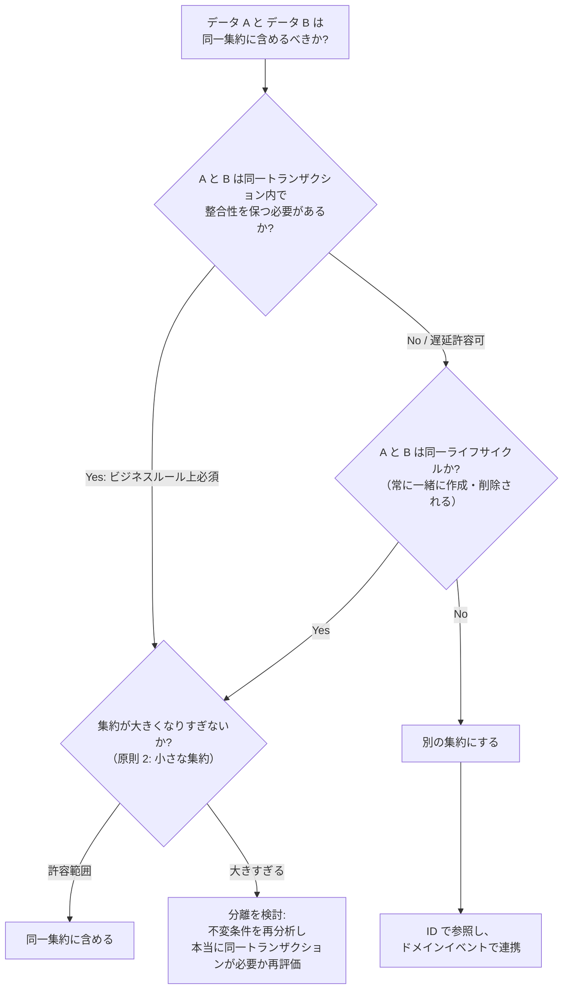

# 設計成果物ガイド

Epic 仕様書（AC）と Task 定義の間に作成する設計成果物の詳細定義。

## 推奨作成順序

設計成果物には依存関係があり、以下の順序で作成することを推奨する:

<!-- レビュー指摘: 設計ステップの「Phase 1/2/3」がフレームワーク上位概念「Phase」と用語衝突していた。「Step」に改称 -->
```
Step 1: ドメイン設計（ビジネスルールの構造化）
  1. ドメインイベント詳細（Phase 定義のドメインイベント一覧（概要）を詳細化）
  2. ドメインモデル（エンティティ、集約、値オブジェクト）
  3. ドメインロジック設計（ビジネスルール、状態遷移）

Step 2: インターフェース設計（外部境界の定義）
  4. DB スキーマ（論理 → 物理）
  5. API spec
  6. BC 間統合仕様（ACL 変換ルール、イベントペイロード、共有カーネル仕様）
   → G3（設計承認 — 基盤設計）

Step 3: 画面設計（画面系プロジェクトのみ）
  7. 画面設計（モック → 仕様書）
   → G3（設計承認 — 画面設計を含む）
```

画面設計は API spec に依存する（画面のデータソース・操作が API で決まるため）。データフロー設計・コマンド体系設計はプロジェクトタイプに応じて適宜配置する。

## ドメインモデル

| 項目 | 内容 |
|------|------|
| **含めるべき項目** | 集約の一覧（集約ルート、エンティティ、値オブジェクトの名前と責務）、各属性（名前、意味的な型、必須/任意、制約）、集約境界（トランザクション境界）、集約間の関係（ID 参照、多重度）、不変条件 |
| **粒度** | AI が「このエンティティにはどの属性があり、どの集約に属し、他とどう関連するか」を判断できるレベル。メソッドのシグネチャは書かない（ドメインロジック設計の領域） |
| **推奨形式** | Mermaid `classDiagram` で関係を図示 + Markdown テーブルで属性詳細を補足 |
| **AI が迷うポイント** | 集約境界が不明確だと全部を1トランザクションにする。ID 参照 vs 直接参照の指示がないと密結合になる。値オブジェクトとエンティティの区別がないと全て ID 付きエンティティにする |

**エンティティ vs 値オブジェクトの判定基準:**

| 判定基準 | エンティティ | 値オブジェクト |
|---------|------------|-------------|
| **同一性** | ID で識別する（属性が変わっても同一） | 属性の等価性で比較する（同じ属性なら交換可能） |
| **ライフサイクル** | 生成・変更・削除のライフサイクルを持つ | ライフサイクルを持たない。変更時は新しいインスタンスを生成 |
| **不変性** | 可変（状態が変化する） | 不変（Immutable）であるべき |
| **例** | ユーザー、注文、商品 | 金額（通貨 + 数値）、住所、期間、メールアドレス |

> AI は明示されないと全てに ID を付与する傾向がある。「この概念は ID なしで属性の組み合わせだけで表現できるか？」が Yes なら値オブジェクト。

## ドメインロジック設計

### AC パターン分類（設計着手前に必須）

ドメインロジック設計を始める前に、全 AC を以下のパターンに分類する。分類結果が各エンティティの設計セクション（Invariants / State Machine / Domain Logic）に何を書くべきかを決定する。

| AC のパターン | 導出されるドメイン要素 | 設計での対応 |
|------------|-------------------|--------------------|
| 「〜できない」「〜でなければならない」 | 不変条件 | エンティティの Invariants セクション |
| 「〜の場合は〜に遷移する」 | 状態遷移 + ガード条件 | State Machine セクション |
| 「〜によって〜が決まる」 | 計算式・決定表 | Domain Logic セクション |
| 「〜された」（過去形・イベント） | ドメインイベント | domain-events.md |
| 「〜を超えてはならない」「〜の形式であること」 | バリデーション | Fields の制約列 |
| 「〜できる」（CRUD・閲覧系） | エンティティ属性・操作 | Fields + Operations |
| 該当なし | — | 理由を明記 |

**AC-ドメイン要素マッピングマトリクス（必須成果物）:**

全 AC について以下のマトリクスを `docs/domain/[epic-slug]-ac-mapping.md` に作成する。未マップ AC が存在する場合は G3 完了不可。

```markdown
| AC-ID | AC 概要 | ドメイン要素 | 要素種別 |
|-------|---------|------------|---------|
| AC-ENNN-01 | [概要] | [エンティティ名.属性 or サービス名] | [不変条件/状態遷移/計算ロジック/イベント/バリデーション/操作] |
```

> **AI が迷うポイント（追加）:** AC パターン分類を行わずに設計を始めると、計算式・ガード条件・不変条件が漏れる。設計前に必ず全 AC を分類し、マッピングマトリクスを作成すること。

| 項目 | 内容 |
|------|------|
| **含めるべき項目** | ビジネスルール一覧（ルール名、条件、正常結果、違反結果）、決定表（条件の組み合わせ × アクション）、計算式（変数名、式、丸め方法、単位）、状態遷移（状態一覧、遷移イベント、ガード条件、遷移時の副作用）、バリデーションの実行レイヤー（入力 / ドメイン / DB） |
| **粒度** | AI が「この操作でどのビジネスルールが適用され、どの条件でどの結果になるか」をコードに変換できるレベル。曖昧な表現（「適切に」「必要に応じて」）は禁止 |
| **推奨形式** | 状態遷移: Mermaid `stateDiagram-v2`。決定表: Markdown テーブル。計算式: 擬似コードまたは数式 |
| **AI が迷うポイント** | 複数ルール適用時の優先順位が未定義だと任意の順序で適用する。計算の丸め方法がないと言語デフォルトを使う。状態遷移の副作用（例: Active にしたとき在庫消費開始）が未記載だとフラグ変更のみ実装する。AC パターン分類を行わずに設計を始めると計算式・ガード条件の漏れが発生する |

**ドメインサービスの識別基準:**

単一の集約に自然に属さないビジネスルールは、ドメインサービスとして設計する。ドメインサービスはステートレスであること（内部状態を持たず、入力のみから結果を導出する）。

| 配置先 | 判断基準 | 例 |
|--------|---------|---|
| **集約のメソッド** | ルールが 1 つの集約の状態のみに依存する | 注文の合計金額上限チェック |
| **ドメインサービス** | ルールが複数の集約にまたがる、または集約に属さない | 口座間の振込処理、在庫引当と注文確定の連携 |
| **アプリケーションサービス** | ドメインロジックではなくユースケースの手順（リポジトリ呼び出し、トランザクション管理、通知送信等） | 注文ユースケース: リポジトリ取得 → ドメイン操作 → 保存 → イベント発行 |

> ドメインサービスはビジネスルールを持つ。アプリケーションサービスはビジネスルールを持たない（オーケストレーションのみ）。この区別を曖昧にすると、ビジネスロジックがアプリケーション層に漏れ出し、テスト困難になる。

## DB スキーマ

| 項目 | 内容 |
|------|------|
| **含めるべき項目** | テーブル一覧（テーブル名、スキーマ、概要）、カラム定義（カラム名、DB 固有型、NULL 許可、デフォルト値、制約）、主キー戦略、外部キー（参照先、ON DELETE 動作）、インデックス（対象カラム、種別、作成理由）、ドメインモデルとのマッピング |
| **粒度** | AI がマイグレーションファイル（DDL）をそのまま生成できるレベル。カラムの型は DB 固有型で指定する |
| **推奨形式** | Mermaid `erDiagram` で関係を図示 + Markdown テーブルでカラム定義 + 複雑な制約のみ SQL コードブロック |
| **AI が迷うポイント** | 論理削除 vs 物理削除の方針がないとテーブルごとにバラバラ。ENUM の表現方法（DB ENUM / VARCHAR+CHECK / 別テーブル）が不統一になる。タイムスタンプのタイムゾーン方針がないと混在する |

**リポジトリパターンと集約のマッピング:**

| 原則 | 説明 |
|------|------|
| **1 集約 = 1 リポジトリ** | 集約ルートごとにリポジトリを 1 つ定義する。集約内部のエンティティ・値オブジェクトは独自のリポジトリを持たない |
| **集約単位で永続化** | リポジトリは集約ルートを丸ごと保存・取得する。集約内部のエンティティだけを個別に取得する操作は提供しない |
| **テーブル ≠ 集約** | 1 つの集約が複数テーブルにまたがってもよい（正規化）。逆に 1 テーブルに複数の集約を格納してはならない |

> AI がドメインモデルから DB スキーマを生成する際、集約境界とテーブル境界が一致しなくてもよいが、リポジトリの I/F は集約単位であることを守ること。

## API spec

| 項目 | 内容 |
|------|------|
| **含めるべき項目** | エンドポイント一覧（メソッド、パス、概要、対応 AC）、リクエスト定義（パラメータ、ボディ、バリデーション制約）、レスポンス定義（ステータスコードごとのボディ）、共通仕様への参照（認証、ページネーション、エラー形式） |
| **粒度** | AI がルーティング定義、リクエストバリデーション、レスポンスシリアライゼーションをそのまま実装できるレベル |
| **推奨形式** | OpenAPI 3.x (YAML) が最も推奨（コード生成にも使える）。過剰な場合は Markdown テーブル |
| **AI が迷うポイント** | エラーレスポンス形式が未統一だとエンドポイントごとに異なる形式になる。ページネーション方式（offset / cursor）が未定義だと混在する。PATCH の未送信フィールドの扱い（変更なし vs null）が不明だと誤実装する |

## デザインシステム

| 項目 | 内容 |
|------|------|
| **含めるべき項目** | カラーパレット（OKLCH、ライト/ダークモード）、Tailwind テーマ統合（`@theme inline`）、タイポグラフィ、スペーシング、角丸・シャドウ・ボーダー、アニメーション、コンポーネントカタログ（shadcn/ui）、アイコン、レスポンシブブレークポイント |
| **粒度** | AI がデザインシステムに準拠したコンポーネントを生成できるレベル。CSS 変数とコンポーネントカタログが揃っていれば十分 |
| **推奨形式** | CSS 変数定義 + Markdown テーブル。テンプレート: `aidd-framework/templates/design/ui-component-arch.md`, `ui-visual-tokens.md`, `ui-patterns.md` |
| **確立タイミング** | G0 マイルストーン（UI 基盤セクション）で `/aidd-setup mocks` を使用してセットアップ。テーマプリセット（`presets/themes/`）から選択し、プロジェクトに合わせてカスタマイズ |
| **AI が迷うポイント** | ダークモード切り替え方式が不明だと独自実装する。カスタムコンポーネントのバリアント定義方法が不明だと CVA を使わずインラインスタイルにする。空状態の表示方法が不明だと空白にする |

## 画面設計

| 項目 | 内容 |
|------|------|
| **含めるべき項目** | 画面一覧（画面名、URL、ペルソナ、対応 AC）、画面遷移図、実働モック参照、コンポーネント構成（コンポーネント名、shadcn/ui ベース、データソース、操作、API 呼び出し）、インタラクション定義（トリガー → アクション → 結果）、状態管理、画面固有の条件分岐（空状態、ローディング、エラー） |
| **粒度** | AI が「この画面にどのコンポーネントがあり、各コンポーネントはどの API を呼び、ユーザー操作にどう応答するか」を判断できるレベル。ピクセル単位のデザインは不要 |
| **推奨形式** | 画面遷移: Mermaid `flowchart`。モック: shadcn/ui + Tailwind CSS v4 による実働モック（`.tsx`）。コンポーネント: Markdown テーブル。テンプレート: `aidd-framework/templates/design/screen-design.md` |
| **推奨フロー** | デザインシステムに基づいてモック構築 → PO 対話的レビュー → モック確定 → 画面仕様書に統合。詳細は `aidd-framework/guides/mock-development.md` を参照 |
| **ゲート** | G3（設計承認）の画面設計セクションで PO + Lead が承認。画面系プロジェクトのみ実施 |
| **AI が迷うポイント** | 楽観的 vs 悲観的更新の方針がないと操作ごとにバラバラ。空状態（データ0件）の表示が未定義だと空白になる。破壊的操作の確認ダイアログの要否が不明だと省略する。フォームバリデーションのタイミングが不明だと onSubmit のみにする |

## データフロー設計

| 項目 | 内容 |
|------|------|
| **含めるべき項目** | フロー概要図（入力元 → 変換 → 出力先）、入力定義（データソース、形式、取得タイミング）、変換処理（各ステップの入出力スキーマ）、出力定義（出力先、書き込み方式）、エラーリカバリ（リトライ / スキップ / 中断）、冪等性の保証方法、実行制御（同時実行制限、タイムアウト） |
| **粒度** | AI が「どのデータソースから何を読み、どう変換し、どこに書くか。失敗したらどうするか」を判断できるレベル |
| **推奨形式** | フロー概要: Mermaid `flowchart`。スキーママッピング: Markdown テーブル。エラーリカバリ: Markdown テーブル |
| **AI が迷うポイント** | 部分失敗時の挙動（コミット or ロールバック）が不明だと全件ロールバックかエラー無視になる。大量データの処理方式（全件メモリ / チャンク / ストリーミング）が未定義だと全件メモリで実装する。既存データとの衝突時の挙動が不明だと上書きする |

## コマンド体系設計

| 項目 | 内容 |
|------|------|
| **含めるべき項目** | コマンド階層（ルート → サブコマンドのツリー）、各コマンド定義（引数、オプション、デフォルト値、必須/任意）、入出力形式（stdout / stderr の使い分け、出力フォーマット切り替え）、終了コード、環境変数、設定ファイルとの優先関係 |
| **粒度** | AI が引数パーサー定義、ヘルプテキスト、入出力処理をそのまま実装できるレベル。各コマンドに使用例を1つ以上含める |
| **推奨形式** | コマンド階層: ツリー構造テキスト。コマンド定義: Markdown テーブル。使用例: コードブロック |
| **AI が迷うポイント** | TTY 接続時とパイプ時の出力形式切り替えの要否が不明だと常に同じ形式。破壊的操作の確認プロンプトの要否が不明だと省略する。設定の優先順位（引数 > 環境変数 > 設定ファイル > デフォルト）が不明だと独自の優先順位を実装する |

---

<!-- WF+DDD統合: 集約設計の 4 原則 + 判断フローチャート -->
## 集約設計の 4 原則

ドメインモデル設計において、集約の境界は最も重要な設計判断である。以下の 4 原則に従う（Vaughn Vernon「Implementing Domain-Driven Design」）。

### 原則

| # | 原則 | 説明 | 違反時のリスク |
|---|------|------|-------------|
| 1 | **真の不変条件のみを境界内に含める** | 「このデータ変更時に、常に同時に整合性を保つ必要があるか？」が Yes のものだけを同一集約に含める | 不必要に大きな集約 → 同時実行時の競合増加、パフォーマンス低下 |
| 2 | **小さな集約を設計する** | 集約は可能な限り小さく保つ。巨大な集約は同時実行時の競合を招く | ロック競合、スケーラビリティの低下、テストの複雑化 |
| 3 | **他の集約へは ID で参照する** | 集約間をオブジェクト参照で結合しない。識別子（ID）のみを保持する | 集約間の密結合、トランザクション境界の曖昧化、コンテキスト間の独立性喪失 |
| 4 | **境界外では結果整合性を使用する** | 他の集約への影響波及はドメインイベントを介して非同期に行う | 不必要に大きなトランザクション、分散トランザクションの複雑化 |

### 判断フローチャート

集約の境界を判断する際は、以下のフローに従う:



### サブドメイン種別との連動

| サブドメイン | 4 原則の適用レベル | ドメインモデルの深度 |
|------------|-----------------|------------------|
| **コア** | 厳格に適用。全集約で 4 原則をレビュー（G3 必須チェック） | リッチドメインモデル: 集約ルート、値オブジェクト、不変条件を詳細に定義 |
| **支援** | 原則 1, 3 を適用。原則 2, 4 は推奨 | 標準モデル: エンティティ、関係、主要なビジネスルールを定義 |
| **汎用** | 原則 3 を適用（外部サービスとの結合を避ける） | 連携設計のみ: ACL / アダプタの I/F を定義 |

## ドメインイベント詳細仕様の記述ガイド

Phase 定義（G1）で作成したドメインイベント一覧（概要）を、G3 で詳細化する。

### 記述すべき項目

| 項目 | 説明 | 記述例 |
|------|------|--------|
| **ペイロード** | イベントが運ぶデータ。受信側が必要とする最小限のデータに絞る | `{ orderId: string, totalAmount: number, currency: string }` |
| **順序保証** | 同一集約の複数イベントに順序が必要か | 「同一注文 ID 内では発行順を保証」 |
| **冪等性** | 同一イベントが複数回配信された場合の処理方針 | 「イベント ID による重複排除」 |
| **配信保証** | at-least-once / at-most-once / exactly-once | 「at-least-once（受信側で冪等処理）」 |

### 設計上の注意点

- イベントのペイロードに**集約の内部状態を全て含めない**。受信側が必要なデータのみを含める
- イベント名は**過去形**で命名する（例: `OrderPlaced`, `PaymentCompleted`）
- イベントのスキーマ変更は**後方互換性**を保つ。破壊的変更はバージョニングで管理する

## BC 間統合仕様の記述ガイド

コンテキストマップで定義した統合パターンを、G3 で具体的な I/F 仕様に詳細化する。

### 統合パターン別の記述内容

| 統合パターン | 記述すべき内容 | 成果物の例 |
|------------|-------------|----------|
| **ACL（防腐層）** | 変換ルール（外部モデル → 内部モデル）、マッピングテーブル、エラー時のフォールバック | `adapter/external-order-translator.ts` の設計 |
| **OHS（公開ホストサービス）** | API spec（OpenAPI）、認証方式、レート制限、バージョニング方針 | `api-spec-shared-product.yaml` |
| **イベント駆動** | イベントペイロード、トピック/キュー設計、配信保証、リトライ方針 | ドメインイベント詳細仕様に統合 |
| **共有カーネル** | 共有スキーマ、変更管理ルール（誰が変更権限を持つか）、テスト戦略 | `shared/kernel/` ディレクトリの設計 |

### 配置先

BC 間統合仕様は `docs/design/` に配置する:

```
docs/design/
├── integration-[upstream]-[downstream].md  ← 統合仕様（BC ペアごと）
└── ...
```

### 記述テンプレート

```markdown
# BC 間統合仕様: [上流 BC] → [下流 BC]

| 項目 | 内容 |
|------|------|
| 統合パターン | <!-- ACL / OHS / イベント駆動 / 共有カーネル --> |
| 通信方式 | <!-- REST API / メッセージキュー / gRPC --> |
| 上流の責務 | <!-- 何を提供するか --> |
| 下流の責務 | <!-- 何を変換・処理するか --> |

## データマッピング

| 上流モデル | 下流モデル | 変換ルール |
|-----------|-----------|----------|
| <!-- フィールド --> | <!-- フィールド --> | <!-- 変換ロジック --> |

## エラーハンドリング

| エラー状況 | 対応方針 |
|-----------|---------|
| 上流が応答しない | <!-- タイムアウト、リトライ、フォールバック --> |
| データ変換エラー | <!-- ログ、通知、スキップ --> |
```
