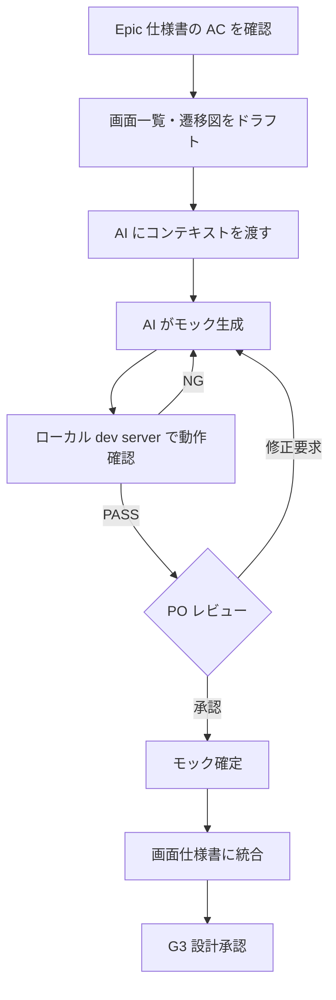

# モック構築ガイド

AI との対話で shadcn/ui + Tailwind CSS v4 ベースの実働モックを構築し、画面仕様書に統合するまでのフローを定義する。

## 前提条件

- G0 マイルストーン（UI 基盤セクション）が完了していること
  - デザインシステム定義が完成している
  - shadcn/ui + Tailwind CSS v4 がセットアップ済み（`/aidd-setup mocks` 実行済み）
  - テーマプリセットが適用済み
- 基盤設計（G3 マイルストーン: `/aidd-new-epic` Step 2-3）が承認済みであること
  - API 仕様が確定している（画面のデータソース・操作が明確）
  - ドメインモデルが確定している（表示するデータ構造が明確）

## モック構築フロー



### Step 1: AC から画面構成を導出する

Epic 仕様書の AC を読み、以下を整理する:

1. **必要な画面の洗い出し** — 各 AC が「どの画面で」実現されるかをマッピング
2. **画面一覧の作成** — 画面設計テンプレート（`aidd-framework/templates/design/screen-design.md`）のセクション 1 に記入
3. **画面遷移図の作成** — Mermaid flowchart で画面間の遷移を図示

### Step 2: AI にコンテキストを渡す

モック生成の品質は**渡すコンテキストの質**で決まる。以下の 3 点セットを AI に渡す:

#### 2-1. デザインシステムと UI テンプレート

デザインシステム定義（`design-system.md`）から以下を抽出して渡す:

- テーマプリセット（`presets/themes/`）とプロジェクト固有カスタマイズ
- デザイン原則と「AI が迷うポイント」の方針
- スペーシング・角丸・シャドウのルール

また、**コンポーネントカタログ**（`ui/catalog.json`）を参照し、画面の性質に合うコンポーネントをベースにモックを構築する。コンポーネントをコピーしてカスタマイズすることで、デザインシステムに準拠したモックを効率的に作成できる。

#### 2-2. API 仕様（データ構造）

API 仕様書から対象画面に関連する部分を抽出:

- エンドポイント一覧（この画面が呼ぶ API）
- レスポンスのデータ構造（画面に表示するフィールド）
- エラーレスポンスの形式

#### 2-3. Epic 仕様書（AC）

対象画面に関連する AC を抽出:

- 正常系のシナリオ
- エラー系のシナリオ
- バリデーションルール

### `/aidd-mock` スキルで自動化

Step 3〜6 は `/aidd-mock` スキルで対話的に自動化できる。Epic AC の読み込みからテンプレート推薦、カスタマイズ、全状態カバレッジ、ローカル確認、PO レビュー準備までを一気通貫で実行する。

### Step 3: AI との対話でモックを構築する

#### プロンプトテンプレート

```markdown
## モック生成依頼

### 対象画面
- 画面名: [画面名]
- URL: [パス]
- ペルソナ: [ペルソナ名]

### 対応する AC
[AC をここに貼る]

### デザインシステム
[CSS 変数、@theme inline、コンポーネントカタログをここに貼る]

### データ構造
[API レスポンスのスキーマをここに貼る]

### 要求事項
- shadcn/ui コンポーネントとTailwind CSS v4 ユーティリティで構築すること
- デザインシステムの CSS 変数を使用すること（ハードコードしない）
- レスポンシブ対応（モバイルファースト）
- ダークモード対応
- 以下の状態を全て含めること:
  - データ表示状態（サンプルデータ付き）
  - 空状態（データ 0 件）
  - ローディング状態
  - エラー状態
```

#### 対話的な改善

モックは一発で完成しない。以下のサイクルで育てる:

1. **初回生成** — 大枠のレイアウトとコンポーネント配置
2. **データ確認** — サンプルデータで表示が正しいか確認
3. **PO に方向性を確認（推奨）** — 大枠のレイアウトとデータ表示が意図通りか、早期にフィードバックを得ることで手戻りを最小化する
4. **インタラクション追加** — ボタンクリック、フォーム送信等の動作
5. **状態網羅** — 空状態、ローディング、エラー表示の追加
6. **レスポンシブ調整** — モバイル表示の確認・修正
7. **ダークモード確認** — ダークモードでの表示確認

### Step 4: ローカル dev server で動作確認する（PO レビュー前必須）

PO に共有する前に、必ずローカル dev server で動作を確認する。未確認のまま共有すると、基本的な表示バグに PO の時間を使わせることになる。

```bash
# mocks/ の dev server を起動
task mocks:dev
# → http://localhost:3001 で確認
```

以下をチェックする:

- [ ] ページが正常に表示される（ブラウザコンソールエラーなし）
- [ ] サンプルデータが意図通り表示される
- [ ] 主要なインタラクション（ボタンクリック・フォーム入力等）が動作する
- [ ] レスポンシブ: モバイル幅（375px）でレイアウトが崩れない
- [ ] ダークモード切り替えで表示が崩れない
- [ ] 空状態・ローディング・エラー状態が表示される

全項目 PASS 後に Step 5（PO レビュー）へ進む。NG があった場合は Step 3 の対話的改善サイクルに戻って修正する。詳細は `aidd-framework/guides/local-verification.md` を参照。

### Step 5: PO レビュー

構築したモックを PO に提示し、以下を確認する:

- AC の意図通りの画面構成になっているか
- ユーザーフローが自然か
- 情報の優先順位（何を目立たせるか）が正しいか
- 不足している画面・機能はないか

PO からのフィードバックを受けて修正 → 再レビューを繰り返す。

### Step 6: 画面仕様書に統合する

モックが確定したら、画面設計テンプレート（`aidd-framework/templates/design/screen-design.md`）に統合する:

1. **モック参照の記入** — 実働モックのファイルパスとスクリーンショットを記載
2. **コンポーネント構成の記入** — モックで使用したコンポーネントを表に転記
3. **インタラクション定義の記入** — モックで実装した操作をトリガー→アクション→結果の形式で記載
4. **状態管理の記入** — モックで管理している状態を一覧化
5. **条件分岐の記入** — 空状態・ローディング・エラー等の表示条件を記載

## Tailwind 活用パターン集

### カードレイアウト

一覧表示の基本パターン。グリッドで並べ、ホバーで浮遊感を出す。

```html
<!-- カードグリッド -->
<div class="grid grid-cols-1 gap-6 sm:grid-cols-2 lg:grid-cols-3">
  <!-- カード -->
  <div class="rounded-xl border bg-card p-6 shadow-sm transition-shadow hover:shadow-md">
    <h3 class="text-lg font-semibold text-card-foreground">タイトル</h3>
    <p class="mt-2 text-sm text-muted-foreground">説明文</p>
    <div class="mt-4 flex items-center gap-2">
      <Badge>ステータス</Badge>
    </div>
  </div>
</div>
```

### ヒーローセクション

ランディングページや機能紹介の冒頭。中央揃え + 大きなタイポグラフィ。

```html
<section class="flex min-h-[60vh] flex-col items-center justify-center gap-6 px-4 text-center">
  <h1 class="text-4xl font-bold tracking-tight sm:text-5xl lg:text-6xl">
    見出しテキスト
  </h1>
  <p class="max-w-2xl text-lg text-muted-foreground">
    説明文。適度な max-width で読みやすさを確保。
  </p>
  <div class="flex gap-4">
    <Button size="lg">プライマリ CTA</Button>
    <Button size="lg" variant="outline">セカンダリ CTA</Button>
  </div>
</section>
```

### フォームレイアウト

入力フォームの基本構成。ラベル + 入力 + エラーメッセージの3層。

```html
<form class="mx-auto max-w-md space-y-6">
  <!-- フィールド -->
  <div class="space-y-2">
    <Label htmlFor="email">メールアドレス</Label>
    <Input id="email" type="email" placeholder="user@example.com" />
    <!-- エラー時 -->
    <p class="text-sm text-destructive">有効なメールアドレスを入力してください</p>
  </div>

  <!-- フィールドグループ（横並び） -->
  <div class="grid grid-cols-2 gap-4">
    <div class="space-y-2">
      <Label htmlFor="first-name">姓</Label>
      <Input id="first-name" />
    </div>
    <div class="space-y-2">
      <Label htmlFor="last-name">名</Label>
      <Input id="last-name" />
    </div>
  </div>

  <Button type="submit" class="w-full">送信</Button>
</form>
```

### データテーブル

一覧データの表示。ソートヘッダー + アクション列。

```html
<div class="rounded-xl border">
  <Table>
    <TableHeader>
      <TableRow>
        <TableHead class="w-[200px]">名前</TableHead>
        <TableHead>ステータス</TableHead>
        <TableHead class="text-right">金額</TableHead>
        <TableHead class="w-[100px]">操作</TableHead>
      </TableRow>
    </TableHeader>
    <TableBody>
      <TableRow>
        <TableCell class="font-medium">項目名</TableCell>
        <TableCell><Badge variant="outline">有効</Badge></TableCell>
        <TableCell class="text-right">¥1,000</TableCell>
        <TableCell>
          <DropdownMenu>
            <DropdownMenuTrigger asChild>
              <Button variant="ghost" size="icon"><MoreHorizontal class="size-4" /></Button>
            </DropdownMenuTrigger>
            <DropdownMenuContent align="end">
              <DropdownMenuItem>編集</DropdownMenuItem>
              <DropdownMenuItem class="text-destructive">削除</DropdownMenuItem>
            </DropdownMenuContent>
          </DropdownMenu>
        </TableCell>
      </TableRow>
    </TableBody>
  </Table>
</div>
```

### ナビゲーション + サイドバー

ダッシュボード系の基本レイアウト。Sidebar + メインコンテンツ。

```html
<div class="flex min-h-screen">
  <!-- サイドバー -->
  <aside class="hidden w-64 border-r bg-sidebar p-6 md:block">
    <nav class="space-y-2">
      <a href="#" class="flex items-center gap-3 rounded-lg bg-sidebar-accent px-3 py-2 text-sm font-medium text-sidebar-accent-foreground">
        <Home class="size-4" /> ダッシュボード
      </a>
      <a href="#" class="flex items-center gap-3 rounded-lg px-3 py-2 text-sm text-sidebar-foreground hover:bg-sidebar-accent">
        <Settings class="size-4" /> 設定
      </a>
    </nav>
  </aside>

  <!-- メインコンテンツ -->
  <main class="flex-1 p-6 lg:p-8">
    <h1 class="text-2xl font-semibold">ページタイトル</h1>
    <div class="mt-6">
      <!-- コンテンツ -->
    </div>
  </main>
</div>
```

### 空状態

データが 0 件のときの表示。アイコン + メッセージ + CTA。

```html
<div class="flex min-h-[400px] flex-col items-center justify-center gap-4 rounded-xl border border-dashed p-8 text-center">
  <div class="rounded-full bg-muted p-4">
    <Inbox class="size-8 text-muted-foreground" />
  </div>
  <div class="space-y-1">
    <h3 class="text-lg font-semibold">データがありません</h3>
    <p class="text-sm text-muted-foreground">最初のアイテムを作成してください。</p>
  </div>
  <Button>
    <Plus class="size-4" /> 新規作成
  </Button>
</div>
```

### ローディング状態（Skeleton）

データ取得中のプレースホルダー表示。

```html
<!-- カード Skeleton -->
<div class="rounded-xl border bg-card p-6">
  <Skeleton class="h-5 w-2/3" />
  <Skeleton class="mt-2 h-4 w-full" />
  <Skeleton class="mt-2 h-4 w-4/5" />
  <div class="mt-4 flex gap-2">
    <Skeleton class="h-6 w-16 rounded-full" />
  </div>
</div>

<!-- テーブル Skeleton -->
<div class="space-y-3">
  <Skeleton class="h-10 w-full" />
  <Skeleton class="h-10 w-full" />
  <Skeleton class="h-10 w-full" />
</div>
```

## レスポンシブパターン

### モバイル → デスクトップの基本戦略

```html
<!-- スニペット: 各パターンの Tailwind クラス適用例 -->

<!-- 1列 → 2列 → 3列 グリッド -->
<div class="grid grid-cols-1 gap-6 sm:grid-cols-2 lg:grid-cols-3">

<!-- モバイルで非表示、デスクトップで表示 -->
<div class="hidden md:block">

<!-- モバイルで縦積み、デスクトップで横並び -->
<div class="flex flex-col gap-4 md:flex-row">

<!-- モバイルでフル幅、デスクトップで制限幅 -->
<div class="w-full md:max-w-md lg:max-w-lg">
```

### Container Queries

コンポーネント単位のレスポンシブ対応。親コンテナのサイズに応じて変化する。

```html
<!-- コンテナ定義 -->
<div class="@container">
  <!-- コンテナ幅に応じたレイアウト変更 -->
  <div class="flex flex-col gap-4 @md:flex-row @md:items-center">
    <div class="flex-1">コンテンツ</div>
    <div>アクション</div>
  </div>
</div>
```

## ダークモードパターン

shadcn/ui の CSS 変数ベースのテーマを使えば、ほとんどのケースは自動対応する。手動対応が必要なケース:

```html
<!-- 画像の明暗切り替え -->


<!-- ダークモードで異なるシャドウ -->
<div class="shadow-sm dark:shadow-none dark:ring-1 dark:ring-border">

<!-- ダークモードで異なる背景 -->
<div class="bg-gradient-to-b from-muted/50 to-background">
```

## アニメーション・トランジション活用

```html
<!-- ホバートランジション（カード） -->
<div class="transition-all duration-200 hover:-translate-y-1 hover:shadow-md">

<!-- フェードイン（ページ遷移時） -->
<div class="animate-in fade-in duration-300">

<!-- スライドイン（サイドパネル） -->
<div class="animate-in slide-in-from-right duration-300">

<!-- パルス（通知バッジ） -->
<span class="relative flex size-3">
  <span class="absolute inline-flex size-full animate-ping rounded-full bg-primary opacity-75"></span>
  <span class="relative inline-flex size-3 rounded-full bg-primary"></span>
</span>
```

## モック管理

### モックと本番コードの分離戦略

モックと本番コードは**完全に分離する**。

| | モック（PM 担当） | 本番コード（EG 担当） |
|---|---|---|
| 配置先 | `mocks/` | `src/` |
| 目的 | PO/顧客と画面仕様を合意する | AC を満たす実装 |
| 品質基準 | 見た目とインタラクションが正しい | AC 準拠、テスト通過、規約遵守 |
| API 接続 | 不要（サンプルデータ） | 必須 |

**分離の理由:**
- PM が `mocks/` で自由に試行錯誤しても本番コードに影響ゼロ
- EG はモックを「画面仕様書の添付物」として参照し、`src/` に実装
- git の diff/blame が汚れない（モック修正と本実装が混ざらない）

### ファイル配置

```
mocks/                          # モック専用ディレクトリ（自己完結、本番コードと完全分離）
  package.json                  # Next.js + Storybook セットアップ
  next.config.ts
  .storybook/                   # Storybook 設定
  app/
    globals.css                 # デザインシステムの CSS 変数
    layout.tsx
    [epic-slug]/
      [screen-name]/
        page.tsx                # モック画面
        mock-data.ts            # サンプルデータ
  components/
    ui/                         # shadcn/ui コンポーネント（mocks/ 内に独立インストール）
  templates/                    # FW テンプレート（/aidd-setup mocks でコピー）
    catalog.json                # AI 向けテンプレートメタデータ
    layouts/
    pages/
    components/
  stories/                      # Storybook Stories
  screenshots/
    [epic-slug]/
      [screen-name]-desktop.png
      [screen-name]-mobile.png
      [screen-name]-dark.png
```

**ポイント:**
- `mocks/` は自己完結の環境。`src/` への依存はない
- `mocks/` は独立した Next.js プロジェクトとして `cd mocks && pnpm dev` で起動（ポート 3001）
- Storybook は `cd mocks && pnpm storybook` で独立起動（ポート 6006）
- 本番コード（`src/`）にモックは一切含まれない

### セットアップ

`/aidd-setup mocks` スキルがモック環境をセットアップする:

1. `mocks/` に独立した Next.js + shadcn/ui をセットアップ
2. Storybook を mocks/ 内にセットアップ
3. FW テンプレートを `mocks/templates/` にコピー
4. デザインシステムの CSS 変数を `mocks/app/globals.css` に配置

### 顧客共有

モックを PO/顧客に共有する方法を**G0 マイルストーン（UI 基盤セクション）の時点で決定する**。

#### 推奨: Vercel Preview

```bash
# mocks/ ディレクトリを Vercel プロジェクトとして接続
cd mocks && vercel
```

- PR ごとにプレビュー URL が自動生成される
- 顧客に URL を渡すだけで操作可能
- パスワード保護（Vercel Pro）で公開範囲を制御

#### 代替パターン

| 方法 | ユースケース |
|------|------------|
| **Cloudflare Pages** | Vercel が使えない場合。無料枠が広い |
| **GitHub Pages** | 静的エクスポート（`next export`）で十分な場合 |
| **スクリーンショット + 操作動画** | ホスティング環境がない場合の最低限。Issue や Slack に添付 |
| **ローカル起動 + 画面共有** | 即席の同期レビュー |

### モックの品質基準

モックは「プロトタイプ」であり「本番コード」ではない。以下の基準を満たせば十分:

- [ ] デザインシステムの CSS 変数を使用している（色のハードコードなし）
- [ ] shadcn/ui コンポーネントをベースにしている
- [ ] サンプルデータで表示が確認できる
- [ ] 主要なインタラクション（ボタンクリック、フォーム送信等）が動作する
- [ ] レスポンシブ（モバイル / デスクトップ）で表示が崩れない
- [ ] ダークモードで表示が崩れない

以下は**不要**:
- API との実接続
- 完全なバリデーション実装
- パフォーマンス最適化
- テストコード
