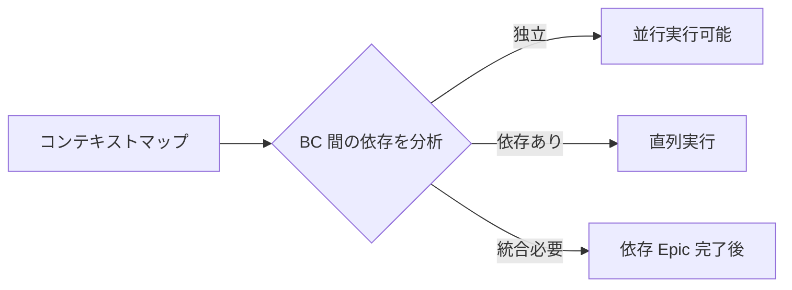

# スケーリングガイド: AI エージェント群による並行開発

## このガイドの目的

FRAMEWORK.md の「AI エージェント協調モデル」と「スケーリング戦略」を、実際のプロジェクトで運用するための実践ガイド。チーム規模やプロジェクト特性に応じた並行開発パターンとベストプラクティスを提供する。

## 前提知識

<!-- レビュー指摘: 前提知識の参照がプレーンテキストでリンクが未設定だった -->
- [FRAMEWORK.md の「ロールと AI モード」](../FRAMEWORK.md#ロールと-ai-モード)を理解していること
- [FRAMEWORK.md の「マイルストーン」](../FRAMEWORK.md#マイルストーン)を理解していること
- DDD の基本概念（BC、集約、コンテキストマップ）を理解していること

---

## 1. チーム構成パターン

プロジェクトの規模と特性に応じて、以下の構成パターンから選択する。

### パターン A: ソロ + AI（1名）

```
人間（PO/TL 兼務）
  └── AI エージェント（全4モード兼務）
        ├── 生成: 仕様書・設計の成果物生成
        ├── 実装: コード・テスト生成
        ├── レビュー: /aidd-epic-review による一次検証
        └── オーケストレーション: /aidd-next による次アクション提案
```

**特徴:**
- 人間がボトルネック（レビュー帯域が律速）
- 並行度: 2-3 Task（Worktree 並行）
- マイルストーン判定: セルフチェック + AI レビュー補完
- 最も重要な規律: G2（Epic 仕様書承認）を手抜きしない

**推奨ワークフロー:**
1. AI に成果物を生成させている間に、別の Task の PR レビューを行う
2. 実装は AI に任せ、人間は次の Epic / Task の仕様準備に集中する
3. レビューは AI 一次判定（`/aidd-epic-review`）で MUST FIX を先に解消し、人間は設計判断のみに集中

### パターン B: 小規模チーム + AI（2-3名）

```
PO（1名）
TL（1-2名）
  └── AI エージェント群
        ├── Epic A 担当エージェント（Worktree A）
        ├── Epic B 担当エージェント（Worktree B）
        └── レビューエージェント（/aidd-epic-review）
```

**特徴:**
- Epic レベルの並行実行が可能
- 並行度: 3-5 Task（Epic 並行含む）
- マイルストーン判定: G2 は PO + TL のペアレビュー必須。G5 は AI 一次 + TL 承認
- 人間の役割分担: PO がビジネス判断、TL が技術判断

**推奨ワークフロー:**
1. Phase 定義時にコンテキストマップを作成し、独立した BC を特定する
2. 独立 BC の Epic を並行して AI に実装させる（各 Epic に Worktree を割り当て）
3. TL は並行 PR のレビューに集中。PO は次の Phase / Epic の仕様準備

### パターン C: 中規模チーム + AI（4名以上）

```
PO（1名）
TL（2名以上）
  └── AI エージェント群
        ├── BC「注文」チーム: 設計AI + 実装AI + レビューAI
        ├── BC「在庫」チーム: 設計AI + 実装AI + レビューAI
        ├── BC「決済」チーム: 設計AI + 実装AI + レビューAI
        └── オーケストレーター: 依存関係管理・統合調整
```

**特徴:**
- BC 単位のエージェントチーム編成
- 並行度: Epic 単位（BC ごとに独立実行）
- マイルストーン判定: 全マイルストーンでロール分担。G3 は AI 自動判定
- 人間の役割: PO が設計判断・ビジネス判断、TL が統合品質に集中

**推奨ワークフロー:**
1. Phase 定義でコンテキストマップを作成し、BC ごとにエージェントチームを割り当てる
2. 各 BC チームが独立して Epic を進行（G2 → G3 → G4 → G5 → G6）
3. BC 間統合 Epic は依存 Epic の G6 通過後に着手
4. TL は BC 間の設計整合性レビューに集中

---

## 2. 並行実行の実践手順

### Step 1: コンテキストマップから並行実行計画を導出

Phase 定義（G1）で作成したコンテキストマップを元に、並行実行可能な Epic を特定する。



**判定ルール:**
- BC 間に統合パターンが「別々の道」→ 完全並行可
- BC 間が「イベント駆動」→ イベント I/F を先に合意すれば並行可
- BC 間が「ACL」→ 上流 BC の API が確定すれば下流は並行可（ACL でモック化）
- BC 間が「共有カーネル」→ 共有部分を先に実装し、その後並行可
- BC 間が「パートナーシップ」→ 直列推奨（リリースタイミングの同期が必要）

### Step 2: Worktree の準備

```bash
# Epic A（BC: 注文）の最初の Task
task wt:create BRANCH=feature/TASK-001-order-crud

# Epic B（BC: 在庫）の最初の Task（並行実行）
task wt:create BRANCH=feature/TASK-004-inventory-crud
# → /tmp/<project>-feature/TASK-001-order-crud、/tmp/<project>-feature/TASK-004-inventory-crud に作成され、mise install まで自動実行される
```

### Step 3: 並行実行の監視

並行実行中は以下を定期的に確認する:

| 確認項目 | 頻度 | 方法 |
|---------|------|------|
| コンフリクトの兆候 | 各 PR 作成時 | `git diff main...HEAD --name-only` で変更ファイルの重複をチェック |
| マージ順序 | PR レビュー時 | 依存関係に基づき先行 Task から順にマージ |
| main ブランチの健全性 | 各マージ後 | CI が全パスしていることを確認 |
| BC 間 I/F の変更 | Epic 進行中 | 設計成果物（API spec、イベント定義）の変更を検知 |

### Step 4: マージとコンフリクト解決

並行実行した Task のマージは以下の順序で行う:

1. **依存のない Task から先にマージ** — 共通ライブラリ、ドメインモデルなど
2. **同一 BC 内は定義順にマージ** — Task 定義の依存関係に従う
3. **BC 間統合 Task は最後にマージ** — 依存する全 BC の Task がマージ済みであること

**コンフリクト発生時:**
- 軽微なコンフリクト（import 文、設定ファイル等）: AI に解決させる
- 設計レベルのコンフリクト（同一ドメイン概念の異なる実装）: 人間が判断し、必要に応じて ADR を作成

---

## 3. AI 判定レベル別の運用ガイド

### G3（Task 承認）: AI 自動判定

G3 は以下の全項目を機械的に検証可能であり、AI 自動判定の対象とする。

**AI が検証する項目:**
- [ ] Task が 1 PR で完結する粒度か（変更行数・ファイル数の推定）
- [ ] 全 AC が Task にカバーされているか（AC-ID の追跡）
- [ ] Task 間の依存関係に循環がないか
- [ ] AI への指示コンテキストがコンテキストウィンドウに収まるか

**人間の抜き打ち確認:**
- 3-5 Task に 1 回程度、AI の判定結果をサンプルチェックする
- AI が見逃しやすいポイント: ドメイン概念の分割が業務フローに沿っているか

### G5（PR レビュー）: AI 一次判定 + 人間承認

**AI 一次判定のフロー:**
```
/aidd-epic-review 実行
  → MUST FIX が 0 件: 人間レビューに進む
  → MUST FIX が 1 件以上: AI または人間が修正 → 再度 /aidd-epic-review
```

**人間が確認すべきポイント（AI では判定困難な項目）:**
- ドメインモデルの設計意図が正しく実装されているか
- エッジケースの処理が業務ルールに合致しているか
- パフォーマンスへの影響（N+1 クエリ、不必要なデータ読み込み等）
- セキュリティ上の懸念（認可チェック漏れ、入力値のサニタイズ等）

### その他のマイルストーン: AI 支援

G0、G1、G2、G3、G4、G6 では AI はあくまで支援役。以下のように活用する:

| マイルストーン | AI の活用方法 |
|--------|-------------|
| G0 | CHARTER の形式チェック、用語集の網羅性確認 |
| G1 | Phase 定義書の形式チェック、Epic 間依存関係の矛盾検出、ドメイン分析成果物の整合性 |
| G2 | AC 品質基準 6 条件の機械的チェック、Epic 間の AC 重複検出 |
| G3 | 設計成果物間の整合性チェック（ドメインモデル ↔ DB スキーマ ↔ API spec） |
| G4 | AC → Task のカバレッジ 100% 自動検証、Task 間依存関係の循環検出 |
| G6 | E2E テストの全件パス確認、AC カバレッジの自動検証、メトリクス収集、成功基準の達成状況レポート |

---

## 4. ベストプラクティス

### やるべきこと

- **コンテキストマップを最初に作る。** 並行実行の成否は BC 境界の明確さで決まる。曖昧な境界は後から必ずコンフリクトを生む
- **用語集を BC 単位で整備する。** 複数エージェントが同時に開発する場合、用語の不統一が命名のバラつきとなって現れる
- **AI レビュー（`/aidd-epic-review`）を G5 の前提条件にする。** MUST FIX 0 件を人間レビューのエントリ条件とすることで、人間のレビュー負荷を大幅に削減できる
- **main ブランチを常にグリーンに保つ。** 並行実行では1つの壊れたマージが全エージェントに波及する。CI チェックを厳格に運用する
- **BC 間の I/F 変更は即座に共有する。** API spec やドメインイベント定義の変更は、影響を受ける全 Epic のエージェントに通知する

### やってはいけないこと

- **同一集約への変更を並行実行しない。** トランザクション境界が同一の Task を並行実行すると、必ずセマンティックコンフリクトが発生する
- **コンテキストマップなしに並行実行を開始しない。** BC 境界が不明確なまま並行実行すると、統合時に大規模なリファクタリングが必要になる
- **AI 自動判定（G3）の結果を一切確認しない。** 抜き打ちチェックを省略すると、AI の判定精度の低下に気づけない
- **人間のレビューを省略しない。** AI 一次判定で MUST FIX 0 件でも、設計判断・ビジネス判断は人間が行う
- **全 Task を同時に並行実行しない。** 並行度はレビュー帯域とコンフリクトリスクで制約される。推奨上限を超えると品質が低下する

---

## 5. トラブルシューティング

### 並行実行で頻繁にコンフリクトが発生する

**原因:** BC 境界が適切でない可能性が高い。複数の Epic が同一のドメイン概念を異なる視点で変更している。

**対策:**
1. コンフリクトが発生するファイルを分析し、共有されているドメイン概念を特定する
2. コンテキストマップを見直し、共有概念のオーナーシップを明確にする
3. 必要に応じて、共有概念を先行 Task として切り出し、後続を直列化する

### AI レビューが同じ指摘を繰り返す

**原因:** 規約ドキュメントまたは CLAUDE.md に十分なパターンが記録されていない。

**対策:**
1. 繰り返される指摘を `/aidd-feedback-recorder` で feedback Issue に記録する
2. feedback Issue の内容を規約ドキュメントに昇格させる
3. CLAUDE.md の「プロジェクト固有の発見事項」に追記する

### 並行 Epic の統合時に設計の不整合が発覚する

**原因:** G3（設計承認）で BC 間の統合仕様が不十分だった。

**対策:**
1. BC 間統合仕様（`docs/design/integration-*.md`）を見直す
2. 統合テストを追加し、I/F の契約を自動検証する
3. 今後の Phase 定義では、BC 間統合 Epic を明示的に計画する

### 人間のレビューがボトルネックになる

**原因:** 並行度が人間のレビュー帯域を超えている。

**対策:**
1. AI 一次判定（`/aidd-epic-review`）の MUST FIX 0 件を前提条件とし、人間は設計判断のみに集中する
2. 並行度を下げる（推奨上限を参照）
3. レビュー対象を絞る: コアドメインの Epic は人間が詳細レビュー、支援/汎用ドメインは AI レビュー + 軽い確認

---

## 6. 段階的スケーリングパス

並行開発は段階的に導入することを推奨する。

```
Level 0: 直列開発（1 Task ずつ）
  → フレームワークの基本プロセスに慣れる

Level 1: Task 並行（同一 Epic 内の独立 Task を Worktree で並行）
  → 並行実行の基本とコンフリクト解決を学ぶ

Level 2: Epic 並行（異なる BC の Epic を並行実行）
  → コンテキストマップベースの並行計画を実践する

Level 3: BC チーム運用（BC ごとにエージェントチームを編成）
  → 大規模開発のフル並行実行
```

各レベルの移行基準:
- **Level 0 → 1:** Phase 1 を完了し、G5 の初回パス率が 50% 以上
- **Level 1 → 2:** コンテキストマップが整備され、BC 間の I/F が安定
- **Level 2 → 3:** 4名以上のチーム、かつ 3 BC 以上の独立した並行実行実績
