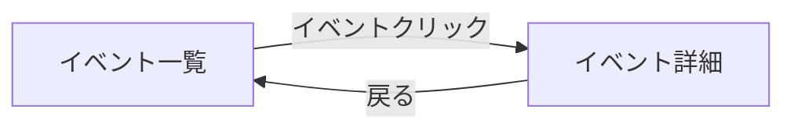

# UI 開発クイックスタート

プロジェクトに UI 開発を導入し、モック構築から画面仕様書完成まで一気通貫で進めるためのステップバイステップガイド。

## 前提

- プロジェクトの CHARTER、技術スタック（ADR）が決まっている（G0 通過済み）
- Epic 仕様書（AC）が書かれている（G2 通過済み）
- 基盤設計（ドメインモデル、DB、API）が完了している（G3 通過済み — `/aidd-new-epic` Step 2-3 で設計統合）

## Step 1: UI 基盤をセットアップする

`/aidd-setup mocks` を実行する。以下が自動で構築される:

1. **mocks/ に React (Next.js) プロジェクト作成**
2. **テーマプリセットの選択・適用**（Neutral / Blue / Green から選択）
3. **shadcn/ui + Tailwind CSS v4 の初期化 + 基本コンポーネント 22 種の一括インストール**
4. **ダークモード（next-themes）の設定**
5. **FW テンプレート 16 種を mocks/templates/ にコピー**
6. **Storybook セットアップ + テンプレート Stories 自動生成**
7. **デザインシステム定義テンプレートの配置**

セットアップ完了後の確認:

```bash
# モック画面
cd mocks && pnpm dev
# → http://localhost:3001

# Storybook
cd mocks && pnpm storybook
# → http://localhost:6006
```

> **参照:** スキルの詳細は `skills/aidd-setup/SKILL.md`（mocks カテゴリ）

## Step 2: デザインシステムを定義する

`docs/design/design-system.md` を開き、プロジェクトに合わせてカスタマイズする。

### 最低限やること

1. **カラーパレットの確認** — テーマプリセットのデフォルト値が入っている。ブランドカラーがある場合は `--primary` を変更

   ```css
   :root {
     --primary: oklch(0.55 0.2 250); /* ブランドカラーに変更 */
   }
   ```

2. **フォントの確認** — デフォルトは Inter。変更する場合はタイポグラフィセクションを更新

3. **コンポーネントカタログの確認** — インストール済みの 22 コンポーネントが一覧されている。プロジェクトで追加が必要なコンポーネントがあれば `pnpm dlx shadcn@latest add [name]` で追加

4. **「AI が迷うポイント」の記入** — 全項目にプロジェクトの方針を記入する。特に重要:
   - ダークモード切り替え方式
   - ローディング状態の表示方法
   - 空状態の表示方法

> **参照:** テンプレートの詳細は `aidd-framework/templates/design/ui-component-arch.md`, `ui-visual-tokens.md`, `ui-patterns.md`

## Step 3: 画面一覧と遷移図を作る

画面仕様書（`aidd-framework/templates/design/screen-design.md`）をコピーして、セクション 1・2 を埋める。

### 3-1. Epic 仕様書の AC から画面を洗い出す

各 AC を読み、「この AC はどの画面で実現されるか」をマッピングする。

**例:**
| AC | 画面 |
|----|------|
| AC-1: ユーザーはイベント一覧を検索できる | S1: イベント一覧 |
| AC-2: ユーザーはイベント詳細を確認できる | S2: イベント詳細 |
| AC-3: ユーザーはチケットを購入できる | S2: イベント詳細（購入フロー） |

### 3-2. 画面一覧テーブルを埋める

```markdown
| # | 画面名 | URL パス | ペルソナ | 対応 AC | モック |
|---|--------|---------|---------|---------|--------|
| S1 | イベント一覧 | `/` | 一般ユーザー | AC-1 | `src/app/page.tsx` |
| S2 | イベント詳細 | `/events/[id]` | 一般ユーザー | AC-2, AC-3 | `src/app/events/[id]/page.tsx` |
```

### 3-3. 画面遷移図を Mermaid で書く



遷移のトリガー（リンククリック、フォーム送信、ブラウザバック等）をラベルに含めること。

## Step 4: モックを構築する

画面ごとに、AI との対話でモックを構築する。

### 4-1. AI にコンテキストを渡す

以下の 3 点セットをプロンプトに含める:

```markdown
## モック生成依頼

### 対象画面
- 画面名: イベント一覧
- URL: /
- ペルソナ: 一般ユーザー

### 対応する AC
AC-1: ユーザーはイベント一覧をキーワードやカテゴリで検索できる。
（AC の全文をここに貼る）

### デザインシステム
（design-system.md の CSS 変数、@theme inline、コンポーネントカタログをここに貼る）

### データ構造
（API 仕様書のレスポンス型をここに貼る）

### 要求事項
- shadcn/ui コンポーネントと Tailwind CSS v4 で構築
- デザインシステムの CSS 変数を使用（ハードコードしない）
- レスポンシブ対応（モバイルファースト）
- ダークモード対応
- 以下の状態を含める: データ表示、空状態、ローディング、エラー
```

### 4-2. 対話的に改善する

1. **初回生成** — 大枠のレイアウトとコンポーネント配置
2. **データ確認** — サンプルデータで表示が正しいか
3. **PO に方向性を確認（推奨）** — 早い段階でフィードバック
4. **インタラクション追加** — ボタンクリック、フォーム送信等
5. **状態網羅** — 空状態、ローディング、エラー
6. **レスポンシブ調整** — モバイル表示
7. **ダークモード確認**

### 4-3. PO レビュー

モックを PO に見せて以下を確認:
- AC の意図通りか
- ユーザーフローが自然か
- 情報の優先順位が正しいか
- 不足している機能はないか

フィードバックを受けて修正 → 再レビューを繰り返す。

> **参照:** パターン集やプロンプトの詳細は `aidd-framework/guides/mock-development.md`

## Step 5: スクリーンショットを撮る

モックが確定したら、Playwright でスクリーンショットを自動撮影する。

### 5-1. Playwright をインストール

```bash
pnpm add -D @playwright/test
npx playwright install chromium
```

### 5-2. スクリーンショットスクリプトを作成

`take-screenshots.ts` をプロジェクトルートに作成:

```typescript
import { chromium } from "@playwright/test";

const BASE = "http://localhost:3001"; // モック環境のポート
const DIR = "./screenshots";

const pages = [
  { name: "screen-name", path: "/path", label: "画面名" },
  // 全画面分を列挙
];

async function main() {
  const browser = await chromium.launch();

  for (const pg of pages) {
    // デスクトップ
    const desktop = await browser.newContext({ viewport: { width: 1280, height: 900 } });
    const dp = await desktop.newPage();
    await dp.goto(`${BASE}${pg.path}`, { waitUntil: "networkidle" });
    await dp.waitForTimeout(500);
    await dp.screenshot({ path: `${DIR}/${pg.name}-desktop.png`, fullPage: true });
    await desktop.close();

    // モバイル
    const mobile = await browser.newContext({ viewport: { width: 390, height: 844 } });
    const mp = await mobile.newPage();
    await mp.goto(`${BASE}${pg.path}`, { waitUntil: "networkidle" });
    await mp.waitForTimeout(500);
    await mp.screenshot({ path: `${DIR}/${pg.name}-mobile.png`, fullPage: true });
    await mobile.close();

    console.log(`✅ ${pg.label}`);
  }

  await browser.close();
}

main().catch(console.error);
```

### 5-3. 実行

```bash
# モック環境を起動した状態で
mkdir -p screenshots
npx tsx take-screenshots.ts
```

`screenshots/` にデスクトップ + モバイルの PNG が生成される。

## Step 6: 画面仕様書を完成させる

画面仕様書の残りのセクションを埋める。モックを見ながら転記する作業。

### 画面ごとに記入するもの

1. **モック参照** — スクリーンショットの Markdown 画像リンクを記入

   ```markdown
   | 種別 | スクリーンショット |
   |------|----------------|
   | デスクトップ |  |
   | モバイル |  |
   ```

2. **コンポーネント構成** — モックで使用したコンポーネントをテーブルに記入

   | # | コンポーネント | shadcn/ui ベース | データソース | 操作 | API 呼び出し |
   |---|---|---|---|---|---|
   | 1 | 検索バー | Input | ユーザー入力 | キーワード検索 | `GET /api/v1/events?q=` |

3. **インタラクション定義** — トリガー → アクション → 結果（正常 + エラー）

4. **フォームバリデーション**（入力フォームがある画面のみ） — フィールドごとの制約・エラーメッセージ・タイミング

   | # | フィールド | 型 | 必須 | 制約 | エラーメッセージ | タイミング |
   |---|---|---|---|---|---|---|
   | 1 | タイトル | string | 必須 | 1〜100文字 | 「タイトルは100文字以内です」 | onBlur |
   | 2 | 本文 | string | 必須 | 1〜50,000文字 | 「本文は50,000文字以内です」 | onSubmit |

   > ドメインモデルは「何が制約か」を定義し、ここでは「制約違反時にユーザーに何を見せるか」を定義する

5. **状態管理** — state の名前、型、スコープ

6. **画面固有の条件分岐** — データ 0 件、ローディング中、エラー、権限分岐

### 画面共通で記入するもの

7. **共通コンポーネント** — ヘッダー、フッター等
8. **画面間のデータフロー** — URL パラメータ、state 等
9. **AI が迷うポイント** — 全項目にプロジェクトの方針を記入
10. **AC カバレッジ** — 各 AC がどの画面・インタラクションでカバーされるか

> **参照:** テンプレートの全セクションは `aidd-framework/templates/design/screen-design.md`

## Step 7: G3 セルフチェック（画面設計）

画面仕様書の末尾にあるセルフチェックリストを全項目確認する:

- [ ] 全画面にモック参照（スクリーンショット）が含まれている
- [ ] 画面遷移図が全画面・全遷移パスを網羅している
- [ ] 全画面のコンポーネント構成が定義されている
- [ ] 全コンポーネントの API 呼び出し先が明記されている
- [ ] 全インタラクションに正常系・エラー系の結果が定義されている
- [ ] フォーム入力がある画面でバリデーション定義（制約、エラーメッセージ、タイミング）が記載されている
- [ ] 画面固有の条件分岐が全画面で定義されている
- [ ] レスポンシブ対応のモバイルスクリーンショットが含まれている
- [ ] 画面間のデータフローが定義されている
- [ ] コンポーネントがデザインシステムのコンポーネントカタログと整合している
- [ ] 全 AC が AC カバレッジでカバーされている
- [ ] AI が迷うポイントの全項目にプロジェクトの方針が記入されている

全項目チェックが通ったら、TL に G3（設計承認）を依頼する。

> **参照:** チェックリストの詳細は `aidd-framework/checklists/g3-design-approval.md`

## 完了後の次のステップ

G3 承認後は `/aidd-decompose-epic` で Task 定義を行う。画面仕様書の各画面を 1PR 単位の Task に分解し、AI に実装を依頼する。

```
G3 承認（設計完了）
  ↓
Task 定義 — 画面ごとに 1PR 単位に分割
  ↓
Epic 分解承認（G4 — AC → Task トレーサビリティ）
  ↓
AI が Task に基づいて実装（G5 — PR レビュー）
  ↓
全 Task 完了 → G6（Phase 完了）
```

## サンプル

実際にこのフローで作成されたサンプルアプリ:

- **ブログシステム:** `aidd-framework/examples/blog-app/` — 5 画面（記事一覧、詳細、作成、編集、ダッシュボード）
- **チケット販売システム:** `aidd-framework/examples/ticket-app/` — 6 画面（イベント一覧、詳細、マイチケット、管理ダッシュボード、イベント管理、イベント作成）+ [スクリーンショット付き画面仕様書](../examples/ticket-app/docs/screen-design.md)
