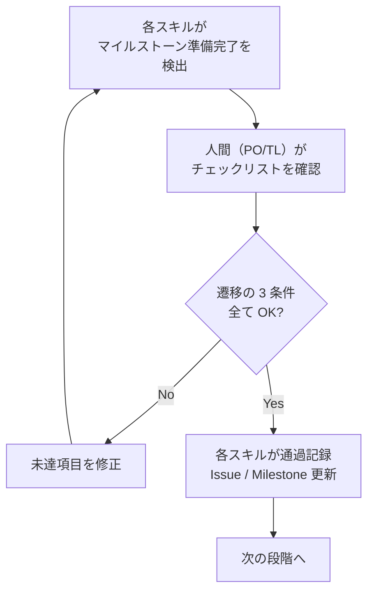

# マイルストーン定義

## 1. マイルストーンの役割

マイルストーンは品質ゲートではない。品質は各スキルが実行時に保証する。マイルストーンの責務は以下の 3 つに限定される。

| 責務 | 説明 |
|------|------|
| **統合確認** | 複数の成果物が揃い、相互に整合しているかを確認する |
| **マイルストーン記録** | 通過事実を GitHub Issue / Milestone に記録し、プロジェクト状態を追跡可能にする |
| **遷移判定** | 次の段階に進む準備が整っているかを判断し、人間の承認を得る |

各スキルが実行時に「AI 補完 → セルフレビュー → ブリーフィング → 人間承認」を完了させている。そのためマイルストーンでは個々の成果物の品質を再検査しない。マイルストーンが確認するのは「全ての成果物が揃い、相互に整合しているか」という統合の観点のみである。

マイルストーン通過に伴う git 操作（ブランチ作成・PR 作成・マージ）のタイミングは [gitflow ガイド](../guides/gitflow.md) に従う。

---

## 2. 遷移の 3 条件

マイルストーンを通過するには、以下の 3 条件を全て満たす必要がある。

| # | 条件 | 責任者 | 検証方法 |
|---|------|--------|---------|
| 1 | **AI 補完完了** — 全成果物で各スキルの AI 補完が完了している | AI（各スキル） | `/aidd-next` が各成果物の補完完了を検証 |
| 2 | **AI レビュー PASS** — 全成果物で AI レビューが PASS している | AI（レビューモード） | `/aidd-next` が各成果物のレビュー PASS を検証 |
| 3 | **人間承認** — 判断者全員が統合結果を承認している | 判断者（PO / TL） | `/aidd-next` が人間に承認を求め、結果を記録 |

**部分的な通過は認めない。** 全条件を満たして初めて次の段階に進む。やむを得ず例外承認する場合は、未達成項目のリスクを明記し、解決 Issue を必ず作成する。

---

## 3. 7 マイルストーン定義

### G0: プロジェクト初期化完了

> **位置付け:** Project Init（一回限り）。プロジェクト基盤を整備し、技術的に着手可能な状態を確認するゲート。Release Planning（G1）の前提となる。

| 項目 | 内容 |
|------|------|
| 旧ゲート | G0 + G0.1 + G0.2 + G0.5 + G0.6 |
| タイミング | プロジェクト最初期 |
| 判断者 | PO + TL |
| 問い | **プロジェクトの方向性が合意され、技術基盤が動作確認済みか?** |

**確認事項:**

| カテゴリ | 項目 | チェックリスト |
|---------|------|--------------|
| プロジェクト憲章 | CHARTER（ビジョン・ビジネスゴール・Phase ロードマップ・スコープ外・非機能要件）が承認済み | [g0](../checklists/g0-initialization.md) |
| 用語集 | 主要なドメイン用語が定義されている | [g0](../checklists/g0-initialization.md) |
| 技術基盤 | 技術スタック ADR、規約ドキュメント群、CI・Git フックが整備済み | [g0](../checklists/g0-initialization.md) |
| Skeleton | 最小 E2E パスが動作確認済み | [g0](../checklists/g0-initialization.md) |
| UI 基盤（画面系のみ） | モック環境・テーマ・デザインシステムがセットアップ済み | [g0](../checklists/g0-initialization.md) |
| UI Skeleton（画面系のみ） | 最小画面が動作確認済み | [g0](../checklists/g0-initialization.md) |
| プロジェクト基盤 | GitHub リポジトリ・Labels・ブランチ保護・SessionStart Hook が設定済み | [g0](../checklists/g0-initialization.md) |

**通過後アクション:**

- CHARTER のステータスを「承認済み」に更新
- GitHub Issue にマイルストーン通過コメントを記録

---

### G1: Phase 定義完了

> **位置付け:** Release Planning。「このマイルストーンで何を作るか」を合意するゲート。G6（phase-review）と対になる。

| 項目 | 内容 |
|------|------|
| 旧ゲート | G1 |
| タイミング | Phase 定義完了時 |
| 判断者 | PO + TL |
| 問い | **このマイルストーンで実現する機能一覧と Epic マッピングの合意があるか？** |

> **Phase 12 で変更（ADR-013）:** Phase 定義書は「機能意図一覧 + Epic マッピング + Won't Have」の3セクション構成に軽量化。ストーリー定義・ドメイン分析は Epic（G2）で行う。

**確認事項:**

| カテゴリ | 項目 | チェックリスト |
|---------|------|--------------|
| 機能意図 | 実現したい機能の一覧が記述されている | [g1](../checklists/g1-phase-definition.md) |
| Epic マッピング | 全機能意図が Epic に割り付けられ、優先度（MUST/WON'T）が合意済み | [g1](../checklists/g1-phase-definition.md) |
| スコープ外 | Won't Have（このPhaseでやらないこと）が明示されている | [g1](../checklists/g1-phase-definition.md) |
| 前 Phase | ADR・feedback Issue・振り返り改善 Issue を確認し、本 Phase への影響を評価済み | [g1](../checklists/g1-phase-definition.md) |

**通過後アクション:**

- Phase 定義書のステータスを「承認済み」に更新
- Milestone にマイルストーン通過コメントを記録（`✅ G1 通過 (日付)`）

---

### G2: Epic 仕様承認

> **位置付け:** Inception（Epic ごと）。機能意図からストーリーを詳細化し AC として承認するゲート。

| 項目 | 内容 |
|------|------|
| 旧ゲート | G2 |
| タイミング | Epic 仕様完了時 |
| 判断者 | PO + TL |
| 問い | **ストーリーと AC が定義・承認されているか？** |

> **Phase 12 で変更（E3: ES-059）:** Phase 定義書にストーリーが含まれなくなったため、Epic 内でストーリーを詳細化する。G2 はストーリー定義 + AC 定義 の承認ゲートになった。

**確認事項:**

| カテゴリ | 項目 | チェックリスト |
|---------|------|--------------|
| ストーリー | ユーザーストーリー一覧が Epic 内で定義されている（Phase 機能意図から詳細化済み） | [g2](../checklists/g2-epic-approval.md) |
| Epic 仕様 | 全 AC が検証可能な形式（AC-ID 付き）。バリデーション・エラーケース・状態遷移が網羅。デモシナリオ記載 | [g2](../checklists/g2-epic-approval.md) |

**通過後アクション:**

- Epic 仕様書のステータスを「承認済み」に更新
- Epic Issue にマイルストーン通過コメントを記録（`✅ G2 通過 (日付)`）

---

### G3: 設計承認

> **位置付け:** Inception 完了（Epic ごと）。設計が完了し Construction に入れる状態かを確認するゲート。

| 項目 | 内容 |
|------|------|
| 旧ゲート | G2.5 + G2.7 |
| タイミング | 設計完了時 |
| 判断者 | TL |
| 問い | **設計が実装可能で、Epic 仕様との整合が取れているか?** |

**G2 + G3 が最も重要なマイルストーン。** ここで AC と設計の品質を担保すれば、G5（PR レビュー）は AC 準拠の確認が中心になり、レビューコストが大幅に下がる。

**確認事項:**

| カテゴリ | 項目 | チェックリスト |
|---------|------|--------------|
| 設計 | ドメインモデル・集約境界・DB スキーマ・API spec が定義済み。Epic 仕様書との整合が取れている | [g3](../checklists/g3-design-approval.md) |
| 画面設計（画面系のみ） | モック画面で PO 合意済み。画面仕様書が完成 | [g3 Section 2](../checklists/g3-design-approval.md) |

**通過後アクション:**

- Epic 仕様書のステータスを「設計済み」に更新
- Epic Issue にマイルストーン通過コメントを記録（`✅ G3 通過 (日付)`）

---

### G4: Epic 分解承認（Task 定義）

> **位置付け:** Construction（Epic ごと）。AC を実装単位（Task = Bolt）に分解し着手可能な状態かを確認するゲート。

| 項目 | 内容 |
|------|------|
| 旧ゲート | G3（Task 定義承認） |
| タイミング | Epic の Task 分解完了時 |
| 判断者 | TL |
| 問い | **AC → Task のトレーサビリティが完全で、実装着手可能か?** |

**確認事項:**

| カテゴリ | 項目 | チェックリスト |
|---------|------|--------------|
| Task 分解 | 全 Task が実装単位に分解済み。AC → Task の全カバレッジが確認済み（漏れなし） | [g4](../checklists/g4-epic-decompose.md) |
| 依存関係 | Task 間依存関係が整理済み（循環なし）。E2E 検証 Task が含まれている | [g4](../checklists/g4-epic-decompose.md) |
| トレーサビリティ | ストーリー → Epic → AC → Task のトレーサビリティが完全 | [g4](../checklists/g4-epic-decompose.md) |
| 実装準備 | 設計成果物（G3 承認済み）との整合性がある。GitHub Issue が全 Task について作成されている | [g4](../checklists/g4-epic-decompose.md) |

**通過後アクション:**

- Epic Issue にマイルストーン通過コメントを記録（`✅ G4 通過 (日付)`）
- 全 Task Issue にマイルストーン通過コメントを記録（`✅ G4 通過 (日付)`）

---

### G5: Epic 総合レビュー

> **位置付け:** Operations（Epic ごと）。Epic の全 Task（Bolt）が完了し AC をすべて満たしているかを確認するゲート。

| 項目 | 内容 |
|------|------|
| 旧ゲート | G4 |
| タイミング | Epic 全 Task 実装完了時 |
| 判断者 | TL |
| 問い | **実装が Epic の全 AC に準拠し、規約を満たしているか?** |

**確認事項:**

`/aidd-review epic` が 3 観点（ビジネス要件・ドキュメント・コード）でチェックを実施し、PASS していること。

| カテゴリ | 項目 |
|---------|------|
| AI レビュー | `/aidd-review epic` が PASS している（`gate:reviewed` ラベル付与済み） |
| AC カバレッジ | Epic の全 AC に対応する実装とテストが存在する |
| 規約準拠 | 規約ドキュメント群の命名規則・実装パターンに従っている |
| CI | 静的解析・型チェック・テスト・ビルドが全て通過 |
| スコープ | Epic のスコープ外の変更が含まれていない |

**通過後アクション:**

- 全 Task 定義のステータスを「完了」に更新
- Epic Issue にマイルストーン通過コメントを記録（`✅ G5 通過 (日付)`）
<!-- レビュー指摘: PR body の Epic 参照と Task close 契約が混在していた -->
- PR body に `Epic: #<Epic Issue番号>` と `Closes #xxx` を記載し、マージ時に全 Task Issue を自動クローズする

---

### G6: Phase 完了

> **位置付け:** Release（Phase ごと・G1 の対）。全 Epic の Operations 完了後にビジネス成果基準を確認するゲート。

| 項目 | 内容 |
|------|------|
| 旧ゲート | G5 + G6 |
| タイミング | Phase の全 Epic 完了時 |
| 判断者 | PO + TL |
| 問い | **Phase のビジネス成果基準を満たしているか?** |

**確認事項:**

| カテゴリ | 項目 | チェックリスト |
|---------|------|--------------|
| Epic 完了 | 全 AC チェック済み（AC-ID カバレッジ 100%）。根拠（PR 番号）が追跡可能 | [g6](../checklists/g6-phase-complete.md) |
| E2E 検証 | Epic AC を直接検証する E2E テストが通過。デモシナリオを PO が実行し確認済み | [g6](../checklists/g6-phase-complete.md) |
| 非機能要件 | 目標値を達成している（定義されている場合） | [g6](../checklists/g6-phase-complete.md) |
| feedback | 全 feedback Issue がクローズまたは判断済み（対応済み / 次 Phase 送り / 見送り） | [g6](../checklists/g6-phase-complete.md) |
| 成功基準 | Phase 定義書のビジネス成果基準が全て達成されている | [g6](../checklists/g6-phase-complete.md) |
| マスタ更新 | 技術スタック・アーキテクチャ概要・DB 設計・`docs/domain/` 成果物が最新状態 | [g6](../checklists/g6-phase-complete.md) |
| レトロスペクティブ | プロセスの振り返りを実施し、改善アクションを Issue 化して次 Phase の Milestone に紐付け | [g6](../checklists/g6-phase-complete.md) |

**通過後アクション:**

- Epic 仕様書のステータスを「完了」に更新、Epic Issue をクローズ
- Phase 定義書のステータスを「完了」に更新
- Milestone にマイルストーン通過コメントを記録（`✅ G6 通過 (日付)`）
- Milestone をクローズ
- Phase 完了検証（`/aidd-review phase`）のドキュメント更新は最後の Epic PR に同梱済み、またはフォールバック PR でマージ済み（[gitflow ガイド](../guides/gitflow.md) 参照）
- Phase クロージング処理（`/aidd-phase-closing`）で Milestone クローズ・G6 通過記録を実行

---

## 4. マイルストーン × スキル対応表

| マイルストーン | 準備スキル | レビュースキル | 通過記録スキル | 補助（任意） |
|-------------|-----------|-------------|-------------|------------|
| **G0** | `/aidd-setup`, `/aidd-skeleton` | 各スキル内蔵 | 人間（PO/TL） | `/aidd-next` |
| **G1** | `/aidd-new-phase` | 各スキル内蔵 | `/aidd-new-phase` | `/aidd-next` |
| **G2** | `/aidd-new-epic` | 各スキル内蔵 | 人間（PO/TL） | `/aidd-next` |
| **G3** | `/aidd-epic-design` | 各スキル内蔵 | 人間（TL） | `/aidd-next` |
| **G4** | `/aidd-decompose-epic` | 各スキル内蔵 | 人間（PO/TL） | `/aidd-next` |
| **G5** | `/aidd-impl` | `/aidd-review epic` | `/aidd-review epic` | `/aidd-next` |
| **G6** | `/aidd-review phase` | — | `/aidd-phase-closing` | `/aidd-next` |

画面系プロジェクトでは以下のスキルが追加される:

| マイルストーン | 追加スキル |
|-------------|-----------|
| **G0** | `/aidd-setup mocks`, `/aidd-ui-skeleton` |
| **G3** | `/aidd-screen-plan`, `/aidd-screen-spec`, `/aidd-screen-ui` |

---

## 5. マイルストーン判定プロセス

マイルストーンの通過判定は**人間（PO/TL）**が行い、通過記録は**各スキルが自身の完了処理**で行う。`/aidd-next` は次のアクション提案のみを担い、判定・記録の責務を持たない。

```
1. 各スキルが前提チェックリストを検証し、準備完了を検出
   → /aidd-next で現在位置を確認（任意）

2. 人間（PO/TL）がチェックリスト（checklists/g*.md）を確認し通過を判断

3. 通過時: 各スキルが GitHub Issue / Milestone に通過コメントを記録
   - G1 → /aidd-new-phase の完了処理
   - G5 → /aidd-review epic の PASS 処理
   - G6 → /aidd-review phase の PASS 処理 + /aidd-phase-closing による通過記録
   - その他 → 人間が手動で記録
```



---

## 6. 旧ゲートからの移行対応表

旧 12 ゲートから新 7 マイルストーンへの対応。

| 旧ゲート | 旧名称 | 新マイルストーン | 備考 |
|---------|--------|---------------|------|
| G0 | プロジェクト憲章 | **G0** | 統合 |
| G0.1 | 技術基盤確立 | **G0** | 統合 |
| G0.2 | Skeleton 検証 | **G0** | 統合 |
| G0.5 | UI 基盤（画面系） | **G0** | 統合。画面系のみ |
| G0.6 | UI Skeleton（画面系） | **G0** | 統合。画面系のみ |
| G1 | Phase 定義承認 | **G1** | 変更なし |
| G2 | Epic 仕様承認 | **G2** | Epic 仕様のみ |
| G2.5 | 設計承認 | **G3** | 新設の設計承認マイルストーン |
| G2.7 | 画面設計承認（画面系） | **G3** | 新設の設計承認マイルストーンに統合。画面系のみ |
| G3 | Task 定義承認 | **G4** | Epic 分解承認として復活。AC → Task のトレーサビリティ承認 |
| G4 | PR レビュー | **G5** | 番号変更 |
| G5 | Epic 完了 | **G6** | 統合 |
| G6 | Phase 完了 | **G6** | 統合 |

**統合の原則:**

| 統合 | 理由 |
|------|------|
| **G0 統合** | プロジェクト初期化は一連の流れで完了する。途中でゲート通過を挟む必要がない |
| **G2 → G2 + G3 分離** | Epic 仕様承認（PO + TL）と設計承認（TL）は判断者と観点が異なる。Epic 仕様は AC の完全性をビジネス視点で、設計は実装可能性を技術視点で判断する |
| **旧 G3 → G4 復活** | Task 定義は各スキルが品質保証するが、AC → Task のトレーサビリティは統合確認が必要。実装着手前に全チェーンの完全性を承認する |
| **G6 統合** | Epic 完了と Phase 完了は累積的な関係にある。全 Epic 完了をもって Phase 完了とする |

**既存チェックリストの扱い:**

`checklists/` ディレクトリの既存ファイルはそのまま維持する。各マイルストーンの判定時に、対応するチェックリストを参照して統合チェックを実行する。
