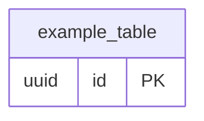

<!-- レビュー指摘: 設計成果物テンプレートが完全に欠落していた -->
<!-- 要件定義: guides/design-artifacts.md「DB スキーマ」セクションを参照 -->
# DB スキーマ設計: [Epic 名]

| 項目 | 内容 |
|------|------|
| ステータス | Draft / Approved |
| Epic 仕様書 | ES-xxx |
| ADR 参照 | ADR-xxx, ADR-yyy |
| ドメインモデル設計 | [リンク] |
| 対象 DB | [DB名 バージョン] |
| 最終更新 | yyyy-mm-dd |

## 設計方針

<!-- プロジェクト共通の DB 設計方針を記載する。Epic 固有の判断がある場合は ADR を参照 -->

| # | 方針 | 内容 | 根拠 |
|---|------|------|------|
| 1 | 論理削除 vs 物理削除 | | ADR-xxx |
| 2 | ENUM の表現方法 | | ADR-xxx |
| 3 | タイムスタンプのタイムゾーン | | ADR-xxx |
| 4 | 主キー戦略 | | ADR-xxx |
| 5 | 命名規則 | | 規約ドキュメント |

## ER 図

<!-- 要件: Mermaid erDiagram で関係を図示 -->

## テーブル定義

<!-- 要件: カラム定義（カラム名、DB 固有型、NULL 許可、デフォルト値、制約）。AI がマイグレーションファイル（DDL）をそのまま生成できるレベル -->
<!-- テーブルごとにサブセクションを作成する -->

### [テーブル名] テーブル

| # | カラム名 | DB 型 | NULL | デフォルト | 制約 | 説明 |
|---|---------|-------|------|-----------|------|------|
| 1 | | | | | | |

**外部キー:**

<!-- 要件: 外部キー（参照先、ON DELETE 動作） -->

| 参照元 | 参照先 | ON DELETE | ON UPDATE |
|--------|--------|-----------|-----------|
| | | | |

**インデックス:**

<!-- 要件: インデックス（対象カラム、種別、作成理由） -->

| # | インデックス名 | カラム | 種別 | 作成理由 |
|---|--------------|--------|------|---------|
| 1 | | | | |

## ドメインモデルとのマッピング

| ドメインモデル | DB テーブル | マッピング方針 |
|--------------|------------|---------------|
| | | |

## AI が迷うポイント

<!-- 要件: guides/design-artifacts.md「AI が迷うポイント」参照 -->

| # | 迷うポイント | 未定義時の AI のデフォルト | このプロジェクトでの方針 |
|---|------------|------------------------|----------------------|
| 1 | 論理削除 vs 物理削除 | テーブルごとにバラバラになる | |
| 2 | ENUM の表現方法 | DB ENUM 型を使用する | |
| 3 | タイムスタンプのタイムゾーン | タイムゾーンなし型を使う | |
| 4 | 値オブジェクトの永続化方法 | 全て独立テーブルにする | |
| 5 | ON DELETE 動作 | 指定しない（DB デフォルト） | |

## AC カバレッジ

| AC | 対応するテーブル・カラム |
|----|----------------------|
| | |

## セルフチェック（G3 対応）

- [ ] 全テーブルのカラムに DB 固有型が指定されている
- [ ] 全カラムに NULL 許可/不可が明記されている
- [ ] 外部キーの ON DELETE / ON UPDATE 動作が全て定義されている
- [ ] インデックスに作成理由が記載されている
- [ ] ドメインモデルの全属性が DB カラムにマッピングされている
- [ ] マイグレーションファイル（DDL）をこの定義から生成できるレベルの詳細さがある
- [ ] 「AI が迷うポイント」の全項目にプロジェクトの方針が記入されている
- [ ] ADR の決定事項と矛盾していない
