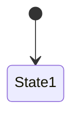

<!-- レビュー指摘: 設計成果物テンプレートが完全に欠落していた -->
<!-- 要件定義: guides/design-artifacts.md「ドメインロジック設計」セクションを参照 -->
# ドメインロジック設計: [Epic 名]

| 項目 | 内容 |
|------|------|
| ステータス | Draft / Approved |
| Epic 仕様書 | ES-xxx |
| ADR 参照 | ADR-xxx, ADR-yyy |
| ドメインモデル設計 | [リンク] |
| 最終更新 | yyyy-mm-dd |

## ビジネスルール一覧

<!-- 要件: ビジネスルール一覧（ルール名、条件、正常結果、違反結果） -->

| # | ルール名 | 対象集約 | 概要 | 詳細セクション |
|---|---------|---------|------|--------------|
| BR-1 | | | | §状態遷移 / §決定表 / §計算式 / §バリデーション |

## 状態遷移

<!-- 要件: 状態遷移（状態一覧、遷移イベント、ガード条件、遷移時の副作用）。Mermaid stateDiagram-v2 で図示 -->
<!-- 該当する集約ごとにサブセクションを作成する -->

### [ステータス名]

**状態一覧:**

| # | 状態 | 説明 | DB 値 |
|---|------|------|-------|
| 1 | | | |

**遷移定義:**

| # | 遷移元 | イベント | ガード条件 | 遷移先 | 副作用 | 失敗時 |
|---|--------|---------|-----------|--------|--------|--------|
| T-1 | | | | | | |

**禁止遷移（明示）:**

| 遷移元 | イベント | 理由 |
|--------|---------|------|
| | | |

## 決定表

<!-- 要件: 決定表（条件の組み合わせ × アクション）。Markdown テーブルで記述 -->
<!-- 決定表ごとにサブセクションを作成する -->

### DT-1: [決定表名]

| # | [条件1] | [条件2] | [条件3] | → 結果 |
|---|---------|---------|---------|---------|
| 1 | | | | |

> **ルール適用順序:** 上から順に評価する。最初にマッチした行の結果を返す。

## 計算式

<!-- 要件: 計算式（変数名、式、丸め方法、単位） -->
<!-- 計算式ごとにサブセクションを作成する -->

### CALC-1: [計算式名]

| 項目 | 定義 |
|------|------|
| **目的** | |
| **入力** | |
| **計算式** | |
| **変数定義** | |
| **丸め方法** | |
| **単位** | |
| **エッジケース** | |

## バリデーション実行レイヤー

<!-- 要件: バリデーションの実行レイヤー（入力 / ドメイン / DB） -->

| # | バリデーション | 入力層 | ドメイン層 | DB 層 | 備考 |
|---|--------------|:---:|:---:|:---:|------|
| 1 | | | | | |

> **凡例:** ○ = このレイヤーで検証する、— = このレイヤーでは検証しない

## エラーコード一覧

<!-- API 仕様のエラーレスポンスと対応させる -->

| エラーコード | HTTP ステータス | 発生条件 | ユーザー向けメッセージ例 |
|------------|---------------|---------|---------------------|
| | | | |

## AI が迷うポイント

<!-- 要件: guides/design-artifacts.md「AI が迷うポイント」参照 -->

| # | 迷うポイント | 未定義時の AI のデフォルト | このプロジェクトでの方針 |
|---|------------|------------------------|----------------------|
| 1 | 複数ルール適用時の優先順位 | 任意の順序で適用する | |
| 2 | 計算の丸め方法 | 言語デフォルトを使う | |
| 3 | 状態遷移の副作用 | フラグ変更のみ実装する | |
| 4 | バリデーションエラーの返し方 | 最初のエラーのみ返す | |

## AC カバレッジ

| AC | 対応するビジネスルール |
|----|---------------------|
| | |

## セルフチェック（G3 対応）

- [ ] 全ビジネスルールが一覧化されている
- [ ] 状態遷移の全状態に説明と DB 値が定義されている
- [ ] 状態遷移の全遷移にガード条件と副作用が定義されている
- [ ] 禁止遷移が明示的に列挙され、エラーコードが定義されている
- [ ] 決定表の全行に結果が定義されている（空欄がない）
- [ ] 決定表のルール適用順序が明記されている
- [ ] 計算式に丸め方法・単位・エッジケースが定義されている
- [ ] バリデーション実行レイヤーが全ルールについて定義されている
- [ ] エラーコードが API 仕様のエラーレスポンスと一致している
- [ ] 曖昧な表現（「適切に」「必要に応じて」）が含まれていない
- [ ] Epic 仕様書の全 AC が「AC カバレッジ」でカバーされている
- [ ] 「AI が迷うポイント」の全項目にプロジェクトの方針が記入されている
- [ ] ADR の決定事項と矛盾していない
