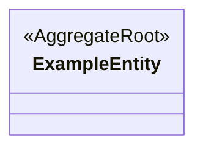

<!-- レビュー指摘: 設計成果物テンプレートが完全に欠落していた -->
<!-- 要件定義: guides/design-artifacts.md「ドメインモデル」セクションを参照 -->
# ドメインモデル設計: [Epic 名]

| 項目 | 内容 |
|------|------|
| ステータス | Draft / Approved |
| Epic 仕様書 | ES-xxx |
| ADR 参照 | ADR-xxx, ADR-yyy |
| 最終更新 | yyyy-mm-dd |

## 集約一覧

<!-- 要件: 集約の一覧（集約ルート、エンティティ、値オブジェクトの名前と責務）、集約境界（トランザクション境界） -->

| # | 集約名 | 集約ルート | 責務 | トランザクション境界の説明 |
|---|--------|-----------|------|--------------------------|
| 1 | | | | |

## 集約・エンティティ・値オブジェクト関係図

<!-- 要件: Mermaid classDiagram で関係を図示 -->
<!-- 注意: 集約間は ID 参照（点線矢印 -->）で示す。直接参照（実線）は集約内部のみ -->

## エンティティ詳細

<!-- 要件: エンティティ単位で Fields・Invariants・State Machine・Domain Logic・Operations を一括定義する -->
<!-- 集約ごとにサブセクションを作成し、集約内の全エンティティを列挙する -->

### 集約: [集約名]

#### Entity: [集約ルート名]

##### Fields（属性）

| フィールド | 型 | 制約 | 必須 | 対応 AC |
|-----------|---|------|------|--------|
| id | UUID | — | ✓ | — |
| name | String | 最大100文字 | ✓ | AC-1 |
| status | Enum | draft/active/archived | ✓ | AC-2 |

##### Invariants（不変条件）[必須: 1件以上、根拠 AC-ID を明記]

- name は空文字列にできない — 根拠: AC-1
- status が archived の場合、name は変更できない — 根拠: AC-3

##### State Machine（状態遷移）[状態数 3 以上の場合必須]

| 遷移元 | イベント | ガード条件 | 遷移先 | 根拠 AC-ID |
|--------|---------|----------|--------|-----------|
| draft | activate | 常に可 | active | AC-2 |
| active | archive | 常に可 | archived | AC-2 |
| archived | reactivate | 管理者ロールのみ | active | AC-4 |

##### Domain Logic（計算式・決定表）[「〜によって決まる」パターンの AC がある場合必須]

| ロジック名 | 入力 | 出力 | 計算式 / 決定表 | 根拠 AC-ID |
|-----------|-----|------|---------------|-----------|
| 割引額計算 | quantity, unitPrice | discountAmount | quantity >= 10 → 10% off; else 0 | AC-5 |

##### Operations（操作の事前/事後条件）

| 操作名 | 事前条件 | 事後条件 | 失敗時の挙動 | 根拠 AC-ID |
|-------|---------|---------|------------|-----------|
| activate | status == draft | status == active | InvalidStateException | AC-2 |
| updateName | status != archived | name が新しい値に更新される | ValidationException | AC-1, AC-3 |

#### 値オブジェクト: [名前]

| 属性名 | 意味的な型 | 制約 |
|--------|-----------|------|
| | | |

## 集約間の関係

<!-- 要件: 集約間の関係（ID 参照、多重度） -->

| 参照元 | 参照先 | 参照方法 | 多重度 | 説明 |
|--------|--------|---------|--------|------|
| | | ID 参照 | | |

## AI が迷うポイント

<!-- 要件: guides/design-artifacts.md「AI が迷うポイント」参照 -->
<!-- 未定義の場合、AI は「デフォルト」列の振る舞いで実装する。意図と異なる場合は必ず「方針」列に記入すること -->

| # | 迷うポイント | 未定義時の AI のデフォルト | このプロジェクトでの方針 |
|---|------------|------------------------|----------------------|
| 1 | 集約境界が不明確 | 全部を1トランザクションにする | |
| 2 | ID 参照 vs 直接参照 | 全て直接参照（密結合）にする | |
| 3 | 値オブジェクト vs エンティティの区別 | 全て ID 付きエンティティにする | |

## AC カバレッジ

| AC | 対応する設計要素 |
|----|----------------|
| | |

## セルフチェック（G3 対応）

### consistency（整合性）

- [ ] 全集約の境界が明確に定義されている（トランザクション境界の説明がある）
- [ ] 集約間の関係は全て ID 参照で定義されている
- [ ] エンティティと値オブジェクトが明確に区別されている
- [ ] 不変条件がビジネスルールとして妥当か
- [ ] 状態遷移が不変条件と矛盾しないか
- [ ] Fields の制約列がドメインモデルの属性制約と一致しているか
- [ ] Epic 仕様書の全 AC が「AC カバレッジ」でカバーされている
- [ ] ADR の決定事項と矛盾していない
- [ ] Mermaid 図とエンティティ詳細の内容が一致している
- [ ] 「AI が迷うポイント」の全項目にプロジェクトの方針が記入されている

### completeness（完全性）— FAIL 条件を含む

- [ ] **[FAIL条件]** 全エンティティに Invariants が 1 件以上定義されている
- [ ] **[FAIL条件]** ステートフルエンティティ（状態数 3 以上）の全遷移にガード条件が定義されている（「常に可」含む）
- [ ] 「〜によって決まる」パターンの AC に Domain Logic（計算式または決定表）が定義されている
- [ ] 全操作に Operations（事後条件・失敗時の挙動）が定義されている
