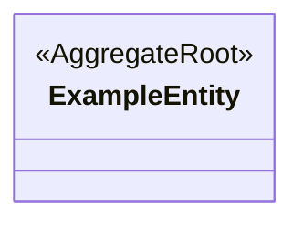

<!-- レビュー指摘: 設計成果物テンプレートが完全に欠落していた -->
<!-- 要件定義: guides/design-artifacts.md「ドメインモデル」セクションを参照 -->
# ドメインモデル設計: [Epic 名]

| 項目 | 内容 |
|------|------|
| ステータス | Draft / Approved |
| Epic 仕様書 | ES-xxx |
| ADR 参照 | ADR-xxx, ADR-yyy |
| 最終更新 | yyyy-mm-dd |

## 集約一覧

<!-- 要件: 集約の一覧（集約ルート、エンティティ、値オブジェクトの名前と責務）、集約境界（トランザクション境界） -->

| # | 集約名 | 集約ルート | 責務 | トランザクション境界の説明 |
|---|--------|-----------|------|--------------------------|
| 1 | | | | |

## 集約・エンティティ・値オブジェクト関係図

<!-- 要件: Mermaid classDiagram で関係を図示 -->
<!-- 注意: 集約間は ID 参照（点線矢印 -->）で示す。直接参照（実線）は集約内部のみ -->

## 属性詳細

<!-- 要件: 各属性（名前、意味的な型、必須/任意、制約） -->
<!-- 集約ごとにサブセクションを作成する -->

### 集約: [集約名]

#### 集約ルート: [エンティティ名]

| 属性名 | 意味的な型 | 必須/任意 | 制約 | 備考 |
|--------|-----------|----------|------|------|
| | | | | |

#### 値オブジェクト: [名前]

| 属性名 | 意味的な型 | 制約 |
|--------|-----------|------|
| | | |

## 集約間の関係

<!-- 要件: 集約間の関係（ID 参照、多重度） -->

| 参照元 | 参照先 | 参照方法 | 多重度 | 説明 |
|--------|--------|---------|--------|------|
| | | ID 参照 | | |

## 不変条件

<!-- 要件: 不変条件 -->

| # | 対象集約 | 不変条件 | 違反時の振る舞い |
|---|---------|---------|----------------|
| 1 | | | |

## AI が迷うポイント

<!-- 要件: guides/design-artifacts.md「AI が迷うポイント」参照 -->
<!-- 未定義の場合、AI は「デフォルト」列の振る舞いで実装する。意図と異なる場合は必ず「方針」列に記入すること -->

| # | 迷うポイント | 未定義時の AI のデフォルト | このプロジェクトでの方針 |
|---|------------|------------------------|----------------------|
| 1 | 集約境界が不明確 | 全部を1トランザクションにする | |
| 2 | ID 参照 vs 直接参照 | 全て直接参照（密結合）にする | |
| 3 | 値オブジェクト vs エンティティの区別 | 全て ID 付きエンティティにする | |

## AC カバレッジ

| AC | 対応する設計要素 |
|----|----------------|
| | |

## セルフチェック（G3 対応）

- [ ] 全集約の境界が明確に定義されている（トランザクション境界の説明がある）
- [ ] 集約間の関係は全て ID 参照で定義されている
- [ ] エンティティと値オブジェクトが明確に区別されている
- [ ] 全属性に意味的な型・必須/任意・制約が定義されている
- [ ] 不変条件が一覧化され、違反時の振る舞いが定義されている
- [ ] Epic 仕様書の全 AC が「AC カバレッジ」でカバーされている
- [ ] ADR の決定事項と矛盾していない
- [ ] 「AI が迷うポイント」の全項目にプロジェクトの方針が記入されている
- [ ] Mermaid 図と属性詳細テーブルの内容が一致している
