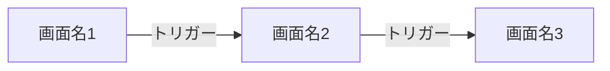

<!-- 要件定義: guides/design-artifacts.md「画面設計」セクションを参照 -->
# 画面設計: [Epic 名]

| 項目 | 内容 |
|------|------|
| ステータス | Draft / Approved |
| Epic 仕様書 | ES-xxx |
| ADR 参照 | ADR-xxx, ADR-yyy |
| デザインシステム | [リンク] |
| API 仕様書 | [リンク] |
| 最終更新 | yyyy-mm-dd |

## 1. 画面一覧

<!-- 要件: 画面一覧（画面名、URL、ペルソナ、対応 AC） -->

| # | 画面名 | URL パス | ペルソナ | 対応 AC | モック |
|---|--------|---------|---------|---------|--------|
| S1 | | | | | [リンク or パス] |
| S2 | | | | | [リンク or パス] |

## 2. 画面遷移図

<!-- 要件: Mermaid flowchart で画面間の遷移を図示する -->
<!-- 遷移のトリガー（リンククリック、フォーム送信、ブラウザバック等）をラベルに含めること -->

## 3. 画面詳細

<!-- 画面ごとにサブセクションを作成する -->

### S1: [画面名]

**URL:** `/path`
**ペルソナ:** [ペルソナ名]
**対応 AC:** AC-x, AC-y

#### モック参照

<!-- 要件: 実働モック（HTML/React）への参照。モック構築ガイド（guides/mock-development.md）の手順で作成したモックのパスまたはスクリーンショットを記載する -->

| 種別 | パス / リンク |
|------|-------------|
| 実働モック | `mocks/[epic]/[screen].html` |
| スクリーンショット（デスクトップ） | |
| スクリーンショット（モバイル） | |

#### コンポーネント構成

<!-- 要件: コンポーネント構成（コンポーネント名、データソース、操作、API 呼び出し） -->

| # | コンポーネント | shadcn/ui ベース | データソース | 操作 | API 呼び出し |
|---|--------------|-----------------|------------|------|-------------|
| 1 | | | | | |
| 2 | | | | | |

#### インタラクション定義

<!-- 要件: インタラクション定義（トリガー → アクション → 結果） -->
<!-- 結果（エラー）列の記入例: 「バリデーションエラー: フィールド下に赤字表示」「サーバーエラー: Toast で通知」「認証エラー: ログイン画面へリダイレクト」等。エラー種別ごとに改行で列挙する -->

| # | トリガー | アクション | 結果（正常） | 結果（エラー） | 対応 AC |
|---|---------|-----------|------------|--------------|---------|
| 1 | | | | | |
| 2 | | | | | |

#### フォームバリデーション

<!-- 入力フォームがある画面のみ記載する。表示のみの画面では省略可。 -->
<!-- ドメインモデルは「何が制約か」を定義し、ここでは「制約違反時にユーザーに何を見せるか」を定義する -->

| # | フィールド | 型 | 必須 | 制約 | エラーメッセージ | タイミング |
|---|----------|-----|------|------|---------------|----------|
| 1 | | | | | | onBlur / onSubmit / onChange |

#### 状態管理

<!-- 要件: この画面で管理する状態の一覧 -->

| # | 状態名 | 型 | 初期値 | 更新トリガー | スコープ |
|---|--------|-----|--------|------------|---------|
| 1 | | | | | コンポーネント / ページ / グローバル / URL パラメータ / サーバーキャッシュ |

#### 画面固有の条件分岐

<!-- この画面で発生する表示の条件分岐（権限による表示切替、データ状態による分岐等） -->

| # | 条件 | 表示内容 | 備考 |
|---|------|---------|------|
| 1 | データ 0 件 | 空状態コンポーネント | |
| 2 | ローディング中 | Skeleton | |
| 3 | エラー発生 | エラーメッセージ | |

---

<!-- 画面ごとに S1 と同じ構造（モック参照、コンポーネント構成、インタラクション定義、状態管理、条件分岐）で記載する -->

### S2: [画面名]

**URL:** `/path`
**ペルソナ:** [ペルソナ名]
**対応 AC:** AC-x, AC-y

#### モック参照

| 種別 | パス / リンク |
|------|-------------|
| 実働モック | `mocks/[epic]/[screen].html` |
| スクリーンショット（デスクトップ） | |
| スクリーンショット（モバイル） | |

#### コンポーネント構成

| # | コンポーネント | shadcn/ui ベース | データソース | 操作 | API 呼び出し |
|---|--------------|-----------------|------------|------|-------------|
| 1 | | | | | |

#### インタラクション定義

<!-- 結果（エラー）列の記入例: 「バリデーションエラー: フィールド下に赤字表示」「サーバーエラー: Toast で通知」「認証エラー: ログイン画面へリダイレクト」等。エラー種別ごとに改行で列挙する -->

| # | トリガー | アクション | 結果（正常） | 結果（エラー） | 対応 AC |
|---|---------|-----------|------------|--------------|---------|
| 1 | | | | | |

#### フォームバリデーション

<!-- 入力フォームがある画面のみ記載する -->

| # | フィールド | 型 | 必須 | 制約 | エラーメッセージ | タイミング |
|---|----------|-----|------|------|---------------|----------|
| 1 | | | | | | onBlur / onSubmit / onChange |

#### 状態管理

| # | 状態名 | 型 | 初期値 | 更新トリガー | スコープ |
|---|--------|-----|--------|------------|---------|
| 1 | | | | | コンポーネント / ページ / グローバル / URL パラメータ / サーバーキャッシュ |

#### 画面固有の条件分岐

| # | 条件 | 表示内容 | 備考 |
|---|------|---------|------|
| 1 | データ 0 件 | 空状態コンポーネント | |
| 2 | ローディング中 | Skeleton | |
| 3 | エラー発生 | エラーメッセージ | |

## 4. 共通コンポーネント

<!-- 複数画面で共有するコンポーネント（ヘッダー、フッター、サイドバー等）がある場合に定義する -->

| # | コンポーネント | 使用画面 | 説明 |
|---|--------------|---------|------|
| 1 | | | |

## 5. 画面間のデータフロー

<!-- 画面間でデータを受け渡す場合（URL パラメータ、グローバルステート、キャッシュ等）を定義する -->

| # | 送信元画面 | 受信先画面 | データ | 受け渡し方法 |
|---|----------|----------|--------|------------|
| 1 | | | | URL パラメータ / state / cache |

## AI が迷うポイント

<!-- 要件: guides/design-artifacts.md「AI が迷うポイント」参照 -->

| # | 迷うポイント | 未定義時の AI のデフォルト | このプロジェクトでの方針 |
|---|------------|------------------------|----------------------|
| 1 | 楽観的 vs 悲観的更新 | 操作ごとにバラバラになる | |
| 2 | 空状態（データ 0 件）の表示 | 空白を表示する | |
| 3 | 破壊的操作の確認ダイアログ | 確認なしで即実行する | |
| 4 | フォームバリデーションのタイミング | onSubmit のみ | |
| 5 | ページネーション方式 | 全件取得する | |
| 6 | 画面遷移時のローディング表示 | 何も表示しない | |
| 7 | エラー時のリトライ方法 | リトライ手段を提供しない | |
| 8 | モバイル時のナビゲーション変化 | デスクトップと同じ表示にする | |

## AC カバレッジ

<!-- 要件: Epic 仕様書の全 AC が画面設計でカバーされていることを確認する -->

| AC | 対応する画面 | 対応するインタラクション |
|----|-----------|---------------------|
| | | |

## セルフチェック（G3 対応）

- [ ] 全画面にモック参照（実働モックまたはスクリーンショット）が含まれている
- [ ] 画面遷移図が全画面・全遷移パスを網羅している
- [ ] 全画面のコンポーネント構成が定義されている
- [ ] 全コンポーネントの API 呼び出し先が明記されている（API 仕様書との整合性）
- [ ] 全インタラクションに正常系・エラー系の結果が定義されている
- [ ] フォーム入力がある画面でバリデーション定義（制約、エラーメッセージ、タイミング）が記載されている
- [ ] 画面固有の条件分岐（空状態、ローディング、エラー）が全画面で定義されている
- [ ] レスポンシブ対応が必要な画面でモバイルのスクリーンショット/モックが含まれている
- [ ] 画面間のデータフローが定義されている
- [ ] コンポーネントがデザインシステムのコンポーネントカタログと整合している
- [ ] Epic 仕様書の全 AC が「AC カバレッジ」でカバーされている
- [ ] 「AI が迷うポイント」の全項目にプロジェクトの方針が記入されている
- [ ] ADR の決定事項と矛盾していない
