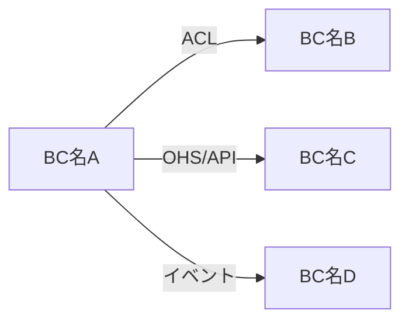

# コンテキストマップ

<!-- BC（境界づけられたコンテキスト）間の関係を俯瞰するドキュメント。
     Phase 定義（G1）で作成し、Phase 完了（G6 マイルストーン）で振り返る。
     配置先: docs/domain/context-map.md -->

| 項目 | 内容 |
|------|------|
| 対象 Phase | <!-- PD-NNN-slug --> |
| 作成日 | <!-- YYYY-MM-DD --> |
| ステータス | <!-- ドラフト / 承認済み --> |

## BC 一覧

| BC 名 | サブドメイン種別 | 対応 Epic | 責務（1 行） | BC キャンバス |
|--------|---------------|----------|-------------|-------------|
| <!-- BC名 --> | <!-- コア / 支援 / 汎用 --> | <!-- ES-NNN --> | <!-- 責務 --> | [bc-xxx.md](bc-xxx.md) |

## コンテキストマップ図

<!-- Mermaid で BC 間の関係を図示する。矢印は依存の方向（上流 → 下流）。
     ラベルに統合パターンを記載する -->

## 統合パターン詳細

| # | 上流 BC | 下流 BC | 統合パターン | 通信方式 | 備考 |
|---|--------|--------|------------|---------|------|
| 1 | <!-- 上流 --> | <!-- 下流 --> | <!-- ACL / OHS / 共有カーネル / コンフォーミスト / 顧客-供給者 / イベント駆動 / 別々の道 / パートナーシップ / 公開言語 --> | <!-- REST API / メッセージキュー / gRPC / DB共有 --> | <!-- 選択理由 --> |

<!-- 統合パターンの選択基準:
     - ACL（防腐層）: 上流のモデルが下流に汚染するのを防ぐ。レガシー連携や外部システムに有効
     - OHS（公開ホストサービス）: 標準化された API を多数の下流に提供。マスターデータ系に有効
     - 共有カーネル: モデルの一部を物理共有。密な連携が必要だが調整コスト高
     - コンフォーミスト: 下流が上流をそのまま受入。上流変更に下流が追従
     - 顧客-供給者: 下流の要望が上流の計画に反映される協力関係
     - イベント駆動: 非同期にイベントを発行・購読。疎結合
     - 別々の道: 統合コスト > 利益の場合、重複を許容
     - パートナーシップ (Partnership): 2 つの BC が密に連携し共に進化。リリースタイミングを合わせる必要がある。顧客-供給者より対等な関係
     - 公開言語 (Published Language): 標準化されたデータ交換フォーマット（JSON Schema, Protocol Buffers 等）で BC 間通信。OHS と組み合わせて使うことが多い -->

## 共有データ・共通概念

<!-- 複数の BC にまたがる概念がある場合、どの BC がオーナーか明記する -->

| 共有概念 | オーナー BC | 参照する BC | 共有方式 |
|---------|-----------|-----------|---------|
| <!-- 概念名 --> | <!-- オーナー --> | <!-- 参照者 --> | <!-- ID 参照 / イベント同期 / 共有カーネル --> |
