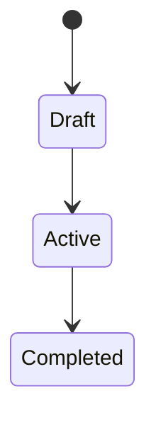

<!-- 配置先: docs/requirements/ES-NNN-slug.md — 相対リンクはこの配置先を前提としている -->
# ES-xxx: [Epic 名]

| 項目 | 内容 |
|------|------|
| ステータス | ドラフト / 承認済み / 基盤設計済み / 設計済み / 実装中 / 完了 / 例外承認 |
| 例外承認 Issue | <!-- 例外承認の場合のみ: #xxx, #yyy --> |
| Issue | #xxx |
| Phase 定義書 | PD-xxx |
| Epic | Ex |
| 所属 BC | <!-- BC名 → docs/domain/bc-xxx.md --> |
| ADR 参照 | ADR-xxx, ADR-yyy |

## 対応ストーリー

<!-- Phase 定義書のストーリーへの逆参照。
     Epic が扱うストーリーを Phase 定義書（PD-xxx）から転記する。
     トレーサビリティチェーン: ストーリー → Epic → AC → Task → PR
     詳細は aidd-framework/process/story-to-epic.md を参照 -->

- S1: [ストーリー概要]
- S2: [ストーリー概要]

## 概要

[Epic の目的を2-3文で]

## ストーリーと受入基準

### Story x.x: [タイトル]

> As a **[ペルソナ]**, I want to [行動], so that [理由].

**受入基準:**

<!-- AC はユーザー視点の E2E シナリオとして記述する。
     「ユーザー操作 → システム応答」の対で表現し、外部から観測できる振る舞いを書く。
     良い例: 「ユーザーが商品名で検索すると、名前に一致する商品が価格順に表示される」
     悪い例: 「GET /api/products?q=xxx が 200 を返し、price 昇順の JSON 配列を含む」
     API レスポンスや DB 状態の検証は Task レベルのテスト観点であり、AC には含めない。 -->

<!-- AC-ID 形式: AC-ENNN-NN（E = Epic 番号, NN = 連番）
     E 番号は Epic 仕様書のファイル番号（ES-NNN の NNN）と一致させる。
     例: ES-002-xxx.md の AC は AC-E002-01, AC-E002-02, ...
     この ID は Task 定義・PR description・テストコードで参照される -->

<!-- ストーリートレース: 各 AC の末尾に「← Sn」で導出元ストーリーを明示する。
     AI が補完した AC には「（AI 補完: [理由]）」を付記する。
     これにより AC → ストーリー → Phase 定義書への逆追跡が可能になる。
     詳細は aidd-framework/process/story-to-epic.md を参照 -->

- [ ] **AC-ENNN-01**: ... ← S1
- [ ] **AC-ENNN-02**: ... ← S2
- [ ] **AC-ENNN-03**: ... ← S1（AI 補完: [理由]）

**インターフェース:** [対応する外部インターフェースがある場合に記載]

## バリデーションルール

| フィールド | ルール | エラー時の振る舞い |
|-----------|--------|------------------|

## ステータス遷移（該当する場合）

## エラーケース

| ケース | 条件 | 期待する振る舞い | 説明 |
|--------|------|----------------|------|

## 非機能要件

| 項目 | 基準 |
|------|------|

## デリバリーする価値

| 項目 | 内容 |
|------|------|
| 対象ユーザー/ペルソナ | [この Epic の完了で価値を受け取る人] |
| デリバリーする価値 | [この Epic が完了したとき、対象ユーザーが新たにできるようになること] |
| デモシナリオ | [完了を示すために実演する E2E シナリオの概要] |

> 技術基盤 Epic の場合: 対象ユーザーは「後続 Epic の開発者」でもよい。その場合も「何が可能になるか」を具体的に記述する。

## E2E 検証計画

| 項目 | 内容 |
|------|------|
| 検証シナリオ | [どの AC をどの手段（自動 E2E テスト / 手動デモ）で検証するか] |
| 検証環境 | [必要な外部依存。実サービス / fake / stub の区分を明記] |
| 前提条件 | [ビルドが必要なコンポーネント、環境変数、テストデータ等] |

## 他 Epic への依存・影響

## 未決定事項

| # | 事項 | ステータス | 解決先 |
|---|------|----------|--------|

## 完全性チェック

- [ ] 全ストーリーに AC が定義されている
- [ ] 正常系・異常系のレスポンスが定義されている
- [ ] バリデーションルールが網羅されている
- [ ] ステータス遷移が図示されている（該当する場合）
- [ ] 権限が各操作で明記されている
- [ ] 関連 ADR が参照されている
- [ ] 非機能要件が定義されている
- [ ] 他 Epic への依存・影響が明記されている
- [ ] 未決定事項が明示されている
- [ ] デリバリーする価値が明記されている（対象ユーザー・価値・デモシナリオ）
- [ ] E2E 検証計画が定義されている（検証シナリオ・検証環境・前提条件）
- [ ] 全 AC に AC-ID（`AC-ENNN-NN` 形式）が付与されている
- [ ] 対応ストーリーが Phase 定義書から転記されている
- [ ] 全 AC にストーリートレース（`← Sn`）が付与されている
- [ ] AI 補完の AC には理由が明記されている（`AI 補完: [理由]`）
- [ ] 所属 BC が記載され、BC キャンバスが docs/domain/ に存在する
