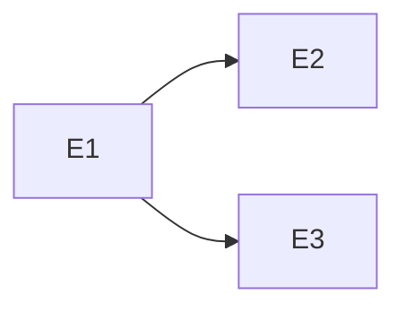

<!-- 配置先: docs/requirements/PD-NNN-slug.md — 相対リンクはこの配置先を前提としている -->
# PD-xxx: Phase N — [Phase 名]

| 項目 | 内容 |
|------|------|
| ステータス | ドラフト / 承認済み / 完了 / 例外承認 |
| 日付 | yyyy-mm-dd |
| 例外承認 Issue | <!-- 例外承認の場合のみ: #xxx, #yyy --> |

## 1. ビジョンと背景

[この Phase で達成すること、CHARTER のどのゴールに対応するか]

## 2. ペルソナ

[この Phase で対象とするペルソナ]

## 3. ユーザーストーリー一覧

### 人間の入力
<!-- PO が入力するユーザーストーリー。不完全でよい。AI が補完する -->
- S1: As a **[ペルソナ]**, I want to [行動], so that [理由].
- S2: ...

### AI 補完
<!-- AI が情報収集・推論で補完したストーリー。出典を明記 -->
- S3: As a **[ペルソナ]**, I want to [行動], so that [理由].（AI 補完: [補完理由]）

## 4. 主要ワークフロー

[ペルソナがこの Phase の成果物を使って行う主要な業務フロー]

## ドメイン分析成果物

<!-- Phase 定義プロセスの Step 2（ドメイン分析）で作成した成果物への参照 -->

| 成果物 | 配置先 | ステータス |
|--------|--------|----------|
| コンテキストマップ | [docs/domain/context-map.md](../domain/context-map.md) | <!-- ドラフト / 承認済み --> |
| BC キャンバス: [BC名] | [docs/domain/bc-xxx.md](../domain/bc-xxx.md) | <!-- ドラフト / 承認済み --> |
| ドメインイベント一覧（概要） | [docs/domain/domain-events.md](../domain/domain-events.md) | <!-- ドラフト / 承認済み --> |
| 用語集 | [docs/glossary.md](../glossary.md) | <!-- BC セクション更新済み --> |

## サブドメイン分類

<!-- 各 Epic をコア/支援/汎用に分類し、設計深度・テスト戦略の方針を決定する。
     判断基準: 「この機能を競合と同じ方法で実装しても、ビジネス上の不利益はないか？」→ Yes なら支援/汎用、No ならコア -->

| Epic | サブドメイン種別 | 分類理由 | 設計深度 | テスト重点 |
|------|---------------|---------|---------|----------|
| <!-- E1: xxx --> | <!-- コア / 支援 / 汎用 --> | <!-- 分類の根拠 --> | <!-- リッチモデル / 標準 / 連携設計 --> | <!-- ドメインロジック厚め / 統合中心 / E2E中心 --> |

## 5. Epic 一覧と優先度（MoSCoW）

| # | Epic 名 | 対応ストーリー | 所属 BC | MoSCoW | 概要 | Epic 仕様書 |
|---|---------|--------------|--------|--------|------|-----------|
| E1 | <!-- Epic名 --> | <!-- S1, S3 --> | <!-- BC名 --> | <!-- MUST/SHOULD/COULD/WON'T --> | <!-- 1行概要 --> | <!-- ES-NNN --> |

## 6. Epic 間依存関係

## 7. 成功基準

<!-- 各成功基準は以下の 3 条件を全て満たすこと:
     - 計測可能 (Measurable): 客観的に合否を判定できる
     - 期限付き (Time-bound): いつまでに達成するか明記
     - 合意済み (Agreed): 全ステークホルダーが合意
     定量例: [指標] が [目標値] に達する（期限: [日付]）
     定性例: [機能/状態] が実現されている（期限: [日付]） -->

- [ ]
- [ ]

## 7.5. Impact Mapping

<!-- Goal → Actor → Impact → Story → Deliverable で成功基準と Epic の関係を整理する -->

| Goal（成功基準） | Actor（誰が） | Impact（どう変わる） | Story | Deliverable（Epic） |
|-----------------|--------------|--------------------|----|---------------------|
| | | | S1 | E1 |
| | | | S2 | E2 |

## 8. 非機能要件（6 分類詳細化）

<!-- CHARTER の非機能要件（レンジ）を、この Phase の確定値に詳細化する。
     CHARTER で N/A とした項目はそのまま N/A を転記する -->

| 分類 | CHARTER レンジ | Phase 確定値 | 計測方法 | 検証タイミング |
|------|---------------|------------|---------|-------------|
| **可用性** | <!-- CHARTER から転記 --> | <!-- この Phase での確定値 --> | <!-- 監視ツール等 --> | <!-- G6 マイルストーンで検証 --> |
| **性能・拡張性** | <!-- CHARTER から転記 --> | <!-- この Phase での確定値 --> | <!-- 負荷テスト等 --> | <!-- G6 マイルストーンで検証 --> |
| **運用・保守性** | <!-- CHARTER から転記 --> | <!-- この Phase での確定値 --> | <!-- 運用手順等 --> | <!-- G6 マイルストーンで検証 --> |
| **移行性** | <!-- CHARTER から転記 --> | <!-- この Phase での確定値 --> | <!-- 移行リハーサル等 --> | <!-- G6 マイルストーンで検証 --> |
| **セキュリティ** | <!-- CHARTER から転記 --> | <!-- この Phase での確定値 --> | <!-- 脆弱性診断等 --> | <!-- G6 マイルストーンで検証 --> |
| **環境・エコロジー** | <!-- CHARTER から転記 --> | <!-- この Phase での確定値 --> | <!-- N/A --> | <!-- N/A --> |

## 9. 技術的な未定義事項

| # | 事項 | ステータス | 解決先 |
|---|------|----------|--------|
| 1 | | 未解決 | |

## 10. Won't Have（スコープ外）

-

## 11. 参照ドキュメント

- CHARTER: [リンク]
- 技術スタック: [リンク]
- アーキテクチャ概要: [リンク]
- 関連 ADR: ADR-xxx
