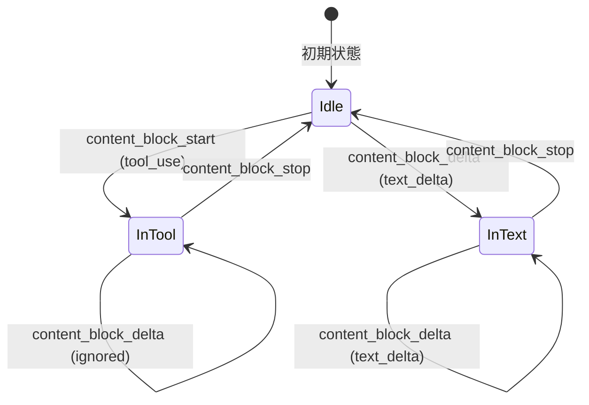

<!-- 配置先: docs/requirements/ES-019-claude-streaming-state-machine.md -->
# ES-019: engines/claude ストリーミング状態機械整理

| 項目 | 内容 |
|------|------|
| 例外承認 Issue | — |
| Issue | #122 |
| Phase 定義書 | docs/requirements/PD-002-code-restructuring.md |
| Epic | E6（engines/claude 整理） |
| 所属 BC | — （設計ステップスキップ: 既存コードの構造整理のみ） |
| ADR 参照 | — |

## 対応ストーリー

- S10: As a **開発者**, I want to `engines/claude.ts`（89条件分岐）のストリーミング処理を状態機械に整理したい, so that デルタ処理の条件分岐が追跡しやすくなり、新エンジン追加時の参考実装になる.

## 概要

`packages/jimmy/src/engines/claude.ts`（622行）の `processStreamLine` メソッドは、Claude CLIが出力する stream-json 形式のイベントを逐行解析している。
現状は `msgType` と `eventType` の多段ネスト条件分岐（`result` / `rate_limit_event` / `assistant` / `stream_event` × `content_block_start` / `content_block_delta` / `content_block_stop`）で実装されており、
状態（ツール実行中 / テキスト出力中）が外部変数 `inTool: boolean` で管理されている。

このEpicでは `processStreamLine` を状態機械パターンに整理し、以下を実現する:

1. 状態（`Idle` / `InText` / `InTool`）と遷移を型で明示
2. イベントタイプごとのハンドラを分離し、条件分岐の深さを減らす
3. 既存の動作を維持したまま、新エンジン追加時の参考実装として機能させる
4. テスト可能な構造（純粋関数 or 小クラス）にすることで単体テストを追加できるようにする

## ストーリーと受入基準

### Story 19.1: processStreamLine を状態機械に整理する（S10）

> As a **開発者**, I want to `engines/claude.ts` の `processStreamLine` メソッドを状態機械パターンに整理したい, so that デルタ処理の条件分岐が追跡しやすくなり、新エンジン追加時の参考実装になる.

**受入基準:**

- [ ] **AC-E019-01**: 開発者が `ClaudeStreamProcessor` （または相当するクラス/モジュール）の状態一覧を確認すると、`Idle` / `InText` / `InTool` の3状態とそれぞれのトランジション条件がコードから読み取れる. ← S10
- [ ] **AC-E019-02**: 開発者が既存の `processStreamLine` と同等の動作をするリファクタリング後の実装を確認すると、ネストが3段以下で、msgType ごとの分岐が独立したハンドラメソッド/関数に分かれている. ← S10
- [ ] **AC-E019-03**: 開発者がリファクタリング後のストリーミングイベント処理に単体テストを追加しようとすると、`processStreamLine` 相当の処理が純粋関数またはモック可能なクラスとして分離されており、外部プロセス（spawn）なしにテストを書ける. ← S10
- [ ] **AC-E019-04**: 開発者が `pnpm build && pnpm test` を実行すると、全テストが PASS し、既存のストリーミング動作が維持されている（リグレッションなし）. ← S10

### Story 19.2: 状態機械実装の単体テストを追加する（S10 補完）

> As a **開発者**, I want to 状態機械として整理されたストリーミングイベント処理の単体テストを追加したい, so that 将来の変更によるリグレッションを自動検知できる.

**受入基準:**

- [ ] **AC-E019-05**: 開発者が `result` イベントを処理するテストを実行すると、`__result` 型の戻り値が返される. ← S10（AI 補完: テスト可能性がストーリーの "so that" から導出可能）
- [ ] **AC-E019-06**: 開発者が `stream_event` + `content_block_start` + `tool_use` block のイベントを処理するテストを実行すると、`__tool_start` 型の戻り値が返される. ← S10（AI 補完: ツール開始イベントは最重要ケース）
- [ ] **AC-E019-07**: 開発者が `stream_event` + `content_block_delta` + `text_delta`（inTool=false）のイベントを処理するテストを実行すると、`delta.type = "text"` の戻り値が返される. ← S10（AI 補完: テキストデルタは最頻出パス）
- [ ] **AC-E019-08**: 開発者が `stream_event` + `content_block_stop`（inTool=true）のイベントを処理するテストを実行すると、`__tool_end` 型の戻り値が返される. ← S10（AI 補完: ツール終了イベントの境界ケース）
- [ ] **AC-E019-09**: 開発者が空行・不正JSONを含む入力のテストを実行すると、`null` が返され例外が発生しない. ← S10（AI 補完: エラーハンドリングの網羅性）

### Story 19.3: 状態遷移の可視化（オプション / COULD）

> As a **開発者**, I want to 状態機械の状態遷移を型またはコメントで文書化したい, so that 初めてコードを読む人が状態遷移を即座に理解できる.

**受入基準:**

- [ ] **AC-E019-10**: 開発者がリファクタリング後のコードを確認すると、StreamState 型（または同等のコメント）が定義されており、各イベントタイプがどの状態から遷移するかが読み取れる. ← S10（AI 補完: 文書化はリファクタリング成果を持続させるために必要）

**インターフェース:** `packages/jimmy/src/engines/claude.ts` 内部実装（外部 API は変更しない）

## 設計成果物

<!-- このEpicは既存コードの構造整理であり、新たなドメインモデルやDBスキーマ・APIは導入しない -->

| 成果物 | 配置先 | ステータス |
|--------|--------|----------|
| 集約モデル詳細 | — | 該当なし |
| DB スキーマ骨格 | — | 該当なし |
| API spec 骨格 | — | 該当なし |

## バリデーションルール

| フィールド | ルール | エラー時の振る舞い |
|-----------|--------|------------------|
| stream-json 各行 | JSON パース可能であること | パース失敗時は `null` を返し例外を発生させない |
| msgType | 既知の型（result / rate_limit_event / assistant / stream_event）のみ処理 | 未知の型は `null` を返す |

## ステータス遷移（ストリーミング状態機械）

## エラーケース

| ケース | 条件 | 期待する振る舞い | 説明 |
|--------|------|----------------|------|
| 空行 | line が空文字列 | null を返す | trim 後に空になる行 |
| 不正 JSON | JSON.parse が例外を投げる | null を返す（例外を握りつぶす） | 現状の動作を維持 |
| 未知の msgType | result/rate_limit_event/assistant/stream_event 以外 | null を返す | 仕様外イベントは無視 |
| stream_event + content_block_delta (inTool=true) | inTool が true の状態でテキストデルタが届く | null を返す | ツール実行中はテキストを無視 |
| stream_event + content_block_start (非 tool_use) | content_block_start で tool_use 以外の block | null を返す | テキストブロック開始は別途 assistant イベントで処理 |

## 非機能要件

| 項目 | 基準 |
|------|------|
| 既存動作維持 | リファクタリング前後で `pnpm test` が全 PASS |
| コード複雑度 | `processStreamLine` の条件分岐ネストが3段以下になること |
| テスト可能性 | 状態機械処理が外部プロセスなしに単体テストできる構造になること |
| ビルド | `pnpm build` が PASS すること |

## デリバリーする価値

| 項目 | 内容 |
|------|------|
| 対象ユーザー/ペルソナ | 開発者（後続 Epic / 新エンジン追加を担当する開発者） |
| デリバリーする価値 | `engines/claude.ts` のストリーミング処理が状態機械として整理され、条件分岐の追跡が容易になる。新しいエンジン実装時に参考実装として機能し、単体テストを追加できる構造になる。 |
| デモシナリオ | リファクタリング後のコードを開発者がレビューし、状態機械の状態遷移をコードから読み取れることを確認する。`pnpm test` 全 PASS で動作維持を確認する。 |

## E2E 検証計画

| 項目 | 内容 |
|------|------|
| 検証シナリオ | AC-E019-01〜04 は `pnpm build && pnpm test` で自動検証。AC-E019-05〜09 は追加した単体テストで自動検証。AC-E019-10 はコードレビューで手動確認。 |
| 検証環境 | ローカル環境。外部プロセス（Claude CLI）は不要（モック可能な構造にする）。 |
| 前提条件 | `pnpm build` が成功すること。ES-019 ブランチの実装が完了していること。 |

## 他 Epic への依存・影響

- **依存なし**: このEpicは `engines/claude.ts` の内部実装整理のみ。外部APIは変更しない。
- **後続Epicへの影響**: 状態機械化によりテスト可能な構造になるため、後続の `engines/` テスト拡充 Epic の前提となる。
- **PD-002依存関係図での位置**: E6（独立 / 随時実施可）。

## 未決定事項

| # | 事項 | ステータス | 解決先 |
|---|------|----------|--------|
| 1 | 状態機械を同一ファイル内クラス vs 独立ファイルに分割するか | 未決定 | Task分解時に判断（既存ファイルが622行で分割の余地あり） |
| 2 | `StreamState` 型の名前と定義範囲（Idle/InText/InTool vs 他の状態名） | 未決定 | Task実装時に判断 |

<!-- AI-UNCERTAIN: 優劣不明 - 状態機械の実装形式（クラス vs 純粋関数 vs discriminated union）のどれが最適か、プロジェクト規約との整合を確認が必要 -->

## 完全性チェック

- [x] 全ストーリーに AC が定義されている
- [x] 正常系・異常系のレスポンスが定義されている
- [x] バリデーションルールが網羅されている
- [x] ステータス遷移が図示されている（状態機械の状態遷移図）
- [x] 権限が各操作で明記されている（内部実装のため権限なし）
- [ ] 関連 ADR が参照されている（ADR不要と判断: 既存パターンの整理のみ）
- [x] 非機能要件が定義されている
- [x] 他 Epic への依存・影響が明記されている
- [x] 未決定事項が明示されている
- [x] デリバリーする価値が明記されている
- [x] E2E 検証計画が定義されている
- [x] 全 AC に AC-ID（`AC-E019-NN` 形式）が付与されている
- [x] 対応ストーリーが Phase 定義書から転記されている
- [x] 全 AC にストーリートレース（`← Sn`）が付与されている
- [x] AI 補完の AC には理由が明記されている
- [x] 所属 BC が記載されている（該当なし）
- [x] 設計成果物セクションが記入されている（該当なし）
