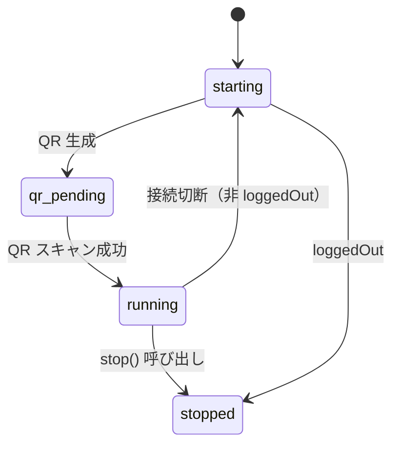

<!-- 配置先: docs/requirements/ES-034-connectors-test-coverage.md — 相対リンクはこの配置先を前提としている -->
# ES-034: src/connectors テストカバレッジ向上（Discord/Slack/WhatsApp/Telegram）

| 項目 | 内容 |
|------|------|
| 例外承認 Issue | — |
| Issue | #242 |
| Phase 定義書 | PD-003 |
| Epic | E8 |
| 所属 BC | connectors |
| ADR 参照 | — |

## 対応ストーリー

- S1: Discord コネクターの未テスト分岐をテストでカバーする（index.ts: branch 49.54% → 90%以上、remote.ts: 0% → 90%以上）
- S2: Slack コネクターの未テスト分岐をテストでカバーする（index.ts: branch 63.39% → 90%以上、format.ts: 71.42% → 90%以上）
- S3: WhatsApp コネクターの未テスト分岐をテストでカバーする（index.ts: branch 63.55% → 90%以上）
- S4: Telegram コネクターの残り分岐をテストでカバーする（index.ts: branch 79.68% → 90%以上）

## 概要

Phase 3 E8 として、src/connectors 配下の Discord / Slack / WhatsApp / Telegram コネクターのテストカバレッジを 90% 以上に引き上げる。各コネクターは既存の `__tests__/` ディレクトリを持つが、分岐カバレッジに多くの未カバー箇所が残っている。既存テストファイルを拡充することで目標を達成する。

## ストーリーと受入基準

### Story 1: Discord コネクターのカバレッジ向上

> As a **開発者**, I want to Discord コネクターの全分岐をテストでカバーする, so that コード変更時の回帰を早期検出できるようにするため.

**受入基準:**

- [ ] **AC-E034-01**: `DiscordConnector` の `handleMessage` において、チャンネルルーティング（`channelRouting` 設定）が指定された場合に `proxyToRemote` が呼ばれ、メッセージがリモートに転送される ← S1
- [ ] **AC-E034-02**: `DiscordConnector` の `handleMessage` において、guildId フィルタが設定されている場合に、異なるギルドのメッセージは無視される ← S1
- [ ] **AC-E034-03**: `DiscordConnector` の `handleMessage` において、channelId フィルタが設定されている場合に、指定外チャンネルのメッセージは無視される（ただし DM は常に許可） ← S1
- [ ] **AC-E034-04**: `DiscordConnector` の `replyMessage` が、thread が指定されている場合はスレッドチャンネルに、指定なしの場合は通常チャンネルに送信する ← S1
- [ ] **AC-E034-05**: `DiscordConnector` の `editMessage` が、messageTs がない場合は何もせず返る ← S1
- [ ] **AC-E034-06**: `DiscordConnector` の `addReaction`/`removeReaction` が、messageTs がない場合は何もせず返る ← S1
- [ ] **AC-E034-07**: `DiscordConnector` の `setTypingStatus` が、既存の typing interval をクリアしてから新しい interval を設定する ← S1（AI 補完: typing状態管理は既存コードに実装されているが未テスト）
- [ ] **AC-E034-08**: `DiscordConnector` の `start` において、client error イベントが発火した場合に status が "error" になる ← S1
- [ ] **AC-E034-09**: `RemoteDiscordConnector` の `sendMessage`/`replyMessage`/`editMessage`/`addReaction`/`removeReaction`/`setTypingStatus` が、プロキシ URL にリクエストを送信し成功時は messageId を返す ← S1
- [ ] **AC-E034-10**: `RemoteDiscordConnector` の各操作で HTTP エラーが発生した場合に `undefined` を返す ← S1（AI 補完: エラーハンドリングは実装済みだが未テスト）
- [ ] **AC-E034-11**: `RemoteDiscordConnector` の `deliverMessage` が、登録済みハンドラにメッセージを配信する ← S1

**インターフェース:** `DiscordConnector`・`RemoteDiscordConnector`（`src/connectors/discord/index.ts`, `src/connectors/discord/remote.ts`）

### Story 2: Slack コネクターのカバレッジ向上

> As a **開発者**, I want to Slack コネクターの全分岐をテストでカバーする, so that コード変更時の回帰を早期検出できるようにするため.

**受入基準:**

- [ ] **AC-E034-12**: `SlackConnector` の `addReaction`/`removeReaction` が、messageTs がない場合は何もせず返る ← S2
- [ ] **AC-E034-13**: `SlackConnector` の `addReaction`/`removeReaction` が、API 呼び出しで例外が発生した場合に警告ログを出力して処理を続行する ← S2（AI 補完: エラーハンドリングは実装済みだが未テスト）
- [ ] **AC-E034-14**: `SlackConnector` の `setTypingStatus` が、Slack API の `chat.scheduleMessage`（または typing API）を通じて typing 状態を設定する ← S2
- [ ] **AC-E034-15**: `SlackConnector` の `format.ts` において、長いテキストが 3000 文字以内のチャンクに分割される ← S2
- [ ] **AC-E034-16**: `SlackConnector` の `format.ts` において、コードブロック（` ``` `）をまたぐ分割が行われず、ブロックが適切に閉じられる ← S2（AI 補完: コードブロック保護ロジックの分岐が未テスト）

**インターフェース:** `SlackConnector`（`src/connectors/slack/index.ts`, `src/connectors/slack/format.ts`）

### Story 3: WhatsApp コネクターのカバレッジ向上

> As a **開発者**, I want to WhatsApp コネクターの全分岐をテストでカバーする, so that コード変更時の回帰を早期検出できるようにするため.

**受入基準:**

- [ ] **AC-E034-17**: `WhatsAppConnector` の `connection.update` イベントで QR コードが生成された場合に、`connectionStatus` が `"qr_pending"` になり `latestQr` に QR データが格納される ← S3
- [ ] **AC-E034-18**: `WhatsAppConnector` の `connection.update` イベントで接続が閉じられた場合（loggedOut以外）に `scheduleReconnect` が呼ばれ、再接続が試みられる ← S3
- [ ] **AC-E034-19**: `WhatsAppConnector` の `connection.update` イベントで loggedOut の場合に再接続が行われない ← S3（AI 補完: loggedOutの分岐は重要なユースケースだが未テスト）
- [ ] **AC-E034-20**: `WhatsAppConnector` の `handleMessage` において、allowFrom が設定されている場合に許可リスト外の JID からのメッセージが無視される ← S3
- [ ] **AC-E034-21**: `WhatsAppConnector` の `handleMessage` において、画像・動画・音声・文書などのメディアメッセージがダウンロードされ `attachments` として IncomingMessage に含まれる ← S3（AI 補完: メディア処理分岐が未テスト）
- [ ] **AC-E034-22**: `WhatsAppConnector` の `stop` が呼ばれた場合に、`connectionStatus` が `"stopped"` になり、保留中の再接続タイマーがキャンセルされる ← S3

**インターフェース:** `WhatsAppConnector`（`src/connectors/whatsapp/index.ts`）

### Story 4: Telegram コネクターの残り分岐カバレッジ向上

> As a **開発者**, I want to Telegram コネクターの残り分岐をテストでカバーする, so that コード変更時の回帰を早期検出できるようにするため.

**受入基準:**

- [ ] **AC-E034-23**: `TelegramConnector` の `handleMessage` において、テキストなし（photo/document のみ）のメッセージが caption を text として処理される ← S4
- [ ] **AC-E034-24**: `TelegramConnector` の `handleMessage` において、添付ファイル（photo/document）が `attachments` フィールドに正しく格納される ← S4（AI 補完: 添付ファイル処理の分岐が未テスト）
- [ ] **AC-E034-25**: `TelegramConnector` の `setTypingStatus` が、Telegram の `sendChatAction` API を呼び出して typing 状態を送信する ← S4

**インターフェース:** `TelegramConnector`（`src/connectors/telegram/index.ts`）

## 設計成果物

| 成果物 | 配置先 | ステータス |
|--------|--------|----------|
| 集約モデル詳細 | 該当なし（テスト拡充のみ） | — |
| DB スキーマ骨格 | 該当なし | — |
| API spec 骨格 | 該当なし | — |

## バリデーションルール

| フィールド | ルール | エラー時の振る舞い |
|-----------|--------|------------------|
| allowFrom（Discord） | 文字列または文字列配列 | 空の場合は全ユーザーを許可 |
| allowFrom（WhatsApp） | JID 形式（`xxx@s.whatsapp.net`）の配列 | 空の場合は全 JID を許可 |
| channelRouting（Discord） | `Record<string, string>` 形式 | キーはチャンネル ID（大きな snowflake を文字列に正規化） |

## ステータス遷移（該当する場合）

WhatsApp コネクターの接続状態遷移:



## エラーケース

| ケース | 条件 | 期待する振る舞い | 説明 |
|--------|------|----------------|------|
| Discord: チャンネル取得失敗 | `channels.fetch` が例外をスロー | エラーログを出力し `undefined` を返す | sendMessage/replyMessage で発生し得る |
| Discord: プロキシ HTTP エラー | リモートホストが 4xx/5xx を返す | エラーログを出力し `undefined` を返す | RemoteDiscordConnector のプロキシ失敗 |
| Discord: プロキシ通信エラー | fetch が例外をスロー | エラーログを出力し `undefined` を返す | ネットワーク障害時 |
| Slack: reaction API エラー | reactions.add/remove が例外をスロー | 警告ログを出力して処理続行 | 非致命的エラー |
| WhatsApp: 再接続タイマー中の stop | stop() が reconnectTimer 保留中に呼ばれる | タイマーをキャンセルして停止 | リソースリーク防止 |
| WhatsApp: loggedOut | statusCode が loggedOut の場合 | 再接続せず stopped に遷移 | 意図的なログアウトとして扱う |

## 非機能要件

| 項目 | 基準 |
|------|------|
| テスト実行速度 | 新規テストを含む全テストが 60 秒以内に完了する |
| 外部依存 | 全テストは外部サービス（Discord API・Slack API・WhatsApp・Telegram）への実接続なしに実行できる（モック使用） |
| ブランチカバレッジ | discord: 90%以上、slack: 90%以上、whatsapp: 90%以上、telegram: 90%以上 |

## デリバリーする価値

| 項目 | 内容 |
|------|------|
| 対象ユーザー/ペルソナ | 後続 Epic 開発者・コネクターをメンテナンスする開発者 |
| デリバリーする価値 | connectors モジュールの変更時に回帰テストが自動検出できるようになり、各コネクターの branch カバレッジが 90% 以上に達する |
| デモシナリオ | `pnpm test --coverage` 実行後、coverage レポートで discord/slack/whatsapp/telegram の branch カバレッジが全て 90% 以上を示す |

## E2E 検証計画

| 項目 | 内容 |
|------|------|
| 検証シナリオ | `pnpm test --coverage` で全テストが PASS し、各コネクターの branch カバレッジが 90% 以上であることを確認 |
| 検証環境 | ローカル環境。外部サービス（Discord/Slack/WhatsApp/Telegram）への実接続不要（全モック） |
| 前提条件 | `pnpm install` 完了。既存の 86 テストファイル・1751 テストが全 PASS の状態 |

## 他 Epic への依存・影響

- ES-020（Discord/Slack/WhatsApp/CronConnector の index.ts テスト追加）: 既存テストを拡充するため、ES-020 のテスト設計パターンを踏襲する
- Phase 3 全体カバレッジ目標（80% 以上）に貢献する

## 未決定事項

| # | 事項 | ステータス | 解決先 |
|---|------|----------|--------|
| 1 | WhatsApp の `handleMessage` でのメディアダウンロード（`downloadMediaMessage`）をどの程度モックするか | 未決定 | Task 定義時に判断 |
| 2 | Slack の `setTypingStatus` 実装（Slack Bolt はネイティブ typing API を持たない） | 未決定 | 実装確認してから AC-E034-14 を調整 |

## 完全性チェック

- [x] 全ストーリーに AC が定義されている
- [x] 正常系・異常系のレスポンスが定義されている
- [x] バリデーションルールが網羅されている
- [x] ステータス遷移が図示されている（WhatsApp のみ該当）
- [x] 権限が各操作で明記されている（allowFrom フィルタとして記述）
- [x] 関連 ADR が参照されている（該当なし）
- [x] 非機能要件が定義されている
- [x] 他 Epic への依存・影響が明記されている
- [x] 未決定事項が明示されている
- [x] デリバリーする価値が明記されている（対象ユーザー・価値・デモシナリオ）
- [x] E2E 検証計画が定義されている（検証シナリオ・検証環境・前提条件）
- [x] 全 AC に AC-ID（`AC-ENNN-NN` 形式）が付与されている
- [x] 対応ストーリーが Phase 定義書から転記されている
- [x] 全 AC にストーリートレース（`← Sn`）が付与されている
- [x] AI 補完の AC には理由が明記されている（`AI 補完: [理由]`）
- [x] 所属 BC が記載されている（connectors）
- [x] 設計成果物セクションが記入されている（該当なしを含む）
