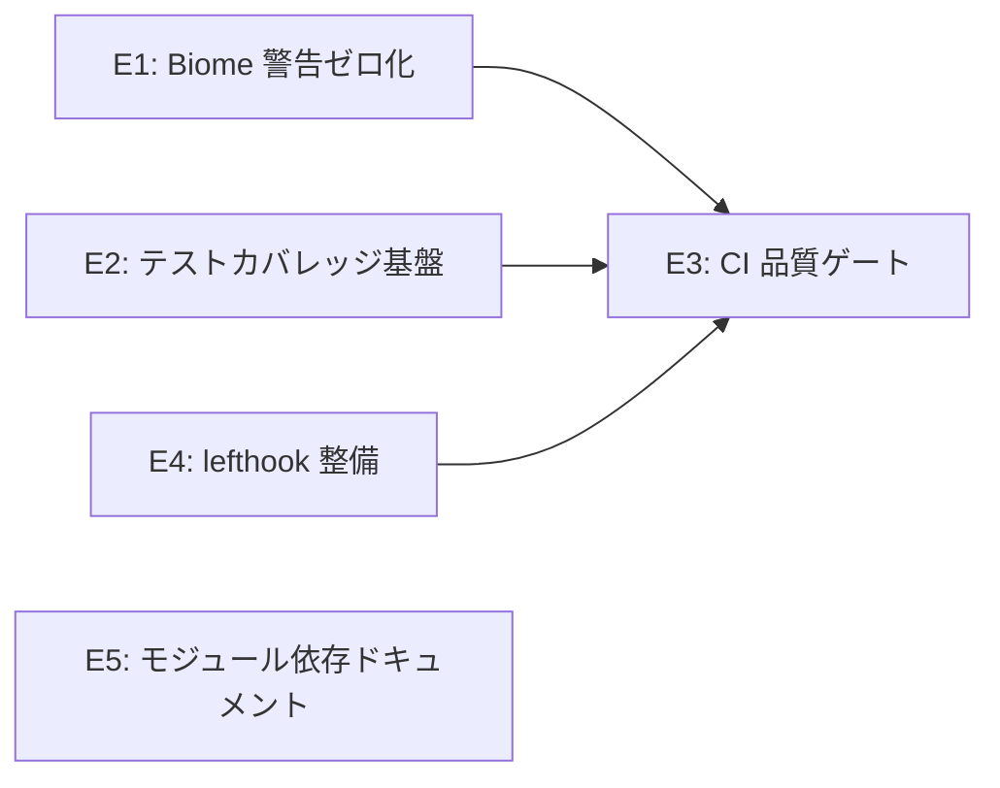

<!-- 配置先: docs/requirements/PD-001-code-quality-stabilization.md — 相対リンクはこの配置先を前提としている -->
# PD-001: Phase 1 — コード品質・安定化

| 項目 | 内容 |
|------|------|
| ステータス | ドラフト |
| 日付 | 2026-04-23 |
| 例外承認 Issue | — |

## 1. ビジョンと背景

jinn v0.9.3 をベースにした unstopia-gateway は、独自拡張（Antigravity エンジン・クロスセッション記憶・多層スキル管理）を実装していく前に、**コードベースの品質基盤を整備**する必要がある。

現状の課題:
- Biome lint 警告 555 件（エラーなし、警告のみ）が残存し、レビュー・実装時のノイズになっている
- テストカバレッジが計測されていないため、安全な変更の境界が不明
- CI パイプラインでカバレッジ閾値・品質ゲートが未設定

この Phase は CHARTER ビジネスゴールの「技術的基盤」に対応し、Phase 2 以降の拡張実装を安全に行うための土台を構築する。

## 2. ペルソナ

| ペルソナ | 役割 | この Phase での目的 |
|---------|------|------------------|
| 開発者（自分） | オーナー / 設計者 | コードベースを安全に拡張できる品質基盤を整える |

## 3. ストーリー一覧

### 人間の入力

- S1: As a **開発者**, I want to Biome の自動修正可能な警告をまとめて解消したい, so that レビュー・実装時のノイズが減る.
- S2: As a **開発者**, I want to `any` 型を具体的な型定義に置き換えたい, so that 型安全性が向上し、実装時のミスを防げる.
- S3: As a **開発者**, I want to `null` 非安全な `!` 演算子を安全な代替に置き換えたい, so that 実行時 NullPointerError のリスクを低減できる.
- S4: As a **開発者**, I want to React コンポーネントの品質問題（hooks deps・key・console）を修正したい, so that バグリスクを低減できる.
- S5: As a **開発者**, I want to Web UI の アクセシビリティ警告を解消したい, so that コードベース全体で Biome 警告ゼロを達成できる.
- S6: As a **開発者**, I want to テストカバレッジを計測できるようにしたい, so that 変更の安全性を定量的に確認できる.
- S7: As a **開発者**, I want to E2E テストの整備状況を把握・改善したい, so that 主要なユーザーフローが自動検証されている状態を作れる.

### AI 補完

- S8: As a **開発者**, I want to `pnpm biome check` がゼロ警告でパスすることを CI で検証したい, so that 品質劣化を自動検知できる.（AI 補完: CI 統合がなければ品質維持の自動化ができないため追加）
- S9: As a **開発者**, I want to CI でテストカバレッジ閾値（branch 60%）を強制したい, so that カバレッジ低下を自動的に防げる.（AI 補完: カバレッジ計測だけでは閾値強制がなければ形骸化するため追加。ユーザー確認: 既存状況によっては 50% スタートも可）
- S10: As a **開発者**, I want to lefthook で pre-commit / commit-msg フックを整備・検証したい, so that コミット前に品質チェックが自動実行される.（AI 補完: lefthook 導入済みだが設定の網羅性確認が必要なため追加）
- S12: As a **開発者**, I want to モジュール間の依存関係を箇条書きでドキュメント化したい, so that 今後の拡張時に影響範囲を把握しやすくなる.（AI 補完: 拡張前に依存グラフを明確化しておくことが Phase 2 以降のリスク低減に繋がるため追加）

> **注記:**
> - **承認済みストーリー**: S1〜S10 + S12 の計 11 件（S11 は削除）
> - S11（TypeScript strict 強化: `exactOptionalPropertyTypes` 等の追加）はユーザー確認の結果削除。現時点での strict 強化は工数対効果が低いと判断。
> - S9 のカバレッジ閾値: branch 60%（現状計測後に 50% スタートへの調整も可）
> - S10: lefthook は既導入済み。設定の確認・補完のみ実施
> - S12: モジュール依存関係の箇条書きドキュメント（軽量フォーマット）

## 4. 主要ワークフロー

### As-Is（現状）

1. 開発者がコードを変更する
2. `pnpm lint` を実行すると 555 件の警告が出力される（エラーなし）
3. どの警告が重要かわからないためスキップしがち
4. テストカバレッジが計測されず、変更の安全性が不明
5. コミット時の品質チェックは lefthook で一部実行されているが、CI での強制がない

### To-Be（目標）

1. 開発者がコードを変更する
2. `pnpm lint` がゼロ警告でパスする
3. `pnpm test --coverage` でカバレッジが branch 60% 以上であることを確認
4. `git commit` 実行時に lefthook が pre-commit フック（lint + typecheck）を実行
5. CI で `biome check`・カバレッジ閾値・E2E テストが全て PASS することを確認してからマージ可能

## 5. ドメイン分析成果物

このフェーズはコード品質改善・ツール整備が中心であり、新たなドメインモデルを導入しない。

| 成果物 | 配置先 | ステータス |
|--------|--------|----------|
| — | — | 該当なし |

## 6. サブドメイン分類

| Epic | サブドメイン種別 | 分類理由 | 設計深度 | テスト重点 |
|------|---------------|---------|---------|----------|
| E1: Biome 警告ゼロ化 | 支援 | 標準的な lint ツール活用。競合と同方法で実装しても不利益なし | 標準 | 統合中心（CI PASS 確認） |
| E2: テストカバレッジ基盤 | 支援 | Vitest coverage 設定。業界標準パターン | 標準 | E2E 中心（threshold PASS 確認） |
| E3: CI 品質ゲート | 支援 | CI パイプライン設定。標準的な DevOps パターン | 連携設計 | E2E 中心（CI ワークフロー動作確認） |
| E4: lefthook 整備 | 支援 | pre-commit フック設定。標準的なGitフロー | 標準 | E2E 中心（コミット時の動作確認） |
| E5: モジュール依存ドキュメント | 汎用 | ドキュメント整備。ドメイン固有性なし | 標準 | 不要 |

## 7. Epic 一覧と優先度（MoSCoW）

| # | Epic 名 | 対応ストーリー | 所属 BC | MoSCoW | 概要 | Epic 仕様書 |
|---|---------|--------------|--------|--------|------|-----------|
| E1 | Biome 警告ゼロ化 | S1, S2, S3, S4, S5 | — | MUST | G1（自動修正）→ G2（any 除去）→ G3（null 安全化）→ G5（React 品質）→ G4（a11y）の順で 555 件の警告を全解消する | — |
| E2 | テストカバレッジ基盤 | S6, S7 | — | MUST | Vitest にカバレッジ計測（@vitest/coverage-v8）を追加し、E2E テストとの整合を確認する | — |
| E3 | CI 品質ゲート | S8, S9 | — | MUST | GitHub Actions ワークフローに biome check・カバレッジ閾値（branch 60%）・E2E テストを統合する | — |
| E4 | lefthook 整備 | S10 | — | SHOULD | lefthook の pre-commit・commit-msg フック設定を確認・補完し、ローカルでの品質チェックを自動化する | — |
| E5 | モジュール依存ドキュメント | S12 | — | COULD | src/ 配下のモジュール間依存関係を箇条書きでドキュメント化する（`docs/architecture/module-dependencies.md`）| — |

## 8. Epic 間依存関係

**補足:**
- E1・E2・E4 は並行実行可能（それぞれ独立した変更）
- E3 は E1・E2・E4 の完了後に CI 統合を実施
- E5 は他 Epic から独立。任意のタイミングで実施可能

## 9. 成功基準

- [ ] `pnpm biome check` がゼロ警告・ゼロエラーで完了する（期限: Phase 1 完了時点）
- [ ] `pnpm test --coverage` で branch カバレッジが 60% 以上（初期状況により 50% スタートも可）を達成する（期限: Phase 1 完了時点）
- [ ] CI ワークフロー（GitHub Actions）で biome check・カバレッジ閾値・E2E テストが PASS する（期限: Phase 1 完了時点）
- [ ] lefthook pre-commit フックが `pnpm lint` + `pnpm typecheck` を実行し、違反時にコミットを阻止する（期限: Phase 1 完了時点）

## 10. Impact Mapping

| Goal（成功基準） | Actor（誰が） | Impact（どう変わる） | Story | Deliverable（Epic） |
|-----------------|--------------|--------------------|----|---------------------|
| Biome ゼロ警告 | 開発者 | 実装時のノイズが排除され、真の問題に集中できる | S1, S2, S3, S4, S5 | E1 |
| カバレッジ 60% 達成 | 開発者 | 変更の安全性を定量的に把握でき、安心してリファクタできる | S6, S7 | E2 |
| CI 品質ゲート通過 | 開発者 | コードベースの品質劣化が自動的に検知・阻止される | S8, S9 | E3 |
| lefthook フック整備 | 開発者 | コミット前にローカルで品質チェックが実行され、CI 失敗を事前に防げる | S10 | E4 |
| モジュール依存ドキュメント整備 | 開発者 | 拡張実装時に影響範囲を素早く把握できる | S12 | E5 |

## 11. 非機能要件（6 分類詳細化）

| 分類 | CHARTER レンジ | Phase 確定値 | 計測方法 | 検証タイミング |
|------|---------------|------------|---------|-------------|
| **可用性** | ローカル daemon として常時稼働 | 既存動作を維持する（品質修正で動作を壊さない） | `pnpm build && pnpm test` PASS | G5 で検証 |
| **性能・拡張性** | エンジン呼び出しオーバーヘッド 100ms 以内 | 今 Phase では変更なし（N/A） | N/A | N/A |
| **運用・保守性** | ホットリロード対応 | 今 Phase では変更なし（N/A） | N/A | N/A |
| **移行性** | jinn からの移行スクリプト提供 | N/A | N/A | N/A |
| **セキュリティ** | ローカル環境限定 | `pnpm audit` ゼロ脆弱性を維持（既達成）| `pnpm audit` | 各 Epic 完了後 |
| **環境・エコロジー** | N/A | N/A | N/A | N/A |

## 12. 外部連携概要

| 連携先 | 方向 | プロトコル | 用途 | 備考 |
|--------|------|----------|------|------|
| GitHub Actions | 送信 | GitHub API | CI パイプライン実行 | 既存ワークフローへの品質ゲート追加 |

## 13. アーキテクチャ影響

| # | 判断事項 | 影響範囲 | ADR 要否 | 備考 |
|---|---------|---------|---------|------|
| 1 | @vitest/coverage-v8 vs @vitest/coverage-istanbul | packages/jimmy | 不要 | v8 が Vitest 公式推奨のため v8 を採用 |
| 2 | CI カバレッジ閾値の初期値（60% vs 50%） | CI ワークフロー | 不要 | 現状のカバレッジ計測後に確定 |

## 14. リスク・前提条件

| # | 種別 | 内容 | 発生確率 | 影響度 | 対策 |
|---|------|------|---------|--------|------|
| 1 | リスク | `any` 型除去で意図しない型エラーが発生し、実装コストが増大する | 中 | 中 | G2 は G1 完了後に着手。型エラーは1ファイルずつ修正 |
| 2 | リスク | `useExhaustiveDependencies` 修正で React hooks の無限ループが発生する | 低 | 高 | 修正後に必ず動作確認。Web UI は storybook 等で検証 |
| 3 | リスク | カバレッジ計測時に現状が閾値（60%）を大幅に下回り、初回から達成が困難 | 中 | 中 | 計測後に 50% スタートへの調整オプションあり（ユーザー確認済み） |
| 4 | 前提 | lefthook は既にインストール済みで基本設定が存在する | — | — | E4 では設定の確認・補完のみ行う |

## 15. 前 Phase 引き継ぎ

| # | 引き継ぎ元 | 内容 | 対応方針 |
|---|-----------|------|---------|
| 1 | G0（プロジェクト初期セットアップ） | Biome 警告 555 件の残存（解消計画は `docs/research/biome-warnings.md` に整理済み） | E1 で対応 |
| 2 | ES-001（grammy 移行・adhoc） | 脆弱性ゼロ達成済み。`pnpm audit` 監視を継続 | E3 CI ゲートで常時監視 |

## 16. 技術的未定義事項

| # | 事項 | ステータス | 解決先 |
|---|------|----------|--------|
| 1 | カバレッジ初期値（現状の branch カバレッジ） | 未計測 | E2 着手時に `pnpm test --coverage` で計測 |
| 2 | lefthook の現在のフック設定内容の網羅性 | 未確認 | E4 着手時に `lefthook.yml` を精査 |

---

<!-- 以下は補助セクション（16 セクションには含めない） -->

### Won't Have（スコープ外）

- S11: TypeScript strict 強化（`exactOptionalPropertyTypes` 等の追加）— 工数対効果が低いためスコープ外
- G4（アクセシビリティ）以外の Web UI 機能追加
- 新機能の実装（Phase 2 の Antigravity エンジン・記憶システム等）
- jinn アップストリームとの差分管理自動化

### 参照ドキュメント

- CHARTER: [docs/PROJECT-CHARTER.md](../PROJECT-CHARTER.md)
- Biome 警告解消計画: [docs/research/biome-warnings.md](../research/biome-warnings.md)
- セキュリティ例外記録: [docs/research/security-exceptions.md](../research/security-exceptions.md)
- テスト規約: [docs/conventions/testing.md](../conventions/testing.md)
