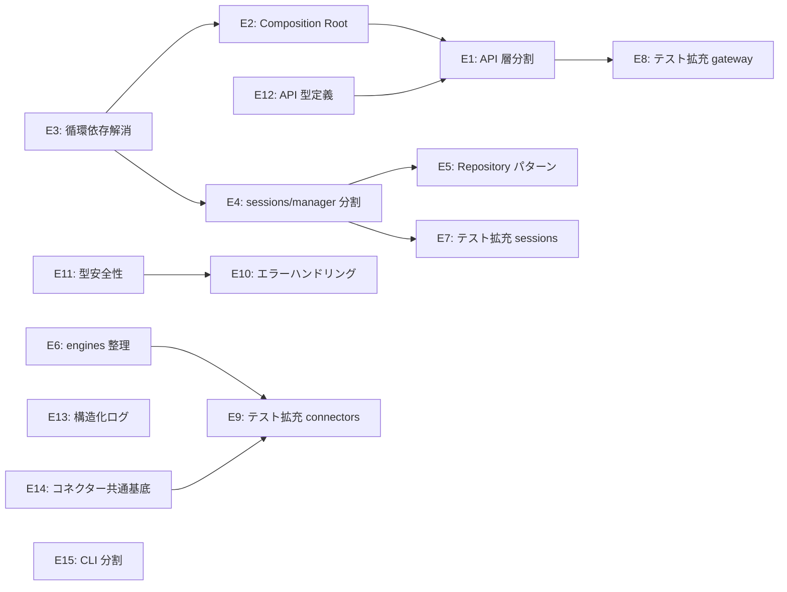

<!-- 配置先: docs/requirements/PD-002-code-restructuring.md — 相対リンクはこの配置先を前提としている -->
# PD-002: Phase 2 — コードベース構造改善

| 項目 | 内容 |
|------|------|
| ステータス | 完了 |
| 日付 | 2026-04-25 |
| 完了日 | 2026-04-28 |
| 例外承認 Issue | — |

## 1. ビジョンと背景

Phase 1 でコード品質の基盤（biome ゼロ警告・テスト基盤・CI ゲート・lefthook）を整備した。
次のステップは **コードベースの構造そのものを改善し、Phase 3 以降の機能拡張（Antigravity エンジン・クロスセッション記憶・多層スキル管理）を安全に受け入れられる状態にすること**。

調査レポート（`docs/research/complexity-and-di-analysis.md`）が示す主要課題:

- `gateway/api.ts` が 2668 行・310 条件分岐に達しており、単一ファイルの限界を超えている
- `sessions ⟷ gateway ⟷ cron` の 3 サイクル循環依存が存在し、変更の影響範囲が読めない
- `SessionManager`（982行）が Engine 実行・Cron 制御・キュー管理・予算チェックを一手に担っており責務が分散している
- エラーハンドリング・ログ・型定義が統一されていないため、デバッグコストが高い

## 2. ペルソナ

| ペルソナ | 役割 | この Phase での目的 |
|---------|------|------------------|
| 開発者（自分） | オーナー / 設計者 | リファクタリングにより、機能追加時の影響範囲を明確化する |

## 3. ストーリー一覧

### 🏗 コア設計・DI

- S1: As a **開発者**, I want to `gateway/api.ts`（2668行）を sessions / org / files / skills の4〜5ファイルに分割したい, so that 各 API ドメインを独立して変更・テストできる.
- S2: As a **開発者**, I want to `gateway/server.ts` を Composition Root として整理し、全依存を1箇所で組み立てたい, so that DI の差し替えが容易になり、テストでモックを注入できる.
- S3: As a **開発者**, I want to `sessions ⟷ gateway` 循環依存を `BudgetChecker` インターフェース抽出で解消したい, so that sessions モジュールが gateway に依存しなくなり、独立してテストできる.
- S4: As a **開発者**, I want to `cron ⟷ sessions` 循環依存を `SessionRunner` インターフェース抽出で解消したい, so that Cron モジュールがセッション実装に依存しなくなる.
- S5: As a **開発者**, I want to `cron ⟷ gateway` 循環依存を `OrgFinder` インターフェース抽出で解消したい, so that Cron が Gateway 実装に依存しなくなり、3サイクル全てが解消される.

### ✂️ 責務分離・モジュール分割

- S6: As a **開発者**, I want to `sessions/manager.ts`（982行）から `EngineRunner` を抽出して責務を分離したい, so that エンジン実行ロジックを独立してテスト・変更できる.
- S7: As a **開発者**, I want to `sessions/manager.ts` から `CronCommandHandler` を抽出したい, so that Cron コマンド処理が SessionManager から切り離され、Cron Epic の変更が manager に波及しない.
- S8: As a **開発者**, I want to `sessions/registry.ts`（698行・33関数）を Repository パターンで抽象化したい, so that SQLite への直接依存がビジネスロジックから除去され、インメモリ実装でテストできる.
- S9: As a **開発者**, I want to `sessions/context.ts`（825行・16関数）のコンテキスト構築ロジックを整理したい, so that プロンプト組み立て・ファイル添付・履歴管理の責務が明確に分かれる.
- S10: As a **開発者**, I want to `engines/claude.ts`（89条件分岐）のストリーミング処理を状態機械に整理したい, so that デルタ処理の条件分岐が追跡しやすくなり、新エンジン追加時の参考実装になる.

### 🧪 テスト・カバレッジ向上

- S11: As a **開発者**, I want to `sessions/` モジュールのテストカバレッジを拡充したい, so that manager / context / registry の主要パスが自動検証される.
- S12: As a **開発者**, I want to `gateway/` モジュールのテストカバレッジを拡充したい, so that budgets / goals / org のビジネスロジックが自動検証される.
- S13: As a **開発者**, I want to `connectors/`（Discord / Slack / WhatsApp）のテストを追加したい, so that メッセージ送受信の主要フローが自動検証される.
- S14: As a **開発者**, I want to Phase 2 完了時に branch カバレッジを 40% 以上に引き上げたい, so that リファクタリング後のリグレッションを定量的に検知できる.

### 🛡 型安全性・エラーハンドリング

- S15: As a **開発者**, I want to エラーハンドリングを型付き `Result<T, E>` パターンに統一したい, so that 例外フローと正常フローが型レベルで区別され、握り潰しを防げる.
- S16: As a **開発者**, I want to `any` 型の残存箇所を具体的な型定義に置き換えたい, so that 型安全性が向上し、リファクタリング時の型エラーを早期検出できる.
- S17: As a **開発者**, I want to API リクエスト・レスポンスの型定義を整備したい, so that `api.ts` 分割時に型の参照が一箇所になり、変更漏れを防げる.

### 📊 観測性・運用性

- S18: As a **開発者**, I want to 構造化ログ（JSON 形式）を導入し、セッション ID でリクエストをトレースしたい, so that 障害時にどのセッションで何が起きたかを素早く特定できる.
- S19: As a **開発者**, I want to コネクターのエラーリトライ・バックオフ処理を共通基底に統一したい, so that 各コネクターが独自にリトライを実装する必要がなくなり、動作が予測可能になる.
- S20: As a **開発者**, I want to `cli/setup.ts`（539行）を機能別サブコマンドに分割したい, so that セットアップ・組織作成・エンジン設定が独立して変更でき、テストも書きやすくなる.

## 4. 主要ワークフロー

### As-Is（現状）

1. 機能を変更すると `api.ts`（2668行）全体が変更対象になる
2. SessionManager を変更すると Cron・Gateway・Engine が連鎖的に影響を受ける
3. テストを書こうとすると循環依存でモック注入ができない
4. ログが文字列のみで、障害発生時にセッションを特定するのに時間がかかる

### To-Be（目標）

1. 機能変更の影響範囲がモジュール境界内に収まる
2. 各モジュールがインターフェースを通じて疎結合になっている
3. 依存を注入できるため、単体テストでモックに差し替えられる
4. 構造化ログとセッション ID でリクエストを即時追跡できる

## 5. ドメイン分析成果物

このフェーズは既存コードの構造改善が中心であり、新たなドメインモデルは導入しない。

| 成果物 | 配置先 | ステータス |
|--------|--------|----------|
| 複雑度・DI 分析レポート | `docs/research/complexity-and-di-analysis.md` | ✅ 完了 |

## 6. サブドメイン分類

| Epic | サブドメイン種別 | 分類理由 | 設計深度 | テスト重点 |
|------|---------------|---------|---------|----------|
| E1: API 層分割 | 支援 | ルーティング整理、標準的なパターン | 標準 | 統合テスト |
| E2: Composition Root / DI | 支援 | DI 設計、標準パターン | 連携設計 | ユニットテスト |
| E3: 循環依存解消 | 支援 | インターフェース分離、標準パターン | 連携設計 | ユニットテスト |
| E4: sessions/manager 分割 | コア | SessionManager は独自拡張の中心 | 詳細設計 | ユニットテスト |
| E5: Repository パターン | 支援 | SQLite 抽象化、標準パターン | 標準 | ユニットテスト |
| E6: engines/claude 整理 | コア | ストリーミング処理は独自実装 | 詳細設計 | ユニットテスト |
| E7: テスト拡充（sessions） | 支援 | テスト追加、標準 | 標準 | ユニットテスト |
| E8: テスト拡充（gateway） | 支援 | テスト追加、標準 | 標準 | ユニットテスト |
| E9: テスト拡充（connectors） | 支援 | テスト追加、標準 | 標準 | ユニットテスト |
| E10: エラーハンドリング統一 | 支援 | Result パターン、標準 | 標準 | ユニットテスト |
| E11: 型安全性向上 | 支援 | any 除去、標準 | 標準 | 型チェック |
| E12: API 型定義整備 | 支援 | 型定義整理 | 標準 | 型チェック |
| E13: 構造化ログ | 支援 | JSON ログ、標準 | 標準 | 統合テスト |
| E14: コネクター共通基底 | 支援 | リトライ統一、標準 | 標準 | ユニットテスト |
| E15: CLI 分割 | 支援 | コマンド整理 | 標準 | ユニットテスト |

## 7. Epic 一覧と優先度（MoSCoW）

| # | Epic 名 | 対応ストーリー | MoSCoW | 概要 | Epic 仕様書 |
|---|---------|--------------|--------|------|-----------|
| E1 | API 層分割 | S1 | MUST | `gateway/api.ts` を4〜5ファイルに分割 | — |
| E2 | Composition Root / DI | S2 | MUST | `gateway/server.ts` をDI 組み立て点に整理 | — |
| E3 | 循環依存解消 | S3, S4, S5 | MUST | 3サイクル全解消（BudgetChecker / SessionRunner / OrgFinder） | — |
| E4 | sessions/manager 分割 | S6, S7 | MUST | EngineRunner・CronCommandHandler を抽出 | — |
| E5 | Repository パターン | S8 | SHOULD | sessions/registry.ts を抽象化 | — |
| E6 | engines/claude 整理 | S10 | SHOULD | ストリーミング処理を状態機械に整理 | — |
| E7 | テスト拡充（sessions） | S11 | MUST | manager / context / registry のテスト追加 | — |
| E8 | テスト拡充（gateway） | S12 | MUST | budgets / goals / org のテスト追加 | — |
| E9 | テスト拡充（connectors） | S13 | SHOULD | Discord / Slack / WhatsApp テスト追加 | — |
| E10 | エラーハンドリング統一 | S15 | SHOULD | Result パターン導入 | — |
| E11 | 型安全性向上 | S16 | SHOULD | any 型除去 | — |
| E12 | API 型定義整備 | S17 | SHOULD | リクエスト・レスポンス型を整備 | — |
| E13 | 構造化ログ | S18 | COULD | JSON ログ + セッション ID トレース | — |
| E14 | コネクター共通基底 | S19 | COULD | リトライ・バックオフ統一 | — |
| E15 | CLI 分割 | S20 | COULD | cli/setup.ts を機能別に分割 | — |

## 8. Epic 間依存関係

**実施推奨順序:**

1. **先行（基盤整備）:** E3（循環依存解消）→ E2（Composition Root）
2. **並行可能 A:** E1（API 分割）+ E12（型定義）
3. **並行可能 B:** E4（manager 分割）+ E11（型安全性）
4. **後続（テスト）:** E7・E8・E9（テスト拡充）
5. **独立（随時）:** E5・E6・E10・E13・E14・E15

## 9. 成功基準

- [x] `gateway/api.ts` が 500 行以下のファイルに分割されている（実績: 39行）
- [x] `npx madge --circular src/` でゼロ循環依存を達成する（実績: ゼロ件）
- [x] `sessions/manager.ts` が 500 行以下になり、EngineRunner が独立モジュールとして存在する（実績: 273行）
- [x] branch カバレッジが 40% 以上を達成する（実績: 44.31%）
- [x] `pnpm build && pnpm test` が全て PASS する（既存動作を維持する）

## 10. Impact Mapping

| Goal（成功基準） | Actor | Impact | Story | Epic |
|-----------------|-------|--------|-------|------|
| api.ts 分割 | 開発者 | API ドメインを独立して変更できる | S1 | E1 |
| 循環依存ゼロ | 開発者 | 変更の影響範囲が予測できる | S3,S4,S5 | E3 |
| manager 分割 | 開発者 | Engine / Cron を独立変更できる | S6,S7 | E4 |
| カバレッジ 40% | 開発者 | リグレッションを自動検知できる | S11-S14 | E7,E8,E9 |
| 構造化ログ | 開発者 | 障害時にセッション追跡できる | S18 | E13 |

## 11. 非機能要件

| 分類 | 目標 | 計測方法 | 検証タイミング |
|------|------|---------|-------------|
| 可用性 | 既存動作を維持する | `pnpm build && pnpm test` PASS | 各 Epic 完了後 |
| 性能 | リファクタリングで性能劣化させない | 既存のレスポンスタイムを維持 | E4 完了後 |
| 保守性 | 循環依存ゼロ・api.ts 分割 | `madge --circular` ゼロ件 | E3 完了後 |
| テスト | branch 40% 以上 | `pnpm test --coverage` | Phase 2 完了時 |
| セキュリティ | `pnpm audit` ゼロ脆弱性維持 | `pnpm audit` | 各 Epic 完了後 |

## 12. リスク・前提条件

| # | 種別 | 内容 | 発生確率 | 影響度 | 対策 |
|---|------|------|---------|--------|------|
| 1 | リスク | `api.ts` 分割でルーティングが壊れる | 中 | 高 | 分割前に統合テストを追加、段階的に移行 |
| 2 | リスク | 循環依存解消でビルドが通らない | 低 | 高 | インターフェース抽出を先行、1サイクルずつ解消 |
| 3 | リスク | SessionManager 分割でセッションフローが壊れる | 中 | 高 | E7（テスト拡充）を先行させてから分割 |
| 4 | リスク | Result パターン導入で既存エラー処理が動かなくなる | 中 | 中 | 新コードから適用、既存は段階的に移行 |
| 5 | 前提 | Phase 2 中は新機能追加をしない | — | — | Phase 3 以降に機能追加を集約 |

## 13. 参照ドキュメント

- 研究レポート: [docs/research/complexity-and-di-analysis.md](../research/complexity-and-di-analysis.md)
- Phase 1 定義書: [docs/requirements/PD-001-code-quality-stabilization.md](PD-001-code-quality-stabilization.md)
- モジュール依存関係: [docs/architecture/module-dependencies.md](../architecture/module-dependencies.md)

---

### Won't Have（スコープ外）

- Antigravity エンジン実装 — Phase 3 へ
- クロスセッション記憶システム — Phase 3 へ
- 多層スキル管理 — Phase 3 へ
- UI 機能追加 — Phase 3 以降へ
- jinn アップストリームとの差分管理自動化
